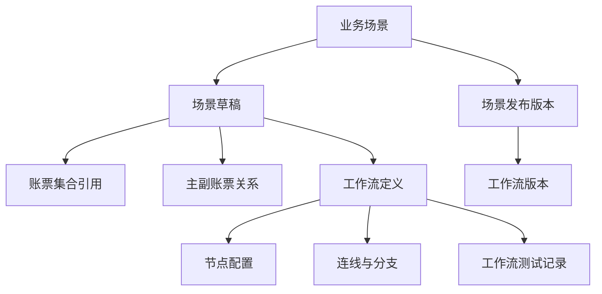

# NeosAI 日本保险 IDP — 产品需求文档（PRD）

## 第 1 章｜文档基础与范围

### 1.1 背景

NeosAI IDP 需要让保险企业按业务场景配置文档处理链路。业务规则配置人员先定义一个场景使用哪些账票、如何引用成案规则、采用哪一个工作流版本，再通过画布配置案件集约后的处理流程。

本文件只描述业务场景设置、工作流画布与可编排节点两个模块，作为总 PRD 中功能 1、功能 2 的可合并版本。

### 1.2 目标

本模块目标是让配置人员完成两件事：

| 目标 | 说明 |
|------|------|
| 场景配置可发布 | 配置业务场景基础信息、账票集合、主副账票关系、工作流版本、输出字段选择，并通过发布校验 |
| 工作流可编排 | 在画布中拖拽节点、连接分支、配置节点参数、运行测试，并将可发布的流程版本绑定到业务场景 |

### 1.3 范围边界

| 范围 | 本文件负责 | 不在本文件展开 |
|------|------------|----------------|
| 业务场景设置 | 场景列表、场景基础信息、关联账票、主副账票关系、匹配策略配置、工作流版本绑定、输出字段选择、发布动作 | 案件集约运行时如何分类、拆分、建案、并入、补件绑定 |
| 工作流画布 | 画布操作、节点目录、连线、分支、节点配置外壳、变量目录、测试入口、发布校验、版本钉扎 | 数据映射规则、AI 检证规则、账票模板、主数据表、API 连接、待办执行页 |
| 可编排节点 | 节点是否可用、引用哪类上游配置、输入输出变量、异常出口、人工确认上下文 | 节点内部算法、OCR 字段定义、模型调用细节、检证模块判定规则 |

### 1.4 本期里程碑

本期支撑保险金请求场景的配置端落地：配置人员可新建业务场景，配置账票集合与工作流画布，完成测试后发布。发布后，新进入处理的案件使用发布时绑定的场景配置与工作流版本；已启动的案件不回溯变更。

### 1.5 假设与依赖

| 编号 | 假设 / 依赖 | 说明 |
|------|-------------|------|
| A-001 | 账票类型设置已维护 | 业务场景只引用已发布账票类型、OCR 字段和表格字段，不在本模块维护模板 |
| A-002 | 数据映射设置已维护 | 数据映射节点只引用当前场景可用的数据映射规则 |
| A-003 | AI 检证设置已维护 | AI 检证节点只选择启用模块与引用规则，不维护规则明细 |
| A-004 | 模型、API、主数据由对应模块维护 | 工作流节点可引用这些配置，但不定义连接、模型或表结构 |
| A-005 | 操作端模块接收运行结果 | 上传、案件集约、案件列表、我的任务、站内信、导出执行由其他模块实现 |

## 第 2 章｜术语与词汇表

### 2.1 术语表

| 中文 | 日语/界面 | 定义 |
|------|-----------|------|
| 业务场景 | 業務シーン | 一类保险业务处理配置，如保险金请求、新保申请、保全变更 |
| 场景草稿 | — | 尚未发布的业务场景配置，可保存、编辑、测试 |
| 场景发布版本 | — | 已发布并可被新案件使用的业务场景配置快照 |
| 工作流定义 | — | 由节点与连线组成的可编排流程模板 |
| 工作流版本 | — | 工作流定义发布时生成的不可变快照，案件实例启动时绑定 |
| 节点 | ノード | 工作流画布上的处理单元，本文件只定义配置外壳和变量契约 |
| 变量目录 | — | 画布中可供条件、通知、自定义节点引用的上游输出集合 |
| 人工确认上下文 | — | 人工确认节点生成待办时声明的处理类型，如前处理确认、OCR 抽出确认、AI 检证确认 |

### 2.2 易混术语

| 中文 | 日语/界面 | 区分要点 |
|------|-----------|----------|
| 主副账票关系 | — | 业务场景设置中的配置项，用于声明主账票字段与关联账票字段如何形成匹配关系 |
| 案件集约 | — | 运行时模块，读取业务场景配置后执行分类、拆分、建案、并入和补件绑定 |
| 数据映射节点 | — | 画布节点，负责引用数据映射设置中的规则并输出标准字段 |
| 数据映射设置 | — | 独立配置模块，维护 OCR 字段到标准字段的具体映射、转换和冲突规则 |
| AI 检证节点 | — | 画布节点，选择本场景启用哪些检证模块并输出检证结果 |
| AI 检证设置 | — | 独立配置模块，维护必填、必要资料、文本、数据、映射冲突、签名盖章等检证规则 |

## 第 3 章｜数据结构与状态

### 3.1 数据结构关系

本文件只定义配置侧实体。案件、文件、待办、站内信等运行侧实体由对应操作端模块维护。

| 实体 | 定义 | 关键属性 | 关联与基数 |
|------|------|----------|------------|
| 业务场景 | 配置端业务大类，是上传与处理链路选择的入口 | 场景 ID、名称、说明、状态、当前发布版本 | 1 个业务场景可有多个草稿和发布版本 |
| 场景草稿 | 编辑中的配置快照 | 账票集合、主账票、主副账票关系、匹配策略、工作流草稿、输出字段 | 1 个业务场景当前最多 1 个编辑草稿 |
| 场景发布版本 | 发布后供新案件使用的不可变快照 | 版本号、发布时间、发布人、绑定工作流版本 | 1 个业务场景可有多个历史发布版本 |
| 账票集合引用 | 当前场景可处理的账票类型集合 | 账票类型、是否主账票、主字段、启用状态 | 引用账票类型设置中的已发布账票 |
| 主副账票关系 | 主账票字段与关联账票字段之间的匹配配置 | 主账票字段、关联账票字段、关系顺序、匹配策略 | 供案件集约读取 |
| 工作流定义 | 画布上的节点与连线草稿 | 节点列表、连线列表、开始节点、结束节点、变量目录 | 绑定在场景草稿内 |
| 工作流版本 | 发布后的工作流不可变快照 | 版本号、节点配置、连线配置、变量契约 | 场景发布版本绑定 1 个工作流版本 |
| 工作流测试记录 | 一次测试运行的结果 | 测试文件、测试结论、失败节点、错误原因 | 归属工作流草稿 |

### 3.2 状态说明与联级关系

配置侧状态分三层：业务场景状态、工作流草稿状态、工作流测试结论。

联级方向：工作流测试结论影响工作流草稿是否可发布；工作流草稿可发布后，业务场景才可发布；业务场景发布后生成场景发布版本和工作流版本。

本文件不定义案件聚合态、文件处理状态和待办状态。

### 3.3 业务场景状态

| 状态 | 含义 | 进入条件 | 允许操作 |
|------|------|----------|----------|
| 草稿 | 尚未发布或发布后有未发布修改 | 新建场景、复制场景、编辑已发布场景 | 编辑、保存、测试、删除 |
| 待确认 | 复制或依赖配置变化后需要配置人员复核 | 复制已有场景，或引用的账票、规则、模型发生失效 | 编辑、确认、测试 |
| 可发布 | 草稿校验通过，最近一次测试结论可用于发布 | 场景配置完整，工作流测试结论为成功或已确认 | 发布 |
| 已发布 | 当前版本可被新案件使用 | 发布成功 | 查看、复制、编辑生成新草稿、停用 |
| 已停用 | 不再允许新案件选择 | 管理员停用已发布场景 | 查看、复制 |

### 3.4 工作流草稿状态

| 状态 | 含义 | 进入条件 | 允许操作 |
|------|------|----------|----------|
| 未测试 | 画布存在未测试配置 | 新建、编辑节点、编辑连线、修改节点参数 | 保存、测试 |
| 测试中 | 正在执行工作流测试 | 点击测试执行 | 等待结果，中止测试 |
| 测试成功 | 测试文件可到达有效结束节点且无阻断错误 | 测试运行通过 | 发布场景、继续编辑 |
| 测试要确认 | 测试可到达结束节点，但存在可接受警告 | 测试输出警告并由配置人员确认 | 发布场景、继续编辑 |
| 测试失败 | 测试存在阻断错误 | 缺连线、无结束节点、变量无效、节点配置缺失等 | 定位错误、继续编辑 |

### 3.5 角色与权限

| 角色 | 业务场景设置 | 工作流画布 | 发布 | 测试 | 查看 |
|------|--------------|------------|------|------|------|
| 系统管理员 | 可编辑 | 可编辑 | 可 | 可 | 可 |
| 业务规则配置人员 | 可编辑 | 可编辑 | 可 | 可 | 可 |
| 业务操作人员 | 不可编辑 | 不可编辑 | 不可 | 不可 | 不可 |
| 只读人员 | 不可编辑 | 不可编辑 | 不可 | 可查看测试结果 | 可 |

指派目标只在人工确认节点中配置，可选角色为操作员和操作管理者。运行时如何派发、改派和办结由我的任务模块处理。

**案件担当者动态指派规则**：案件担当者不是独立的登录角色，而是从人工确认节点所选角色中动态指派的担当用户。指派逻辑如下：

1. 工作流执行到第一个人工确认节点时，系统从该节点指派目标所选角色（操作员或操作管理者）对应的用户组中指派一名用户作为案件担当者。
2. 后续人工确认节点若指派目标仍为同一角色，则默认由已指派的案件担当者继续处理，不再重新指派。
3. 后续人工确认节点若指派目标切换为另一角色，则系统从新角色对应的用户组中重新指派一名用户作为案件担当者。
4. 操作管理者可在案件列表或我的任务中手动改派案件担当者，改派后未完成任务同步更新。

## 第 4 章｜用户交互流程

### 4.1 新建业务场景并发布

业务规则配置人员进入业务场景设置，新建场景，填写名称与说明，选择账票集合，指定主账票与主字段，补齐主副账票关系。系统通过配置完整性检查后，配置人员进入工作流画布，完成节点与连线配置，执行工作流测试。测试成功或警告已确认后，配置人员选择输出字段并发布业务场景。

### 4.2 编辑已发布场景

配置人员从场景列表选择已发布场景并进入编辑。系统基于当前发布版本生成新草稿，旧版本继续供已启动案件使用。配置人员修改账票关系或工作流节点后，系统将草稿状态置为未测试。重新测试并发布后，新案件使用新版本。

### 4.3 复制已有场景

配置人员复制已有业务场景。系统复制场景基础信息、账票集合、主副账票关系、工作流定义和输出字段，并将新场景置为待确认。配置人员需要逐项确认引用的账票类型、规则、模型、API 连接仍有效，再运行测试并发布。

### 4.4 工作流编排与测试

配置人员在画布中从节点目录添加节点，通过连线定义顺序与分支，在检查器中配置每个节点的引用规则、输入变量、输出变量、错误出口和人工确认上下文。点击测试后，系统用测试文件模拟上传、案件集约、画布执行和结束判定，展示每个步骤的状态、输出摘要和错误定位。

### 4.5 上下游衔接

上传模块负责创建上传批次并选择业务场景；案件集约模块读取已发布场景中的账票集合和主副账票关系；工作流引擎按发布版本执行画布节点；我的任务模块承接人工确认待办；导出相关模块读取输出字段配置并执行交付。

## 第 5 章｜全量功能清单

| 编号 | 功能名 | 一句话 | 菜单/路由 | 配置/执行 | 本期详写 | 原型状态 |
|------|--------|--------|-----------|-----------|----------|----------|
| 1 | 业务场景设置 | 配置业务场景、账票集合、主副账票关系、工作流绑定、输出字段和发布版本 | 业务规则配置 / 业务场景设置 | 配置 | Y | 已有高保真原型 |
| 2 | 工作流画布与可编排节点 | 通过画布编排案件集约后的处理流程，配置节点外壳、变量、分支、测试和发布校验 | 业务规则配置 / 业务场景设置 / 工作流画布 | 配置 | Y | 已有高保真原型 |
| 3 | 账票类型设置 | 维护账票模板、OCR 字段、表格字段和文件分割规则 | 业务规则配置 / 账票类型设置 | 配置 | N | 由其他 PRD 维护 |
| 4 | 数据映射设置 | 维护 OCR 字段到标准字段的映射、转换和冲突处理规则 | 业务规则配置 / 数据映射设置 | 配置 | N | 由其他 PRD 维护 |
| 5 | AI 检证设置 | 维护必填、必要资料、文本、数据、映射冲突、签名盖章等检证规则 | 业务规则配置 / AI 检证设置 | 配置 | N | 由其他 PRD 维护 |
| 6 | 主数据设置 | 维护主数据表、照合字段、返回列和候选规则 | 业务规则配置 / 主数据设置 | 配置 | N | 由其他 PRD 维护 |
| 7 | 模型设置 | 维护模型连接和用途指派 | 系统配置 / 模型设置 | 配置 | N | 由其他 PRD 维护 |
| 8 | API 管理 | 维护对外 API 与外部系统连接 | 系统配置 / API 管理 | 配置 | N | 由其他 PRD 维护 |
| 9 | 文件上传 | 处理新增上传、补件上传、格式校验和批次列表 | 操作端 / 文件上传 | 执行 | N | 由其他 PRD 维护 |
| 10 | 案件集约 | 读取场景配置后执行分类、拆分、建案、并入和补件绑定 | 系统执行 / 案件集约 | 执行 | N | 由其他 PRD 维护 |
| 11 | 案件列表与详情 | 查看案件、文件、流程进度，并进行案件级操作 | 操作端 / 案件列表 | 执行 | N | 由其他 PRD 维护 |
| 12 | 我的任务 | 汇聚前处理、OCR 抽出、AI 检证、导出等待办 | 操作端 / 我的任务 | 执行 | N | 由其他 PRD 维护 |
| 13 | 站内信 | 接收工作流通知节点产生的系统消息 | 顶栏消息入口 | 执行 | N | 由其他 PRD 维护 |
| 14 | 系统管理 | 管理用户、角色、权限和安全认证 | 系统管理 | 配置 | N | 由其他 PRD 维护 |

## 第 6 章｜功能详细说明

### 6.01 业务场景设置

#### 范围说明

业务场景设置负责维护一个保险业务大类的可发布配置。配置内容包括基础信息、可受理账票集合、主账票与关联账票关系、案件集约匹配策略、工作流草稿绑定、输出字段选择和发布版本。

业务场景是上传、案件集约、工作流执行、我的任务、案件列表、导出配置共同引用的上游配置。场景发布后生成不可变快照；新案件按上传时选定的已发布场景读取配置，已启动案件继续使用启动时绑定的场景发布版本和工作流版本。

本节只描述配置流程、字段、校验和跨界面联动。案件集约运行时的拆分、分类、建案、并入、补件绑定由案件集约模块执行；数据映射、AI 检证、账票模板、主数据、模型和 API 的内部规则由对应配置模块维护。

#### 功能点

1. 场景列表管理
   - 展示当前租户下的全部业务场景，支持按名称、状态、更新时间筛选。
   - 支持新建、复制、重命名、编辑、查看变更历史、停用。
   - 已发布场景被编辑时，系统基于当前发布版本生成新草稿，不覆盖线上生效版本。
   - 复制场景时同步复制账票集合、主副账票关系、工作流定义和输出字段，复制后的场景状态为待确认。

2. 三步配置流程
   - 第一步配置案件集约规则：维护场景基础信息、账票集合、主账票、关联账票、字段关系和匹配策略。
   - 第二步配置工作流：进入工作流画布，维护节点、连线、分支、变量引用、节点参数和工作流测试。
   - 第三步配置输出字段：选择对外查询和导出的字段集合、顺序、字段来源和展示名称。
   - 三步均支持保存草稿；发布前必须完成全部阻断项校验。

3. 场景基础信息
   - 新建场景时系统生成业务场景 ID。
   - 配置人员填写业务场景名称和说明。
   - 业务场景名称供上传入口、案件列表筛选、我的任务筛选、AI 检证规则适用范围、导出配置和 API 入参使用。
   - 场景说明仅供配置人员识别用途，不参与运行时判定。

4. 账票集合与主账票
   - 账票类型候选项来自账票类型设置中已发布且未停用的账票类型。
   - 一个业务场景至少选择 1 个账票类型，最多选择 10 个账票类型。
   - 必须指定 1 个主账票；主账票用于案件集约阶段识别一笔业务案件的主记录。
   - 非主账票均视为关联账票，运行时根据主副账票关系归入已有案件或进入未集约文件列表。

5. 主副账票关系与匹配策略
   - 为主账票与每个关联账票配置字段关系。
   - 一组字段关系由主账票字段、关联账票字段、关系顺序和匹配策略组成。
   - 同一关联账票可配置多组字段关系；顺序表示案件集约运行时的匹配优先级。
   - 匹配策略支持精确匹配和近似匹配。精确匹配要求字段值标准化后完全一致；近似匹配允许姓名、地址、日期等字段在标准化后按案件集约策略判断候选。
   - 本页面只保存配置，候选命中、冲突、失败原因和重跑策略由案件集约模块执行。

6. 关联预览与配置检查
   - 预览区展示主账票、关联账票、字段关系、匹配策略和当前引用状态。
   - 关联检查会检查未选主账票、未配置关系、字段引用失效、账票停用、关系重复、关系顺序为空等问题。
   - 检查结果分为阻断错误和提示警告。阻断错误必须修复；提示警告可继续保存，但发布前须由配置人员确认。

7. 工作流绑定
   - 每个业务场景必须维护一份工作流定义。
   - 从业务场景第二步进入工作流画布，画布读取当前场景的账票集合、主副账票关系、已发布规则和变量目录。
   - 场景发布时，系统同步发布工作流版本，并将场景发布版本绑定到该工作流版本。
   - 新案件启动工作流实例时绑定当时的工作流版本；已启动案件不受后续草稿编辑影响。

8. 输出字段选择
   - 配置人员选择本场景对外输出的字段集合与顺序。
   - 字段来源包括账票 OCR 字段、数据映射节点输出的标准字段、主数据照合节点输出字段、案件基础字段和工作流结果字段。
   - 输出字段用于导出执行、对外查询 API、案件详情摘要和客户侧交付文件。
   - 字段生成、转换、照合规则由对应模块维护；本页面只选择、排序、命名和控制是否输出。

9. 发布与版本
   - 发布前同时校验基础信息、账票集合、主副账票关系、工作流测试结论、节点配置、变量引用、输出字段和依赖配置状态。
   - 发布成功后生成场景发布版本和工作流版本。
   - 发布版本只影响后续新案件；已启动案件继续使用启动时绑定的版本。
   - 已发布版本可查看，不可直接修改；编辑动作始终生成新草稿。

10. 与其他界面联动
   - 文件上传读取已发布且未停用的业务场景，作为新增上传和集约路径补件上传的必选项。
   - 案件集约读取场景中的账票集合、主账票、主副账票关系、匹配策略和工作流入口。
   - 工作流画布读取场景中的账票集合和已发布规则，限制节点可选项。
   - AI 检证设置读取业务场景作为规则适用范围，并读取该场景关联账票类型作为字段候选范围。
   - 案件列表、我的任务、站内信、导出和 API 管理展示或筛选业务场景名称。

#### 页面与入口

| 场景 | 菜单/入口 | 角色 |
|------|-----------|------|
| 场景列表 | 业务规则配置 / 业务场景设置 | 系统管理员、业务规则配置人员、只读人员 |
| 新建场景 | 场景列表 / 新建 | 系统管理员、业务规则配置人员 |
| 编辑场景 | 场景卡片 / 编辑 | 系统管理员、业务规则配置人员 |
| 复制场景 | 场景卡片 / 复制 | 系统管理员、业务规则配置人员 |
| 查看变更历史 | 场景卡片 / 变更历史 | 系统管理员、业务规则配置人员、只读人员 |
| 配置案件集约规则 | 场景详情 / 第一步 | 系统管理员、业务规则配置人员 |
| 配置工作流 | 场景详情 / 第二步 | 系统管理员、业务规则配置人员 |
| 配置输出字段 | 场景详情 / 第三步 | 系统管理员、业务规则配置人员 |
| 查看发布版本 | 场景详情 / 版本历史 | 系统管理员、业务规则配置人员、只读人员 |

#### 按钮与启用条件

| 按钮 | 适用场景 | 启用条件 | 点击后 |
|------|----------|----------|--------|
| 新建 | 场景列表 | 用户有编辑权限 | 创建空草稿并进入基础信息配置 |
| 复制 | 场景卡片 | 用户有编辑权限 | 复制当前场景配置，生成待确认草稿 |
| 重命名 | 场景卡片 | 用户有编辑权限 | 打开重命名弹窗 |
| 删除 | 场景卡片 | 用户有编辑权限，且场景从未发布 | 二次确认后删除草稿 |
| 停用 | 场景卡片 | 用户有编辑权限，且场景已发布 | 二次确认后场景不再允许新案件选择 |
| 关联检查 | 主副账票关系配置 | 已选择主账票，且存在关联账票 | 校验字段关系并展示结果 |
| 下一步 | 第一步 | 基础信息、账票集合、主副账票关系通过静态校验 | 进入工作流画布 |
| 上一步 | 第二步或第三步 | 始终可用 | 返回上一配置步骤，保留草稿 |
| 进入画布 | 第二步 | 用户有查看权限 | 打开当前场景工作流画布 |
| 保存草稿 | 任意配置步骤 | 用户有编辑权限 | 保存当前草稿，不发布 |
| 选择输出字段 | 第三步 | 工作流至少存在可发布测试结论 | 打开输出字段选择面板 |
| 查看发布差异 | 发布确认 | 草稿来自已发布场景 | 展示草稿与当前发布版本的差异 |
| 发布 | 发布确认 | 场景校验通过，工作流测试结论可发布，输出字段有效 | 生成场景发布版本 |

#### 字段与参数规格

| 字段/参数 | 控件 | 必填 | 数据来源与枚举 | 校验与转换 | 下游消费 |
|-----------|------|------|----------------|------------|----------|
| 业务场景 ID | 只读文本 | 是 | 系统生成 | 新建未保存时展示占位；保存后生成 | 上传、案件、待办、导出、API 关联 |
| 业务场景名称 | 文本输入 | 是 | 用户输入 | 最长 64 字符；同租户内不可重复；前后空格自动去除 | 上传入口、案件列表、我的任务筛选、AI 检证设置 |
| 业务场景说明 | 多行文本 | 否 | 用户输入 | 最长 256 字符 | 配置人员识别用途 |
| 场景状态 | 只读标签 | 是 | 草稿、待确认、可发布、已发布、已停用 | 由保存、测试、发布、停用动作写入 | 场景列表、上传候选过滤 |
| 账票类型 | 多选列表 | 是 | 账票类型设置 · 已发布账票类型 | 至少 1 个，最多 10 个；引用停用时标记待确认 | 案件集约、工作流节点、输出字段 |
| 主账票 | 单选 | 是 | 已选账票类型 | 必须且只能 1 个；删除主账票时清空主字段与关系 | 案件集约读取 |
| 主字段 | 下拉单选 | 是 | 主账票字段 | 字段必须仍存在于账票类型设置；建议选择业务键字段 | 案件集约读取 |
| 关联账票 | 自动派生 | 是 | 已选账票类型中非主账票 | 删除账票时同步清理关系 | 案件集约读取 |
| 主账票字段 | 下拉单选 | 是 | 主账票字段 | 字段必须存在 | 案件集约读取 |
| 关联账票字段 | 下拉单选 | 是 | 对应关联账票字段 | 字段必须存在 | 案件集约读取 |
| 关系顺序 | 自动序号 | 是 | 关系添加顺序 | 支持拖拽调整；同一关联账票内不可重复 | 案件集约读取 |
| 匹配策略 | 下拉单选 | 是 | 精确匹配、近似匹配 | 默认精确匹配；近似匹配须允许案件集约产生候选冲突 | 案件集约读取 |
| 工作流草稿 | 只读摘要 | 是 | 当前场景工作流定义 | 无开始节点、无结束节点、测试失败时阻断发布 | 工作流引擎 |
| 最近测试结论 | 只读标签 | 是 | 未测试、测试成功、测试要确认、测试失败 | 节点或关系变更后回到未测试 | 发布校验 |
| 输出字段 | 勾选与拖拽排序 | 是 | OCR 字段、标准字段、主数据返回列、案件基础字段、工作流结果字段 | 至少选择 1 个；引用失效时阻断发布 | 导出配置、对外查询 API |
| 输出字段显示名 | 文本输入 | 是 | 用户输入或字段默认名 | 同一场景下不可重复；最长 64 字符 | 导出表头、API 字段说明 |
| 输出字段来源 | 只读 | 是 | 字段所属节点或配置模块 | 来源节点删除或变量失效时标记错误 | 发布校验 |

字段表界面文案：业务场景名称 = 業務シーン名；关联检查 = 関連チェック；发布 = 公開。

#### 列表展示

| 列名 | 含义 | 说明 |
|------|------|------|
| 业务场景名称 | 场景名称 | 点击后进入配置详情 |
| 状态 | 草稿、待确认、可发布、已发布、已停用 | 按配置侧状态展示 |
| 账票数 | 已选账票类型数量 | 包含主账票与关联账票 |
| 当前工作流版本 | 已绑定工作流版本 | 未发布时展示草稿状态 |
| 最近测试结论 | 工作流测试结果 | 未测试、成功、要确认、失败 |
| 最近更新时间 | 草稿或发布版本更新时间 | 用于排序 |
| 操作 | 行内操作 | 编辑、复制、重命名、删除、变更历史 |

工具栏：关键词检索、新建、状态筛选。列表默认按最近更新时间倒序。

#### 配置流程

| 步骤 | 配置目标 | 必填完成条件 | 保存行为 | 下游影响 |
|------|----------|--------------|----------|----------|
| 第一步：案件集约规则 | 定义场景基础信息、账票集合、主账票和主副账票关系 | 名称唯一；账票数量 1 到 10；主账票唯一；关联账票均有字段关系 | 保存为场景草稿；若字段引用变化，工作流测试结论回到未测试 | 文件上传候选、案件集约规则、AI 检证规则候选 |
| 第二步：工作流画布 | 定义案件集约后的处理流程 | 开始与结束节点存在；所有分支可达结束；节点配置完整；测试结论可发布 | 保存工作流定义草稿；更新变量目录 | 我的任务、站内信、导出、案件详情流程图 |
| 第三步：输出字段 | 定义对外输出字段集合与顺序 | 至少 1 个字段；字段来源有效；显示名不重复 | 保存输出字段草稿 | 导出执行、对外查询 API、客户交付文件 |
| 发布确认 | 生成发布快照 | 三步均无阻断错误；最近测试结论为测试成功或测试要确认且已确认 | 生成场景发布版本和工作流版本 | 新案件开始使用新版本 |

#### 发布校验项

| 校验项 | 阻断条件 | 用户提示 / 处理 |
|--------|----------|----------------|
| 基础信息 | 名称为空或重复 | 阻断发布，定位到第一步 |
| 账票集合 | 无账票、超过上限、账票已停用 | 阻断发布，标记具体账票 |
| 主账票 | 未选择主账票或主字段失效 | 阻断发布，定位主账票区域 |
| 主副账票关系 | 存在关联账票但无字段关系；字段失效；关系重复 | 阻断发布，定位关系行 |
| 工作流完整性 | 无开始节点、无结束节点、分支断开、结束不可达 | 阻断发布，进入画布并高亮问题节点或连线 |
| 节点配置 | 必填参数为空；引用规则停用；变量失效 | 阻断发布，定位节点检查器 |
| 工作流测试 | 未测试或测试失败 | 阻断发布，提示「请先完成工作流测试」 |
| 输出字段 | 输出字段为空、来源变量失效、显示名重复 | 阻断发布，定位第三步 |
| 版本冲突 | 当前草稿基于的发布版本已被他人更新 | 提示重新加载差异；配置人员确认后继续保存 |

#### 跨界面联动

| 联动对象 | 读取内容 | 联动规则 |
|----------|----------|----------|
| 文件上传 | 已发布且未停用的业务场景名称和 ID | 新增上传必须选择业务场景；无可用场景时阻断上传 |
| 案件集约 | 账票集合、主账票、主字段、主副账票关系、匹配策略 | 执行时按场景发布版本读取，不读取草稿 |
| 工作流画布 | 当前场景账票集合、可用规则、变量目录 | 账票集合变化后，相关节点与变量进入待确认或错误状态 |
| 账票类型设置 | 被引用账票、字段、表格字段 | 账票或字段停用后，引用场景标记待确认 |
| 数据映射设置 | 当前场景可用字段与标准字段 | 数据映射规则输出进入输出字段候选和变量目录 |
| AI 检证设置 | 业务场景与关联账票类型 | 规则适用范围和字段候选随场景配置变化 |
| 我的任务 | 工作流人工确认节点生成的待办上下文 | 待办列表展示业务场景并支持筛选 |
| 站内信 | 通知节点的接收人、标题、正文变量 | 通知节点执行成功后写入当前用户站内信 |
| 导出执行 | 输出字段集合、顺序、显示名 | 工作流完结后生成导出待办，按场景发布版本输出 |
| 对外 API | 业务场景、输出字段、案件结果 | 外部系统查询时按案件绑定版本返回字段 |

#### 异常与边界

| 场景 | 条件 | 用户提示 / 处理 |
|------|------|----------------|
| 名称为空 | 发布或保存时未填写业务场景名称 | 「请输入业务场景名称」 |
| 名称重复 | 同租户已有同名场景 | 「业务场景名称已存在」 |
| 未选择账票 | 账票集合为空 | 「请至少选择 1 个账票类型」 |
| 账票超过上限 | 已选账票超过 10 个 | 「关联账票最多 10 个」 |
| 未选择主账票 | 已有账票但无主账票 | 「请选择主账票」 |
| 未选择主字段 | 主账票未指定主字段 | 「请选择主字段」 |
| 关联关系为空 | 存在关联账票但未配置字段关系 | 「请添加至少 1 条关联字段」 |
| 字段引用失效 | 账票类型设置中字段已删除或停用 | 标记待确认，阻断发布 |
| 工作流未测试 | 工作流测试结论为空或失败 | 「请先完成工作流测试」 |
| 输出字段为空 | 未选择任何输出字段 | 「请选择至少 1 个输出字段」 |
| 已发布场景删除 | 场景已有发布版本 | 不物理删除；提示停用后不再允许新案件选择 |
| 复制场景引用失效 | 被复制场景引用的账票、规则、模型、API 已停用 | 新草稿状态为待确认；相关区域展示失效项 |
| 编辑已发布场景 | 用户修改已发布场景 | 自动生成新草稿；当前发布版本继续生效 |
| 并发保存 | 草稿已被其他用户更新 | 阻断覆盖，提示刷新后重试 |
| 停用场景仍有进行中案件 | 已有案件绑定历史发布版本 | 允许停用；进行中案件继续处理，新上传不可再选 |

### 6.02 工作流画布与可编排节点

#### 范围说明

工作流画布负责配置案件集约完成后的处理流程。画布决定节点顺序、分支条件、人工确认上下文、通知触发点、变量引用、异常出口、测试结果和发布校验。

节点内部业务规则由对应配置模块维护。画布只保存节点配置外壳、引用关系、输入输出变量、异常出口、分支条件和可达性，不重复定义数据映射、AI 检证、账票模板、主数据、模型或 API 的细则。

工作流的运行边界为案件集约完成后至工作流完结。上传、案件集约和导出属于平台固定能力，不在画布上编排；导出待办由工作流完结后自动生成。

#### 功能点

1. 画布编辑
   - 支持从节点目录拖拽节点到画布。
   - 支持通过节点后方添加、连线上插入、拖拽连线建立上下游关系。
   - 支持删除节点、删除连线、自动整理、折叠节点。
   - 删除节点时同步删除相关连线，并将工作流状态置为未测试。

2. 节点目录
   - 节点分为系统节点、处理节点、规则节点、控制节点、人工节点、通知节点、扩展节点。
   - 系统节点包括开始、结束。
   - 处理节点包括 AI 前处理、OCR 抽出。
   - 规则节点包括数据映射、主数据照合、AI 检证。
   - 控制节点包括条件判断。
   - 扩展节点包括外部调用和自定义函数。
   - 节点可用状态由当前业务场景、账票集合、已发布规则、API 连接和用户权限决定。

3. 节点检查器
   - 选中节点后展示节点名称、说明、输入、输出、异常出口和节点参数。
   - 需要引用外部规则的节点，只允许选择对应模块已发布且适用于当前业务场景的规则。
   - 参数保存后更新节点摘要和变量目录。
   - 参数变更后工作流草稿状态回到未测试。

4. 连线与分支
   - 普通节点默认有一个主出口。
   - 条件判断节点支持 IF、ELIF、ELSE 分支。
   - 人工确认节点支持完成、补件、终止等动作出口。
   - 每个可能命中的分支必须连接到下游节点，并最终可达结束节点。

5. 变量目录
   - 系统根据上游节点输出生成变量目录。
   - 条件判断、通知、自定义函数、外部调用、输出字段选择可引用变量目录。
   - 变量引用失效时，相关节点标记错误并阻断发布。
   - 变量目录只展示当前节点可达上游变量，不展示不可达分支变量。

6. 人工确认配置
   - 人工确认节点必须选择上下文和指派目标。
   - 上下文决定生成哪类待办；待办列表与执行页由我的任务模块维护。
   - 指派目标只能选择操作员或操作管理者两种角色；案件担当者由系统从所选角色中动态指派，不作为独立选项配置（详见 3.5 节案件担当者动态指派规则）。
   - 人工确认节点暂停当前工作流分支，待办办结后按用户动作出口继续流转。

7. 工作流测试
   - 配置人员上传测试文件，按当前草稿模拟上传、案件集约、开始节点、画布节点、结束节点。
   - 测试结果展示步骤、节点状态、错误原因、变量摘要和警告。
   - 测试数据不进入正式案件列表。

8. 发布与版本钉扎
   - 场景发布时，工作流草稿生成工作流版本。
   - 新案件启动时绑定当时的工作流版本。
   - 已启动案件继续使用原版本，不受后续编辑影响。

9. 运行时调用逻辑
   - 工作流实例由案件集约完成事件触发。
   - 引擎按连线推进节点；节点执行完成后写入节点输出变量，再刷新下游可引用变量。
   - AI 前处理和 OCR 抽出按文件执行，节点进度由文件处理状态汇聚。
   - 数据映射、主数据照合、AI 检证、条件判断、通知、外部调用、自定义函数按案件执行。
   - 人工确认节点生成待办并暂停；待办完成后将经办动作写回工作流，再按出口继续。
   - 任一节点失败且无异常出口可承接时，节点进度记处理失败，案件进入异常处理。
   - 到达结束节点且所有并行分支均结束后，工作流实例完结，并触发导出待办生成。

#### 页面与入口

| 场景 | 菜单/入口 | 角色 |
|------|-----------|------|
| 工作流画布 | 业务场景设置 / 工作流画布步骤 | 系统管理员、业务规则配置人员、只读人员 |
| 节点检查器 | 画布选中节点 | 系统管理员、业务规则配置人员 |
| 变量目录 | 画布右侧面板 | 系统管理员、业务规则配置人员、只读人员 |
| 工作流测试 | 画布工具栏 / 测试 | 系统管理员、业务规则配置人员、只读人员 |
| 发布确认 | 业务场景设置 / 发布 | 系统管理员、业务规则配置人员 |
| 测试结果详情 | 工作流测试弹窗 / 结果详情 | 系统管理员、业务规则配置人员、只读人员 |
| 节点错误定位 | 测试结果 / 错误节点 | 系统管理员、业务规则配置人员 |

#### 按钮与启用条件

| 按钮 | 适用场景 | 启用条件 | 点击后 |
|------|----------|----------|--------|
| 添加节点 | 节点目录 | 用户有编辑权限 | 将节点加入画布 |
| 插入节点 | 连线操作 | 用户有编辑权限，且目标节点类型可接收上游输出 | 在连线中插入节点并重建上下游连线 |
| 连接节点 | 画布节点 | 源节点存在可用出口，目标节点可接收输入 | 生成连线并刷新变量目录 |
| 删除节点 | 选中节点 | 用户有编辑权限，且节点不是唯一开始节点 | 删除节点及相关连线 |
| 删除连线 | 选中连线 | 用户有编辑权限 | 删除连线并将工作流置为未测试 |
| 自动整理 | 画布工具栏 | 画布存在节点 | 重新布局节点，不改变执行逻辑 |
| 折叠节点 | 画布节点 | 节点存在摘要信息 | 收起参数明细，仅展示节点名称、状态和关键配置 |
| 打开检查器 | 画布节点 | 始终可用 | 展示节点配置、输入输出、异常出口和引用状态 |
| 保存草稿 | 画布工具栏 | 用户有编辑权限 | 保存节点、连线、参数 |
| 测试 | 画布工具栏 | 存在开始节点和结束节点 | 打开工作流测试弹窗 |
| 执行测试 | 测试弹窗 | 已上传测试文件，静态校验通过 | 运行测试并展示结果 |
| 确认警告 | 测试结果 | 测试结论为测试要确认，且用户有编辑权限 | 将该次测试标记为可发布测试结论 |
| 定位错误 | 测试结果 | 存在失败节点或校验错误 | 关闭结果详情并高亮对应节点、连线或字段 |
| 返回场景设置 | 画布工具栏 | 始终可用 | 返回业务场景设置 |

#### 字段与参数规格

| 字段/参数 | 控件 | 必填 | 数据来源与枚举 | 校验与转换 | 下游消费 |
|-----------|------|------|----------------|------------|----------|
| 节点名称 | 文本输入 | 是 | 用户输入或系统默认 | 最长 64 字符；画布内建议唯一 | 画布展示、测试结果 |
| 节点类型 | 只读 | 是 | 节点目录 | 不可修改 | 引擎选择执行器 |
| 节点说明 | 多行文本 | 否 | 用户输入 | 最长 256 字符 | 配置人员识别用途 |
| 输入范围 | 多选或只读摘要 | 否 | 上游节点输出、案件上下文、文件集合 | 引用失效时标记错误 | 节点执行 |
| 输出变量 | 只读或开关 | 否 | 节点类型定义、配置人员定义 | 公开后进入变量目录；变量名须合规 | 条件、通知、自定义函数、输出字段 |
| 账票范围 | 多选 | 否 | 业务场景设置 · 已选账票类型 | 空表示适用全部；账票移除后标记错误 | AI 前处理、OCR 抽出节点 |
| 前处理功能 | 多选开关 | 条件必填 | 画像分割、方向校正、倾斜校正、噪声处理、整列排序 | 至少开启 1 项；关闭则对应能力不执行 | AI 前处理节点 |
| OCR 模型用途 | 下拉单选 | 条件必填 | 模型设置 · OCR 用途有效模型 | 模型停用时阻断发布 | OCR 抽出节点 |
| 数据映射规则 | 下拉单选 | 条件必填 | 数据映射设置 · 当前场景可用规则 | 规则失效时阻断发布 | 数据映射节点 |
| AI 检证模块 | 多选 | 条件必填 | AI 检证设置 · 当前场景可用模块 | 至少选择 1 个启用模块 | AI 检证节点 |
| 主数据规则 | 下拉单选 | 条件必填 | 主数据设置 · 当前场景可用规则 | 规则失效时阻断发布 | 主数据照合节点 |
| 条件变量 | 变量选择器 | 条件节点必填 | 上游可达节点输出 | 数据类型决定可选操作符 | 条件判断节点 |
| 分支条件 | 表达式编辑 | 条件节点必填 | IF、ELIF、ELSE | ELSE 不需要表达式；其他分支必须可解析 | 条件判断节点 |
| 人工确认上下文 | 下拉单选 | 人工确认节点必填 | 前处理确认、OCR 抽出确认、AI 检证确认 | 必须与上游节点类型匹配 | 我的任务 |
| 指派目标 | 下拉单选 | 人工确认节点必填 | 操作员、操作管理者 | 运行时从所选角色中指派案件担当者；同角色后续节点默认沿用同一人 | 我的任务 |
| 待办动作出口 | 多选或固定项 | 人工确认节点必填 | 完成、补件、终止、退回 | 至少保留完成出口；已配置连线的出口不可直接删除 | 工作流分支 |
| 通知渠道 | 多选 | 通知节点必填 | 站内信、邮件、外部回调 | 至少选择 1 个渠道 | 站内信、外部通知 |
| 通知标题 | 文本输入 | 通知节点必填 | 用户输入，可插入变量 | 最长 100 字符；变量必须来自变量目录 | 站内信、外部通知 |
| 通知正文 | 多行文本 | 通知节点必填 | 用户输入，可插入变量 | 最长 2000 字符；变量必须来自变量目录 | 站内信、外部通知 |
| 外部接口 | 下拉单选 | 外部调用节点必填 | API 管理 · 已启用接口 | 接口停用时阻断发布 | 外部调用节点 |
| 请求参数映射 | 表格 | 外部调用节点必填 | 接口入参、变量目录 | 必填入参必须映射；类型不匹配时阻断测试 | API 管理 |
| 脚本配置 | 下拉单选 | 自定义函数节点必填 | 平台扩展配置 · 已启用函数 | 函数停用时阻断发布 | 自定义函数节点 |
| 异常出口 | 开关与连线 | 否 | 节点类型定义 | 开启后必须连接下游；不开启时异常进入异常处理 | 工作流分支 |
| 测试文件 | 文件上传 | 测试时必填 | PDF、PNG、JPG、JPEG、TIFF、TIF、ZIP | 文件格式不符时阻断测试 | 工作流测试 |

字段表界面文案：测试 = テスト；执行测试 = テスト実行；公开 = 公開。

#### 可编排节点目录

| 节点 | 类型 | 画布职责 | 配置来源 | 运行粒度 |
|------|------|----------|----------|----------|
| 开始 | 系统节点 | 接收案件集约完成、补件续跑、异常重试等触发事件 | 系统固定 | 案件 |
| AI 前处理 | 处理节点 | 对文件执行画像分割、方向校正、倾斜校正、噪声处理、整列排序等前处理 | 业务场景账票集合、账票类型设置、模型设置 | 文件 |
| OCR 抽出 | 处理节点 | 对文件执行 OCR 抽出，并产出账票字段与表格字段 | 账票类型设置、模型设置 | 文件 |
| 数据映射 | 规则节点 | 引用数据映射规则，将 OCR 字段映射为标准字段 | 数据映射设置 | 案件 |
| 主数据照合 | 规则节点 | 用上游字段照合主数据并产出命中结果或候选结果 | 主数据设置 | 案件 |
| AI 检证 | 规则节点 | 按五类检证开关执行规则，产出通过或要确认结果 | AI 检证设置、数据映射设置 | 案件 |
| 条件判断 | 控制节点 | 根据变量表达式选择分支 | 变量目录 | 案件 |
| 人工确认 | 人工节点 | 生成指定上下文的人工确认待办并暂停流程 | 角色权限、变量目录 | 案件或文件组 |
| 通知 | 通知节点 | 在分支命中时发送站内信、邮件或外部通知 | 站内信、API 管理、变量目录 | 案件 |
| 外部调用 | 扩展节点 | 调用已登记的外部接口并接收返回结果 | API 管理、变量目录 | 案件 |
| 自定义函数 | 扩展节点 | 调用受控函数处理变量并输出新变量 | 平台扩展配置、变量目录 | 案件 |
| 结束 | 系统节点 | 标记当前分支结束，写入结束结果 | 系统固定 | 案件 |

#### 节点输入输出

| 节点 | 输入 | 内设配置项 | 输出 | 失败或异常出口 |
|------|------|------------|------|----------------|
| 开始 | 案件编号、业务场景发布版本、文件集合、案件集约结果、触发类型 | 无 | 案件上下文、文件集合、触发类型 | 无 |
| AI 前处理 | 文件集合、账票类型、影像文件、账票处理规则 | 账票范围、前处理功能开关、失败是否转人工确认、异常出口 | 前处理后的文件、画像分割结果、方向校正结果、文件处理状态、处理日志 | 前处理失败、需人工确认 |
| OCR 抽出 | 前处理后的文件、账票类型、OCR 模型用途、账票字段模板 | 账票范围、模型用途、置信度阈值、失败是否转人工确认、异常出口 | OCR 字段值、表格字段值、置信度、抽出状态、处理日志 | 抽出失败、低置信度、需人工确认 |
| 数据映射 | OCR 抽出结果、数据映射规则、案件上下文 | 数据映射规则选择、无来源字段时是否跳过、异常出口 | 标准字段集合、字段来源追溯、映射警告 | 规则失效、映射失败 |
| 主数据照合 | 标准字段集合、OCR 字段、主数据规则 | 主数据规则选择、候选上限、无命中处理方式、异常出口 | 命中记录、候选记录、返回列、照合结论 | 规则失效、无命中需确认、候选冲突 |
| AI 检证 | OCR 抽出结果、标准字段集合、文件清单、影像、AI 检证规则 | 完备性、文本、数据、印影署名、数据一致性五类开关；异常出口 | 检证项结果、要确认项、补件建议、检证摘要 | 检证失败、存在要确认项 |
| 条件判断 | 上游可达变量 | IF、ELIF、ELSE 表达式、比较操作符、默认分支 | 命中分支、条件判断结果 | 表达式解析失败、变量缺失 |
| 人工确认 | 上游节点结果、待确认项、案件上下文、文件集合 | 人工确认上下文、指派目标、待办动作出口、超时策略 | 待办记录、经办动作、修正后字段、补件或终止信号 | 待办生成失败、经办动作无出口 |
| 通知 | 案件上下文、变量目录、接收人 | 通知渠道、接收人（操作员、操作管理者）、标题、正文、变量插入、失败处理 | 通知发送记录、站内信记录、外部回调结果 | 发送失败、接收人为空 |
| 外部调用 | 变量目录、案件上下文、接口入参 | 外部接口、请求参数映射、返回字段映射、超时策略、异常出口 | 接口返回变量、调用状态、错误码 | 调用超时、接口错误、字段映射失败 |
| 自定义函数 | 变量目录、案件上下文 | 函数选择、入参映射、返回变量定义、异常出口 | 函数返回变量、执行日志 | 函数失败、返回结构不合规 |
| 结束 | 当前分支上下文、节点执行结果 | 结束结果、是否计入工作流完结 | 分支结束记录、工作流完结信号 | 无 |

#### 变量类别与定义规则

| 变量类别 | 来源 | 命名规则 | 数据类型 | 使用范围 |
|----------|------|----------|----------|----------|
| 系统变量 | 系统固定生成 | 使用系统预置名称；配置人员不可改名 | 字符串、数字、布尔、日期、对象、数组 | 全流程可引用 |
| 案件变量 | 案件集约、开始节点、人工确认动作 | 由系统或节点输出定义；同一工作流内唯一 | 字符串、数字、布尔、日期、对象、数组 | 下游节点、条件、通知、输出字段 |
| 文件变量 | AI 前处理、OCR 抽出 | 按文件维度生成，包含文件编号和账票类型 | 对象、数组、字符串、数字 | 文件处理类节点及下游案件节点 |
| OCR 字段变量 | OCR 抽出节点 | 由账票类型字段定义生成 | 字符串、数字、日期、表格数组 | 数据映射、AI 检证、条件、导出 |
| 标准字段变量 | 数据映射节点 | 采用数据映射设置中的标准变量名 | 字符串为主，必要时附带来源元信息 | AI 检证、条件、导出、外部调用 |
| 主数据变量 | 主数据照合节点 | 采用主数据规则返回列名称 | 字符串、数字、日期、对象、数组 | 条件、通知、导出、外部调用 |
| 检证结果变量 | AI 检证节点 | 系统按检证类型和规则生成 | 布尔、对象、数组 | 条件、人工确认、通知、案件状态汇聚 |
| 人工动作变量 | 人工确认节点 | 系统按上下文和动作生成 | 字符串、对象、数组 | 后续条件、通知、导出 |
| 外部返回变量 | 外部调用或自定义函数 | 配置人员定义返回变量名 | 字符串、数字、布尔、日期、对象、数组 | 后续节点、导出 |

变量定义规则：

1. 变量名在同一工作流版本内唯一，建议使用中文显示名和系统内部键分离。
2. 中文显示名用于界面展示；系统内部键用于表达式、通知模板和外部调用映射。
3. 配置人员新增或修改变量时，系统检查重名、空值、非法字符和引用冲突。
4. 上游节点删除、变量关闭、字段停用或规则改名时，下游引用标记为变量失效。
5. 条件判断只允许选择当前节点可达路径上的上游变量。
6. 对象和数组变量不可直接用于等值比较，必须选择子字段或使用数量、是否为空等操作符。
7. 文件变量用于按文件处理和汇总，导出时必须通过输出字段选择明确展开方式。
8. 测试结果中展示变量摘要；敏感字段按系统权限脱敏。

#### 调用逻辑

| 阶段 | 调用规则 | 状态与输出 |
|------|----------|------------|
| 实例启动 | 案件集约完成后，按案件绑定的场景发布版本启动工作流实例 | 写入工作流版本、案件上下文、文件集合 |
| 节点入队 | 上游节点完成且连线条件满足时，下游节点进入等待执行 | 节点进度为等待或处理中 |
| 文件类节点执行 | AI 前处理和 OCR 抽出按文件并行执行 | 文件处理状态汇聚为节点进度 |
| 案件类节点执行 | 数据映射、主数据照合、AI 检证等按案件执行 | 输出案件级变量 |
| 条件分支 | 条件判断按 IF、ELIF、ELSE 顺序判定，命中第一条满足条件的分支 | 写入命中分支变量 |
| 人工暂停 | 人工确认节点生成待办后暂停该分支 | 待办办结后按动作出口继续 |
| 异常处理 | 节点失败且配置异常出口时进入异常分支；未配置时节点失败 | 案件进入异常处理或等待人工处理 |
| 分支结束 | 到达结束节点时当前分支结束 | 记录结束结果 |
| 工作流完结 | 所有活跃分支均结束，且无未办结人工确认待办 | 触发导出待办 |

#### 测试校验项

| 校验项 | 校验时机 | 阻断条件 | 输出结果 |
|--------|----------|----------|----------|
| 文件格式 | 上传测试文件时 | 格式不在允许范围内 | 阻断执行测试 |
| 场景配置 | 执行测试前 | 账票集合、主账票或主副关系不完整 | 定位到业务场景第一步 |
| 开始节点 | 执行测试前 | 无开始节点或开始节点数量异常 | 定位画布 |
| 结束节点 | 执行测试前 | 无结束节点 | 定位画布 |
| 可达性 | 执行测试前 | 从开始节点无法到达结束节点 | 高亮断点 |
| 分支完整性 | 执行测试前 | 条件分支、人工动作出口、异常出口未连接 | 高亮未连接出口 |
| 节点必填参数 | 执行测试前 | 必填参数为空 | 定位节点检查器 |
| 依赖配置 | 执行测试前和发布前 | 账票、规则、模型、API、函数被删除或停用 | 标记节点错误 |
| 变量引用 | 执行测试前和节点执行时 | 引用变量不存在、不可达或类型不匹配 | 标记变量失效 |
| 表达式解析 | 执行测试前和条件节点执行时 | 表达式语法错误或操作符不支持 | 条件节点失败 |
| 人工确认上下文 | 执行测试前 | 上下文与上游节点结果不匹配 | 阻断测试 |
| 外部调用映射 | 执行测试前 | 必填入参未映射或返回变量重名 | 阻断测试 |
| 运行结果 | 测试执行后 | 节点失败、分支无法结束、存在未处理阻断错误 | 测试失败 |
| 可接受警告 | 测试执行后 | 存在无命中主数据、低置信度、通知渠道未配置等非阻断项 | 测试要确认 |

#### 列表展示

| 区块 | 展示内容 | 说明 |
|------|----------|------|
| 节点目录 | 节点类型、说明、可用状态 | 引用配置缺失时节点可禁用或展示警告 |
| 画布节点 | 节点名称、类型、摘要、状态 | 状态含未配置、已配置、错误 |
| 连线 | 源节点、目标节点、分支标签 | 条件与人工确认节点展示分支名 |
| 变量目录 | 变量名、数据类型、来源节点、说明 | 仅展示当前选中节点可达的上游变量 |
| 测试时间线 | 上传、案件集约、节点执行、结束 | 展示成功、警告、失败、未执行 |
| 测试详情 | 节点输入、输出摘要、错误原因 | 用于定位配置问题 |
| 节点检查器 | 基础信息、输入、输出、参数、异常出口 | 按节点类型展示不同配置项 |
| 发布校验面板 | 阻断错误、警告、可发布结论 | 从业务场景发布入口展示 |

#### 与其他界面联动

| 联动对象 | 联动内容 | 规则 |
|----------|----------|------|
| 业务场景设置 | 第二步进入画布；发布时同步发布工作流版本 | 画布测试结论决定业务场景是否可发布 |
| 账票类型设置 | AI 前处理、OCR 抽出节点读取账票处理规则、OCR 字段、表格字段 | 账票或字段停用后，节点与变量标记错误 |
| 数据映射设置 | 数据映射节点读取规则，输出标准字段变量 | 标准字段进入变量目录和输出字段候选 |
| 主数据设置 | 主数据照合节点读取照合规则与返回列 | 返回列进入变量目录 |
| AI 检证设置 | AI 检证节点读取启用模块与适用规则 | 要确认项生成 AI 检证确认待办 |
| 模型设置 | AI 前处理、OCR 抽出等节点读取模型用途 | 模型停用后节点不可发布 |
| API 管理 | 外部调用节点读取接口，通知节点读取外部回调配置 | API 停用后节点不可发布 |
| 我的任务 | 人工确认节点生成待办 | 待办办结动作驱动工作流继续 |
| 案件列表与详情 | 展示工作流实例、节点进度、文件处理明细 | 按案件绑定版本展示流程图和节点记录 |
| 站内信 | 通知节点写入消息 | 站内信列表展示通知标题、正文和接收时间 |
| 导出执行 | 工作流完结后生成导出待办 | 导出字段来自业务场景第三步 |

#### 异常与边界

| 场景 | 条件 | 用户提示 / 处理 |
|------|------|----------------|
| 无开始节点 | 工作流缺少开始节点 | 阻断测试与发布 |
| 无结束节点 | 工作流缺少结束节点 | 阻断测试与发布 |
| 结束不可达 | 从开始节点无法到达任一结束节点 | 标记断点，阻断发布 |
| 分支无落点 | 条件或人工确认分支未连接下游 | 定位到分支，阻断发布 |
| 变量失效 | 上游节点删除或变量名变化 | 标记引用字段，阻断发布 |
| 规则失效 | 引用的数据映射、AI 检证、主数据、API 配置已删除或停用 | 节点标记错误，阻断发布 |
| 上下文不匹配 | 人工确认上下文与上游节点类型不一致 | 测试失败，提示上下文不匹配 |
| 测试文件为空 | 未上传测试文件 | 「请上传测试文件」 |
| 测试失败 | 节点配置缺失、变量无效或分支断开 | 展示失败节点和错误原因 |
| 回流路径 | 连线形成回流 | 允许保存；测试时若无法到达结束节点则失败 |
| 发布后继续编辑 | 用户编辑已发布工作流 | 自动生成新草稿，当前发布版本不变 |
| 节点目录为空 | 当前场景缺少可用账票、规则或权限 | 节点禁用并展示缺失原因 |
| 插入节点后变量失效 | 原下游节点引用的变量不再可达 | 标记下游节点错误，阻断发布 |
| 人工动作出口未连接 | 完成、补件或终止出口没有下游 | 阻断测试与发布 |
| 通知接收人为空 | 指派目标解析不到用户 | 测试要确认；运行时发送失败并记录错误 |
| 外部接口超时 | 外部调用超过配置超时阈值 | 有异常出口则进入异常分支；无异常出口则节点失败 |
| 并行分支未结束 | 存在活跃分支未到达结束节点 | 工作流不完结，不生成导出待办 |
| 测试数据污染 | 测试运行产生临时案件、待办或站内信 | 测试数据仅在测试记录展示，不进入正式列表 |
