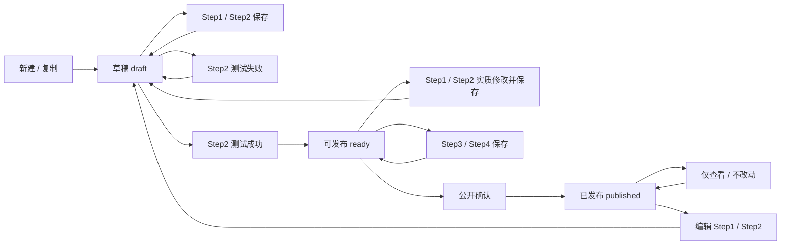
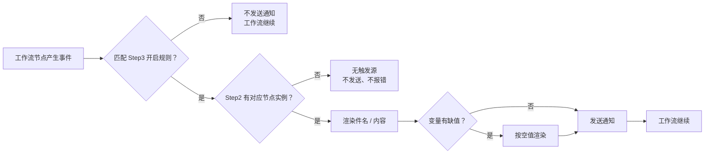
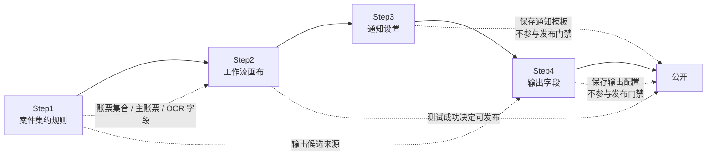

# NeosAI 日本保险 IDP 工作流配置 — 产品需求文档（PRD）

## 第 6 章｜功能详细说明

### 6.01 业务场景设置

#### 6.01.1 概述

四步向导：Step1 案件集约规则，Step2 工作流画布，Step3 通知设置，Step4 输出字段与发布。新建、编辑已发布、复制场景共用流程。案件场景只展示一个主状态，不展示分步状态。各步骤保存只写草稿配置；只有发布生成正式版本号。

#### 6.01.2 功能点

1. 场景列表：新建、复制、重命名、删除、关键词检索；复制后进入 Step1 继续编辑。
2. Step1：配置名称、说明、账票集合（1～20）、主账票与主字段、关联账票字段关系；支持关联检查与 AI 自动关联。
3. Step2：进入工作流画布；画布读取 Step1 账票与关系，限制节点可选范围。工具栏提供工作流测试；测试结论不阻断进入 Step3/Step4，但测试通过是发布条件。
4. Step3：配置全局通知规则模板。每条规则选择対象节点、触发事件、通知对象、件名、内容和可插入变量；页面不展示触发表达式。处理节点按节点专属 `Status / Result` 自动判断；人工确认按完成、补件、案件终止三出口事件触发。
5. Step4：从 OCR 抽出账票类型中勾选要导出的字段（允许 0）。点保存固化勾选；0 字段也可以保存，表示用户确认本场景不导出 OCR 字段。
6. 发布：场景须为可发布。可发布只由 Step2 工作流测试成功决定；Step3、Step4 只是保存通知和输出配置，不参与发布门禁。发布时生成新版本号；新案件只读取已发布版本。

#### 6.01.3 页面与入口

| 场景      | 菜单/入口            | 角色                  |
| ------- | ---------------- | ------------------- |
| 场景列表    | 业务规则配置 / 业务场景设置  | 系统管理员、业务规则配置人员、只读人员 |
| Step1～4 | 场景详情 / 各步骤       | 系统管理员、业务规则配置人员      |
| 工作流画布   | Step2 / ワークフロー設定 | 同上                  |

#### 6.01.4 按钮与启用条件

| 按钮   | 界面文案（日语）    | 适用场景    | 启用条件                        | 点击后                                                         |
| ---- | ----------- | ------- | --------------------------- | ----------------------------------------------------------- |
| 新建   | ＋ 業務シーン追加   | 场景列表    | 有编辑权限                       | 创建草稿并进入 Step1                                               |
| 复制   | コピー         | 场景列表菜单  | 有编辑权限                       | 生成草稿副本并进入 Step1                                             |
| 重命名  | 名称変更        | 场景列表菜单  | 有编辑权限                       | 修改显示名称                                                      |
| 删除   | 削除          | 场景列表菜单  | 有编辑权限                       | 删除场景及本地配置                                                   |
| 关联检查 | 関連チェック      | Step1   | 已选主账票且有关联账票                 | 只检查是否存在未和主账票连上的关联账票                                         |
| 添加账票 | + 帳票追加      | Step1   | 有编辑权限                       | 打开账票类型选择                                                    |
| 自动关联 | AI 自動関連付け   | Step1   | 关联账票不少于 2 件                 | 自动生成字段关联                                                    |
| 下一步  | 保存して次へ / 次へ | Step1→2 | 当前步无阻断错误                    | 进入 Step2                                                    |
| 清空   | リセット        | Step2   | 已进入 Step2                   | 删除开始节点以外的所有工作流节点和连线；测试结论置为未测试；场景回草稿                         |
| 下一步  | 次へ          | Step2→3 | Step2 当前配置可保存               | 保存 Step2 当前状态后进入 Step3 通知设置；测试未通过时仍可进入，但场景保持草稿且不可发布         |
| 上一步  | 前へ          | Step2/3 | 始终可用                        | 返回上一步                                                       |
| 测试   | テスト / テスト実行 | Step2   | 画布有节点                       | 打开测试弹窗并执行工作流测试；测试结论用于判断是否可发布                                |
| 打开画布 | ワークフロー設定    | Step2   | 有查看权限                       | 进入工作流画布                                                     |
| 通知设置 | 通知設定        | Step3   | 始终可用                        | 按全局対象节点和触发事件追加通知规则；规则开启时运行时匹配触发                             |
| 选择字段 | 出力項目を設定     | Step4   | 画布已配置 OCR 抽出时有候选；否则保留两栏配置布局 | 侧栏选 OCR 账票类型，右侧勾选抽出字段；无候选时侧栏和预览区为空，仅提示「出力可能な項目がありません」；允许全不选 |
| 保存   | 保存          | Step3   | 已进入 Step3                   | 保存当前通知配置，停留在 Step3                                          |
| 保存   | 保存          | Step4   | 已进入 Step4                   | 固化当前勾选（允许 0 字段）；不生成版本号                                      |
| 发布   | 公開          | Step4   | 场景状态为可发布                    | 生成新版本号并标记已发布                                                |

#### 6.01.5 字段与参数规格

| 字段/参数       | 控件      | 必填 | 数据来源与枚举                    | 校验与转换                                                                                     | 下游消费             |
| ----------- | ------- | -- | -------------------------- | ----------------------------------------------------------------------------------------- | ---------------- |
| 业务场景 ID     | 只读      | 是  | 系统生成                       | 保存后生成                                                                                     | 上传、案件集约、工作流实例    |
| 业务场景名称      | 文本      | 是  | 用户输入                       | 1～64 字符；租户内唯一                                                                             | 上传、场景列表、画布       |
| 业务场景说明      | 多行      | 否  | 用户输入                       | 最长 256 字符                                                                                 | 场景列表             |
| 场景状态        | 只读标签    | 是  | 草稿、可发布、已发布                 | 草稿=存在未发布草稿或 Step2 测试未通过；可发布=Step2 工作流测试成功；已发布=最新保存态已发布成版本                                 | Step1～4 工具栏、上传过滤 |
| 账票类型        | 多选      | 是  | 账票类型设置                     | 1～20；被后续步骤引用时不可删除                                                                         | 画布、案件集约          |
| 主账票 / 主字段   | 单选      | 是  | 已选账票及 OCR 字段               | 主账票唯一；字段类型从账票类型设置读取                                                                       | 案件集约             |
| 关联账票字段关系    | 下拉组     | 是  | 关联账票 OCR 字段                | 按帐票对配置；同一账票类型存在多种版式时，每种版式配置一个条件组，并按 A、B、C 顺序标识；每个条件组至少 1 条字段关系；组内固定按 AND 判断；组间统一选择 AND 或 OR；字段不存在或为空时，该条字段关系及所属条件组不成立；字段类型从账票类型设置读取 | 案件集约             |
| Step3 通知配置  | 表单      | 否  | 全局対象ノード和トリガーイベント           | 每条规则包含対象ノード、トリガーイベント、通知对象、件名、内容、启用状态；允许同一対象ノード、同一トリガーイベント、同一通知对象保存多条规则；关闭规则不触发            | 运行时内置通知触发        |
| Step4 是否已保存 | 系统内部    | 是  | 已保存 / 未保存                  | 点「保存」记为已保存；改勾选后变未保存；允许保存 0 字段；无 OCR 候选时也可保存空输出设置                                          | 配置保存记录；不影响发布     |
| 输出字段        | 勾选 + 排序 | 否  | Step2 OCR 抽出账票类型及其抽出字段、表格列 | 普通字段与表格分区展示；普通字段区按字段行展示，表格区按表格分块展示，多表格时每个表格一块；每块都只勾选要导出的 OCR 字段/表格列；允许 0 项；不提供导出格式/输出目标配置 | 导出               |

场景状态触发条件：

| 显示状态 | 实现取值        | 触发条件                                                                | 按钮影响                                    |
| ---- | ----------- | ------------------------------------------------------------------- | --------------------------------------- |
| 草稿   | `draft`     | 新建/复制后；Step2 测试未通过或被 Step1/Step2 实质修改作废；旧 `pending_review` 读档时回退为草稿 | 允许保存；允许进入 Step3/Step4；Step2 测试未通过时不允许发布 |
| 可发布  | `ready`     | Step2 工作流测试成功                                                       | 允许发布；允许继续编辑；编辑 Step1/Step2 后回草稿         |
| 已发布  | `published` | 用户在可发布状态点击发布并通过确认，系统生成版本号                                           | 发布按钮置灰；新案件读取该已发布版本；再次编辑时从已发布版本派生草稿      |

业务场景状态转换图：



保存与版本号：每一步保存只保存草稿配置，不生成版本号。Step1 保存只保存场景基础与集约规则；Step2 保存只保存画布、节点、连线和变量引用；Step3 保存只保存通知配置；Step4 保存只保存输出配置。发布读取 Step1～Step4 当前已保存草稿，生成一个新的正式版本号。

每一步状态变更：

| 动作         | 保存内容             | 测试结论                     | 场景主状态 | 说明                                 |
| ---------- | ---------------- | ------------------------ | ----- | ---------------------------------- |
| 新建/复制场景    | 初始化草稿            | 未测试                      | 草稿    | 不生成版本号                             |
| Step1 保存成功 | 场景基础、账票集合、关联规则   | 若 Step1 有实质变更则置为未测试      | 草稿    | 不覆盖 Step2～Step4 已保存内容；若破坏后续引用则阻断保存 |
| Step2 保存成功 | 画布、节点、连线、变量引用    | 若画布有实质变更则置为未测试           | 草稿    | 不阻断进入 Step3；未测试或测试失败时不可发布          |
| Step2 测试成功 | 不改变配置，只写测试结论     | 成功                       | 可发布   | Step3/Step4 保存状态不影响可发布判断           |
| Step2 测试失败 | 不改变配置，只写测试结论     | 失败                       | 草稿    | 可继续进入 Step3/Step4 配置；公开按钮不可用       |
| Step3 保存成功 | 通知规则模板           | 不改变 Step2 测试结论           | 不改变   | 通知规则为空也可保存；有规则时只校验必填字段和变量 token 格式 |
| Step4 保存成功 | 输出字段勾选           | 不改变 Step2 测试结论           | 不改变   | 允许保存 0 个输出字段                       |
| 发布成功       | 读取四步当前已保存草稿并生成版本 | 保留成功结论                   | 已发布   | 生成正式版本号；新案件只读取已发布版本                |
| 已发布后编辑任一步  | 从已发布版本派生草稿       | 若 Step1/Step2 实质变更则置为未测试 | 草稿    | 旧发布版本继续服务正式案件，直到再次发布               |

清空规则：

| 步骤    | 清空对象       | 保留对象                                | 状态影响                              | 说明                           |
| ----- | ---------- | ----------------------------------- | --------------------------------- | ---------------------------- |
| Step1 | 本期不提供清空按钮  | —                                   | —                                 | 避免用户误以为会清空整个 Step1，也避免破坏后续引用 |
| Step2 | 所有工作流节点和连线 | Step1 账票定义、Step3 通知规则、Step4 已保存输出配置 | Step2 测试结论置为未测试；场景回草稿；Step4 需重新保存 | 清空后画布为空，用户需要重新添加开始节点和后续节点    |
| Step3 | 本期不提供清空按钮  | —                                   | —                                 | 用户可逐条删除通知规则                  |
| Step4 | 本期不提供清空按钮  | —                                   | —                                 | 输出字段可通过取消勾选后保存为 0 项          |

已发布后再编辑：打开已发布场景并修改任一步时，系统从已发布版本派生草稿编辑态。保存后重新打开，继续看到已保存的草稿改动，不需要重新改；正式案件仍使用上一个已发布版本。只有再次通过 Step2 测试并点击发布后，才生成新版本并替换后续新案件使用的版本。

#### 6.01.6 Step1 案件集约规则

Step1 负责业务场景基础信息、关联账票集合、主账票、主字段和账票间字段关系。Step2 的账票候选、OCR 字段候选、条件字段候选和 Step4 的输出候选都从 Step1 派生。

Step1 保存只写场景基础与集约规则，不生成版本号，不执行工作流测试。保存前检查必填项、账票数量上限和后续引用保护；通过后进入 Step2。

Step1 不提供清空按钮，原因是关联账票集合、主账票和业务键可能被 Step2 条件、OCR、AI 检证和 Step4 输出引用。用户需要修改基础信息或案件集约规则时，直接编辑对应字段并保存。

账票间字段关系按帐票对维护。条件组用于兼容同一账票类型的多种版式。不同版式可能提供不同字段，例如新版账票通过二维码提供案件编号，旧版账票没有二维码，只能使用姓名、生年月日等 OCR 抽出字段建立关联。每种版式对应一套独立的关联键方案，并配置为一个条件组。一个帐票对至少包含 1 个条件组，并允许继续添加多组；界面按 A、B、C 顺序标识，超过 Z 后使用 AA、AB。

界面以帐票对照矩阵呈现。账票对使用“左侧账票选择框—双向箭头—右侧账票选择框”的单行结构；不显示外部标题，未选择时通过选择框占位符区分左右两侧。两侧只表示配置列位置，不表示主账票或关联账票角色。条件组相对帐票对向右缩进。每条字段关系同样使用“左字段选择框—双向箭头—右字段选择框”的单行结构；不显示外部标题，未选择时通过占位符区分左右字段。每个条件组内的字段关系固定按 AND 判断，只有组内全部字段关系成立，该条件组才成立。任一参与比较的字段在当前版式中不存在、未抽出或值为空时，该条字段关系不成立；不得把左右两侧同时为空判定为相等。

同一帐票对只允许设置一个统一的组间逻辑 AND 或 OR，开关显示在相邻条件组之间，不支持混合表达。组间 OR 用于多版式兼容：任一版式对应的条件组成立，即可判定该帐票对关联成功。组间 AND 用于业务明确要求多套关联键同时成立的场景：所有条件组都成立，才判定该帐票对关联成功。二维码版与非二维码版属于互斥版式时应选择 OR。

运行时按当前文件实际抽出的字段分别计算各组。系统不要求先配置或识别版式名称，而是以该版式实际存在的字段和值决定哪个条件组能够成立。

关联检查只检查一件事：是否存在没有和主账票连上的关联账票。账票数量、主账票和主字段在添加账票或字段选择时已经校验；关系字段有效性、关系方向、重复关系和后续引用保护不属于关联检查。

| 规则 ID | 检查项       | 通过条件                 | 失败条件 / 处理               |
| ----- | --------- | -------------------- | ----------------------- |
| S1-01 | 关联账票连接主账票 | 每个关联账票至少有 1 条关系连到主账票 | 任一关联账票未连到主账票时，提示未关联账票列表 |

#### 6.01.7 Step2 工作流画布

Step2 负责配置工作流节点、连线、条件表达式、人工确认出口和节点参数。Step2 读取 Step1 的账票集合、主账票、关联关系和 OCR 字段；不能在 Step2 单独新增、删除或重命名账票类别和 OCR 字段。

Step2 提供工作流测试，测试结论是发布门禁，不是进入 Step3 的门禁。测试目标是按配置好的工作流，用系统内置测试样例跑一遍，确认当前工作流能否从开始跑到结束。处理节点按当前配置真实调用；测试不创建正式案件、不写真实待办，不读取、不校验、不渲染 Step3 通知规则，也不发送通知或邮件。测试未通过也允许进入 Step3/Step4 继续配置，但场景保持草稿且不可发布；画布、节点配置、连线或变量引用发生实质变更后，测试结论作废。

Step2 清空删除开始节点以外的所有工作流节点和连线。开始节点是系统固定入口，默认存在，节点面板不提供新增，用户不能单独删除，也不会出现多个开始节点。リセット 会让 Step2 测试结论作废，并提示 Step4 需重新保存。清空后画布仅保留开始节点，用户需要重新添加处理节点、条件节点、人工确认和结束节点后才能测试通过。

| 检查维度 | 检查内容                                                        | 失败处理                     |
| ---- | ----------------------------------------------------------- | ------------------------ |
| 结构   | 结束节点、从固定开始节点到结束的有效路径、孤立节点、回流可终止                             | 测试失败；高亮问题节点或断点；保持草稿且不可发布 |
| 连线   | 输入数量、条件出口、人工确认出口、悬空连线                                       | 测试失败；提示对应连线或出口问题         |
| 节点配置 | 前处理、OCR 抽出、数据映射、AI 检证、人工确认、自定义函数                            | 测试失败；提示缺失配置或非法依赖         |
| 变量引用 | 条件变量、自定义函数输入、删除或改线后的引用                                      | 测试失败；提示失效变量和节点           |
| 字段选择 | 标准字段和 OCR 字段必须选到叶子字段                                        | 测试失败；提示重新选择字段            |
| 测试执行 | 按画布路径真实调用处理节点并生成时间线；人工确认使用测试样例里的人工判断结果选择出口，不创建真实待办、不等待真实审查者 | 任一节点失败即停止本轮测试            |

#### 6.01.8 Step3 通知设置

Step3 负责配置全局通知规则模板，不读取 Step2 画布里的实际节点实例。运行时由工作流节点类型、输出变量和变量取值匹配这里的全局规则；如果 Step2 没有对应节点，则对应规则不会被触发，但配置本身仍可保存。

页面上方是「通知ルール追加」生成器。配置人员先选対象节点，再选节点变量和取值，例如 `ocrStatus = failed` 或 `ocrResult = reviewRequired`。然后选择通知对象，编辑件名和内容。件名和内容上方提供变量插入区，先切换插入目标（件名 / 内容），再从变量下拉中选择要插入的变量。

页面下方是「通知ルール一覧」。每条规则展示 No.、対象ノード（对象节点）、トリガーイベント（触发事件）、通知对象、件名、内容摘要、状态和操作。每条规则可开启、关闭、编辑、删除。点击「編集」打开弹窗编辑器，不回填到页面上方生成器。

| 配置项      | 控件   | 必填 | 规则                                                                                                                            |
| -------- | ---- | -- | ----------------------------------------------------------------------------------------------------------------------------- |
| 対象ノード    | 单选下拉 | 是  | 固定为前处理、OCR 抽出、数据映射、AI 检证、人工确认                                                                                                 |
| トリガーイベント | 单选下拉 | 是  | 随対象ノード切换；处理节点展示该节点可触发通知的输出变量及取值，开放 `status=processing/success/failed` 和 `result=passed/reviewRequired`；人工确认按画布三分支开放完成、补件、案件终止 |
| 通知对象     | 多选下拉 | 是  | 可多选；允许同一対象ノード、同一トリガーイベント、同一通知对象保存多条规则                                                                                         |
| 件名       | 文本   | 是  | 支持插入变量                                                                                                                        |
| 内容       | 多行文本 | 是  | 支持插入变量                                                                                                                        |
| 状态       | 开关   | 是  | 开启规则参与运行时匹配；关闭规则保留配置但不触发                                                                                                      |

通知可插入变量：

| 变量来源   | 可插入范围            | 插入格式示例                                        | 说明                                                    |
| ------ | ---------------- | --------------------------------------------- | ----------------------------------------------------- |
| 系统变量   | 案件 ID            | `{caseId}`                                    | 运行时由通知引擎注入                                            |
| 节点输出变量 | 可配置通知节点的标准输出变量定义 | `{ocrStatus}`、`{verifyResult}`、`{hitlStatus}` | Step3 为全局模板页，不读取 Step2 当前画布；运行时有对应节点输出时填值，没有值时按缺值规则处理 |

通知变量选择器规则：

1. 变量插入只影响件名和内容，不允许用户配置触发表达式。
2. トリガーイベント只决定什么时候发送通知，不限制件名/内容可插入的变量范围。
3. 变量选择器展示系统变量 `caseId` 和固定节点类型的标准输出变量定义，不展示文件变量 `files[]`，不读取 Step2 当前画布，也不随画布节点增删动态变化。
4. 保存时只校验变量 token 格式，不校验变量是否属于当前トリガーイベント，也不校验 Step2 当前画布是否存在対象ノード。
5. 运行时若某变量在具体案件路径中没有值，按空值渲染；不阻断工作流。

内置触发事件：

| 対象ノード  | 可选トリガーイベント                                                                                | 说明                     |
| ------ | ----------------------------------------------------------------------------------------- | ---------------------- |
| 前处理    | `preprocessStatus = processing/success/failed`；`preprocessResult = passed/reviewRequired` | 直接选择前处理节点输出变量的具体取值     |
| OCR 抽出 | `ocrStatus = processing/success/failed`；`ocrResult = passed/reviewRequired`               | 直接选择 OCR 抽出节点输出变量的具体取值 |
| 数据映射   | `mappingStatus = processing/success/failed`；`mappingResult = passed/reviewRequired`       | 直接选择数据映射节点输出变量的具体取值    |
| AI 检证  | `verifyStatus = processing/success/failed`；`verifyResult = passed/reviewRequired`         | 直接选择 AI 检证节点输出变量的具体取值  |
| 人工确认   | 完成；补件；案件终止                                                                                | 人工确认按画布三分支触发           |

校验规则：

| 规则 ID | 检查项      | 通过条件                                          | 失败条件 / 处理                           |
| ----- | -------- | --------------------------------------------- | ----------------------------------- |
| S3-01 | 进入 Step3 | Step2 当前配置可保存                                 | 测试未完成或失败不阻断进入；仅在 Step3 顶部提示当前场景不可发布 |
| S3-02 | 可配置节点    | 対象ノード在固定列表内                                   | 不允许选择开始、结束、条件、自定义函数                 |
| S3-03 | 必填字段     | 启用规则必须填写対象ノード、トリガーイベント、通知对象、件名、内容             | 缺任一必填项时提示补齐                         |
| S3-04 | 变量插入     | 件名和内容可插入系统变量和固定节点输出定义变量；不允许插入文件变量；变量不改变触发条件   | 变量 token 格式非法时阻断保存并提示变量名            |
| S3-05 | 画布依赖     | Step3 不读取 Step2 当前画布节点实例；通知规则可先作为全局模板保存       | 不因 Step2 没有対象ノード而阻断保存               |
| S3-06 | 内置触发     | 页面不展示自由表达式；处理节点从対象ノード输出变量的可选取值中选择；人工确认从三分支中选择 | 不允许用户手写触发条件                         |

保存与运行时：

| 动作       | 规则                                                          |
| -------- | ----------------------------------------------------------- |
| 保存       | 通知规则为空时允许保存；有规则时只执行必填字段和变量 token 格式校验                       |
| 次へ       | 先保存 Step3 通知配置；保存成功后进入 Step4                                |
| 运行时匹配    | 工作流节点触发事件时，用节点类型和事件匹配开启规则；命中多条则全部发送；没有命中规则则不发通知，不影响工作流继续    |
| 対象ノード不存在 | 如果 Step3 配了某节点通知，但 Step2 画布没有该节点，运行时没有触发源；该规则不发送、不报错、不影响工作流 |
| 变量缺值     | 如果件名或内容插入的变量在本次案件路径中没有产生值，按空值渲染；通知日志记录缺值变量名，不阻断发送和工作流       |

通知运行时匹配图：



#### 6.01.9 Step4 输出字段与发布

Step4 负责配置导出字段和发布。侧栏展示 Step2 OCR 抽出已开启的账票类型；右侧按「普通字段」和「表格」分区展示。普通字段区是一张字段表；表格区按 OCR 表格分块展示，多表格时每个表格一块。普通字段表和每个表格块的列名一致，固定为字段、OCR 抽出样例、照合结果样例；普通字段行可在普通字段区内拖动排序，表格列行可在所属表格块内拖动排序。只有勾选和排序是配置项；OCR 抽出列和照合结果列都是样例预览，用于帮助配置人员判断字段含义，不作为独立导出配置。允许 0 个字段，表示用户确认本场景不导出 OCR 字段。

Step4 没有测试。点击「保存」固化当前勾选并记为已保存；保存不改写 Step1～Step3，也不重验工作流。公开时只检查场景主状态是否为可发布；发布成功后生成新版本号并标记已发布。

| 规则 ID | 检查项      | 通过条件                                                                                                  | 失败条件 / 处理                                                   |
| ----- | -------- | ----------------------------------------------------------------------------------------------------- | ----------------------------------------------------------- |
| S4-01 | 进入 Step4 | 点击 Step3「次へ」或从步骤条进入                                                                                   | Step3 通知配置未保存不阻断进入                                          |
| S4-02 | 候选来源     | 侧栏仅展示 Step2 OCR 抽出已开启账票类型；右侧普通字段与表格分区展示；普通字段表和每个表格块都使用字段、OCR 抽出样例、照合结果样例三列；普通字段区和各表格块分别支持拖动排序；允许 0 勾选 | 无 OCR 候选时保留 Step4 两栏布局，侧栏和预览区无项目，仅提示「出力可能な項目がありません」；不因此阻断保存 |
| S4-03 | 保存       | 用户点保存即固化当前勾选并记为已保存                                                                                    | 保存失败时保持未保存                                                  |
| S4-04 | 公开       | 主状态为可发布                                                                                               | 未满足时提示完成 Step2 工作流测试；Step4 是否保存不阻断发布                        |

#### 6.01.10 步骤跳转、引用保护与联动

Step1 提供关联检查；Step2 提供工作流测试，并作为发布门禁。Step3 没有测试，只保存通知配置；Step4 没有测试，只保存输出勾选。Step2 测试未通过也可以进入 Step3/Step4 继续配置，但不能发布。终了结构与到达在 Step2 测试内检查。公开时：须处于可发布主状态。

四步依赖图：



步骤跳转与依赖总表：

| 从     | 到     | 跳转条件           | 依赖关系                                        |
| ----- | ----- | -------------- | ------------------------------------------- |
| Step1 | Step2 | 当前 Step1 无阻断错误 | Step2 读取 Step1 的账票集合、主账票、关联关系和 OCR 字段       |
| Step2 | Step3 | Step2 当前配置可保存  | Step2 的测试结论不阻断进入 Step3；画布实质变更后测试结论会失效，并影响发布 |
| Step3 | Step4 | 点击「次へ」或已保存后继续  | Step3 保存的是通知规则模板；Step4 读取 Step2 OCR 抽出候选    |
| Step4 | 公開    | 场景状态为可发布       | 发布时读取 Step1/Step2/Step3/Step4 的最终保存态并生成新版本号 |

状态依赖总表：

| 改动来源     | 影响                                                        |
| -------- | --------------------------------------------------------- |
| Step1 改动 | 会影响 Step2 画布和 Step4 输出候选；破坏性改动时阻断保存                       |
| Step2 改动 | 会使 Step2 测试结论失效；若删除或改线导致 Step4 已引用字段失效，保存时阻断              |
| Step3 改动 | 仅影响通知配置本身；不重置 Step2 测试结论；未保存或保存校验失败不改变主状态，发布时读取上一次已保存通知配置 |
| Step4 改动 | 仅影响输出设置；不重置 Step2 测试结论；不影响主状态是否可发布                        |

四步之间允许来回跳转。Step1 的关联账票集合、OCR 字段和字段类型是 Step2 的账票/字段范围来源；Step2 不单独维护账票类别、OCR 字段和字段类型。前处理目标账票、OCR 节点账票行、条件节点中的账票字段、条件运算子、AI 检证账票上下文，都从 Step1 派生。用户不能直接做会破坏后续引用的修改；系统在保存当前步骤前检查后续步骤引用关系，如果存在引用，阻断本次修改，并提示用户先到后续步骤解除引用。

| 改动来源                   | 如果后续没有引用                                            | 如果后续已有引用                                                    | 用户提示 / 处理                                |
| ---------------------- | --------------------------------------------------- | ----------------------------------------------------------- | ---------------------------------------- |
| Step1 新增关联账票类型         | 允许；Step2/Step4 候选项增加；Step2 工作流测试结论置为未测试，Step4 需重新保存 | 不影响既有引用，允许保存                                                | 保存成功；提示「ワークフローと出力設定を再テストしてください」          |
| Step1 删除关联账票类型         | 允许；对应候选项从 Step2/Step4 消失                            | 阻断删除：该账票被前处理目标账票、OCR 节点账票开关、条件账票字段、AI 检证账票上下文或 Step4 输出字段引用 | 「この帳票は後続ステップで使用されています。参照を解除してから削除してください」 |
| Step1 修改主账票或主字段        | 允许；关联检查结论清空；Step2 工作流测试结论置为未测试，Step4 需重新保存          | 阻断修改：主账票或主字段被案件集约关系、条件 OCR 字段、人工确认确认内容或 Step4 输出字段引用        | 「主帳票または業務キーが後続ステップで使用されています」             |
| Step1 删除、改名或改类型 OCR 字段 | 允许；Step2 条件字段候选、字段运算子和 Step4 输出字段候选更新               | 阻断修改：该字段被条件节点、AI 检证规则或 Step4 输出字段引用                         | 「このOCRフィールドは後続ステップで使用されています」             |
| Step1 修改账票字段关系         | 允许；关联检查结论清空；Step2 工作流测试结论置为未测试，Step4 需重新保存          | 若被 Step2 条件或人工确认确认内容依赖，阻断修改；否则允许并置测试未测试                     | 提示受影响节点名；用户先解除引用再保存                      |
| Step2 删除节点             | 允许；变量池和 Step4 候选项重算                                 | 阻断删除：节点输出被后续条件、人工确认确认内容或 Step4 输出字段引用                       | 「このノードの出力は後続ステップで使用されています」               |
| Step2 删除连线或改线          | 允许；可达变量池重算；Step2 工作流测试结论置为未测试                       | 阻断修改：会导致后续条件或人工确认上游类型校验失效                                   | 提示受影响变量和节点；用户先解除引用再改线                    |
| Step2 修改节点配置           | 允许；变量池重算；Step2 工作流测试结论置为未测试                         | 如果会移除已被引用的变量或改变人工确认合法上游，阻断保存；其他配置允许保存并置测试未测试                | 提示受影响引用；非破坏性配置保存成功                       |
| Step2 修改条件表达式          | 允许；分支路径和测试结论重算                                      | 如果改动会使已连接分支不可达结束节点，阻断保存                                     | 「分岐先が終了ノードに到達できません」                      |
| Step3 修改通知配置           | 允许；不影响 Step2                                        | 若模板插入变量无效，保存时提示移除引用                                         | 不重置 Step2 测试结论                           |
| Step4 增删输出字段           | 允许；不影响 Step2                                        | 允许；允许 0 字段；点保存固化                                            | 不重置 Step2 测试结论；不影响发布                     |
| Step4 修改显示名或排序         | 允许；不影响 Step2                                        | 本期不以显示名/格式为门禁；改后需再保存                                        | 不重置 Step2 测试结论；不影响发布                     |

引用检查范围：

| 被改项目         | 后续引用位置                                              |
| ------------ | --------------------------------------------------- |
| Step1 关联账票类型 | 前处理目标账票、OCR 节点账票开关、AI 检证账票上下文、条件账票字段、Step4 OCR 输出字段 |
| Step1 OCR 字段 | 条件节点左值、条件运算子、AI 检证规则、Step4 输出字段                     |
| Step2 节点     | 后续节点变量引用、条件左值、Step4 工作流结果字段                         |
| Step2 连线     | 变量可达性、人工确认最近上游类型、结束节点可达性                            |
| 标准字段         | 条件节点左值、Step4 标准字段输出                                 |

状态联动规则：

| 场景            | 规则                                                                                 |
| ------------- | ---------------------------------------------------------------------------------- |
| 非破坏性 Step1 改动 | 保存成功；相对进入前有实际变更时场景状态置为草稿、测试结论作废、Step4 需重新保存；无变更时状态与测试结论保持不变；Step2/Step3/Step4 配置保留 |
| 破坏性 Step1 改动  | 保存阻断；不修改现有 Step1 配置；后续步骤不变                                                         |
| 非破坏性 Step2 改动 | 画布有实质修改时场景状态置为草稿、测试结论作废、Step4 需重新保存；从 Step3/Step4 仅回退浏览无修改时状态保持                    |
| 破坏性 Step2 改动  | 保存阻断；不修改现有画布；Step3/Step4 不变                                                        |
| Step3 改通知     | 保存通知配置；不重置 Step2 测试结论；场景可发布状态保持（若仍满足 Step2）                                        |
| Step4 改勾选     | 改后须再点保存才固化输出配置；不重置 Step2 测试结论；场景可发布状态保持（若仍满足 Step2）                                |
| Step4 保存成功    | 记为已保存；不影响公开按钮                                                                      |
| Step4 保存失败    | 保持未保存；不影响公开按钮；场景可发布状态不变                                                            |
| 发布成功          | 场景状态置为已发布；新案件只读取已发布版本                                                              |
| 复制场景          | 复制后保留三步配置，场景状态为草稿；不再展示「要確認」引用检查横幅                                                  |
| 读档重算状态        | 非已发布场景按「测试成功」重算可发布/草稿，清掉旧 ready 残留                                                 |

#### 6.01.11 列表展示

Step1～4 顶部工具栏在场景名后同步展示同一状态徽章（下書き / 公開可能 / 公開済み）。状态按草稿、可发布、已发布三类展示。列表工具栏关键词检索，占位「業務シーン名で検索」。无数据时展示空状态；无权限隐藏新建。

#### 6.01.12 异常与边界

| 场景           | 条件                    | 用户提示 / 处理                                                  |
| ------------ | --------------------- | ---------------------------------------------------------- |
| 未完成 Step2 测试 | Step4 点公开时测试未成功       | 「Workflow テストを完了してください」；阻断发布，不阻断进入 Step3/Step4             |
| 测试失败         | Step2 测试中无终了、分支不可达终了等 | 在测试结果/时间线中提示对应文案（如「終了ノードを1件以上配置してください」）；不在次へ另做一层校验         |
| 名称为空         | 保存或发布未填名称             | 「業務シーン名を入力してください」                                          |
| 名称重复         | 同租户同名                 | 「同じ業務シーン名が既に存在します」                                         |
| 未选账票         | Step1 无关联账票           | 「関連帳票を1件以上追加してください」                                        |
| 无主账票/主字段     | 未指定                   | 「主帳票を1件選択してください」/「業務キーを選択してください」                           |
| 主账票未关联       | 有账票未挂到主账票             | 「主帳票に未関連の帳票があります：{列表}」                                     |
| 关系缺失         | 帐票对没有条件组，或条件组内没有字段关系 | 「この帳票間関連のフィールドを追加してください」                                   |
| 工作流未配置       | 画布无节点                 | 「ワークフローノードを設定してください」                                       |
| 无可选输出字段      | Step4 无 OCR 抽出候选      | 保留 Step4 配置布局；侧栏和预览区无项目，仅提示「出力可能な項目がありません」；允许保存空输出设置；不影响发布 |
| 输出未保存        | 有 OCR 候选但未点保存就公开      | 允许发布；发布读取上一次已保存的输出配置，若从未保存则按空输出处理                          |
| 发布确认         | 点击发布                  | 标题「業務シーンを公開しますか？」；按钮「公開」「キャンセル」                            |
| 并发保存         | 草稿已被他人更新              | 「設定が更新されています。再読み込みしてからもう一度お試しください」                         |

***

### 6.02 工作流画布与可编排节点

#### 6.02.1 概述

画布只编排案件集约完成之后的处理段；不编排上传、案件集约、导出。节点规则在账票类型、数据映射、AI 检证等设置页维护，画布配置外壳、开关、引用与分支。

- 各节点变量统一说明出力、消费路径、允许取值和可用运算符。
- 配置端「出力変数」不提供折叠按钮；列表行只显示裸变量键 + 类型；点圆形 i 查看变量显示名和取值范围。i 气泡标签用日文（変数名 / 取値範囲 / 例），不展示长说明；`files[]` 只附 1 条短 JSON 示例。所有节点都直接平铺展示，不再显示案件/文件/账票类型分组标题。
- 画布节点不再展示配置摘要行；节点卡片只显示类型名（条件/人工确认额外显示分支结构）。

#### 6.02.2 功能点

1. 画布编辑：添加/插入/连接/删除节点与连线、自动整列；逻辑变更置测试为未测试。节点标题固定为类型名。
2. 节点选择器：业务 Agent（前处理、OCR、映射、检证）、控制（条件、人工确认）、扩展（自定义函数）、端点（开始、结束）。
3. 节点编辑面板：按类型展示参数；底部「出力変数」不折叠，只读展示变量键 + 类型；变量显示名、取值范围、`files[]` 短示例在 i 中。映射、检证仅跳转设置页。
4. 变量引用：条件仅选可达上游变量；自定义函数通过「入力変数」追加入参，变量选择器与条件节点一致，并额外允许选择开始节点输出变量。会破坏既有引用的保存阻断，发布前仍发现不可达引用时发布阻断。
5. 分支：条件 IF/ELIF/ELSE；人工确认三出口（完成/补件/案件终止），审查者选出口即路由。
6. 人工确认：默认模板提供 3 个人工确认，分别接在前处理条件、OCR 条件、AI 检证条件的「要确认」分支之后；完成出口回到对应后续主流程，补件出口只允许回流到补件后的再处理入口，案件终止出口只在画布上展示，不开放连接。校验时穿透条件节点检查最近上游处理节点是否为前处理、OCR 抽出或 AI 检证。
7. 工作流测试：用内置集约完成测试样例按当前画布跑一遍；同时检查工作流结构、节点配置、变量引用和路径可达性。测试不跑上传/集约，不创建正式案件，不生成真实人工待办，不发送真实通知；OCR、AI 检证、数据映射、自定义 JavaScript 等处理节点按当前配置真实调用。测试成功后允许发布；测试失败不阻断进入 Step3/Step4，但阻断发布。
8. Step1 派生范围：Step2 的账票类别和 OCR 字段只来自 Step1 关联账票集合；Step2 不能新增、删除或重命名账票类别和 OCR 字段。
9. 说明图标统一为圆形 i。

#### 6.02.3 页面与入口

| 场景     | 菜单/入口          | 角色                  |
| ------ | -------------- | ------------------- |
| 工作流画布  | 业务场景设置 / Step2 | 系统管理员、业务规则配置人员、只读人员 |
| 节点编辑面板 | 画布右侧           | 配置人员                |
| 测试弹窗   | 画布 / テスト       | 配置人员                |

#### 6.02.4 按钮与启用条件

| 按钮        | 界面文案（日语）     | 适用场景      | 启用条件            | 点击后                                              |
| --------- | ------------ | --------- | --------------- | ------------------------------------------------ |
| 添加节点      | ノードを追加       | 画布工具栏/连接点 | 有编辑权限           | 打开选择器                                            |
| 插入节点      | ここにノードを挿入    | 连线        | 类型兼容            | 插入并重连                                            |
| 删除节点/连线   | 削除 / この接続を削除 | 选中项       | 有编辑权限；选中项不是开始节点 | 删除选中节点及相关连线；开始节点不能单独删除；删除后置未测试                   |
| 撤销        | 元に戻す         | 左下角工具栏    | 当前会话存在上一条画布编辑历史 | 回到上一条画布编辑历史状态                                    |
| 取消撤销      | やり直し         | 左下角工具栏    | 已执行撤销且存在后一条历史   | 回到后一条画布编辑历史状态                                    |
| 变更历史      | 変更履歴         | 左下角工具栏    | 当前会话存在画布编辑历史    | 展示当前打开页面期间的画布编辑历史，可选择恢复到某一条历史状态                  |
| 自动整理并全体表示 | 整列して全体表示     | 画布        | 存在节点            | 按左到右层级重布局，自动疏散节点以保留连线曲率空间，重算连线路径，然后调整视口让画布内容完整显示 |
| 保存        | 保存           | 画布        | 有编辑权限           | 保存节点与连线                                          |
| 测试 / 执行测试 | テスト / テスト実行  | 测试弹窗      | 画布有节点           | 执行工作流可执行性检查                                      |
| 定位错误      | エラー箇所へ移動     | 测试时间线     | 存在失败节点          | 高亮画布节点                                           |
| 前へ        | 前へ           | 向导        | 始终可用            | 返回上一步                                            |
| 次へ        | 次へ           | Step2     | Step2 当前配置可保存   | 保存 Step2 并进入 Step3；测试未完成或失败时保留草稿状态               |
| 公開        | 公開           | Step4     | 场景可发布           | 发布确认后标记已发布                                       |

画布底部保留两个快捷工具栏：左下角为撤销、取消撤销、变更历史；右下角为添加节点、自动整理并全体表示、缩小、放大。撤销历史只在当前页面打开期间保留，刷新页面或切换场景后重新初始化。

撤销与取消撤销的操作粒度：

| 类型     | 日文文案     | 包含操作                                               |
| ------ | -------- | -------------------------------------------------- |
| 节点结构编辑 | ノード構成を変更 | 添加节点、插入节点、删除节点                                     |
| 连线编辑   | 接続を変更    | 添加连线、删除连线、修改连接目标                                   |
| 节点位置编辑 | ノード位置を変更 | 拖动节点位置、自动整理并全体表示、交换节点位置                            |
| 不进入历史  | 无        | 条件分支、右侧节点参数配置、保存、测试、步骤跳转、打开/关闭面板、缩放、适配画面、选择节点、查看历史 |

撤销、取消撤销和变更历史只反映 Step2 画布操作，恢复范围是画布节点、连线和节点位置；不恢复条件分支、右侧节点参数配置、Step1 账票关系、Step3 通知规则、Step4 输出字段配置。只要执行了进入历史的画布编辑操作，Step2 测试结论置为未测试，场景回草稿；撤销回旧画布状态也不自动恢复原来的测试通过结论。

#### 6.02.5 节点面板字段与参数

| 节点/字段     | 控件     | 必填     | 数据来源与枚举                                             | 校验与转换                                              | 保存结果与消费方                                                                                       |
| --------- | ------ | ------ | --------------------------------------------------- | -------------------------------------------------- | ---------------------------------------------------------------------------------------------- |
| 开始节点      | 只读说明   | 否      | 系统固定入口                                              | 不保存配置；节点面板不提供新增；单独选中时不显示删除按钮；Step2 リセット 后仍保留一个开始节点 | 运行时由引擎注入 `caseId`、`files[]`；不进入条件变量池                                                           |
| AI 前处理能力  | 开关+多选  | 至少一项   | 画像旋转/补正/分割/排序；目标账票来自 Step1 关联账票集合                   | 全关阻断保存                                             | 保存为前处理节点配置；运行时输出 `preprocessStatus`、`preprocessResult`；条件节点和 Step3 通知可消费这两个输出变量                |
| OCR 抽出开关  | 开关列表   | 至少一项   | Step1 关联账票集合                                        | 关闭账票仅分类                                            | 保存为 OCR 节点目标账票配置；运行时输出 `ocrStatus`、`ocrResult`；Step4 输出字段候选来自已配置 OCR 抽出的账票字段                   |
| 数据映射跳转    | 跳转链接   | 否      | 数据映射设置页                                             | 面板不编映射规则                                           | 节点面板只保存引用关系；映射规则在数据映射设置页维护；运行时输出 `mappingStatus`、`mappingResult` 和标准字段结果，供条件、Step3 通知、Step4 使用 |
| AI 检证模块   | 开关列表   | 至少一项   | 六项检证模块                                              | 至少开启一项                                             | 保存为 AI 检证节点配置；运行时输出 `verifyStatus`、`verifyResult`、逐条规则结果；条件节点和 Step3 通知消费状态/结果，人工确认页读取规则明细     |
| 条件变量/分支   | 级联+表达式 | 条件节点必填 | 可达上游变量；标准字段和 OCR 字段必须选到叶子                           | ELSE 无表达式                                          | 只保存分支表达式和连线出口；条件节点不输出变量，不进入 Step3 通知対象ノード                                                      |
| 审查角色      | 下拉     | 人工确认必填 | 担当者、操作员、操作管理者                                       | —                                                  | 保存为人工确认待办指派规则；运行时生成待办并输出 `hitlStatus`；完成、补件、案件终止由人工提交事件表达，Step3 通知也按这三类事件触发                    |
| 自定义函数输入参数 | 弹窗+列表  | 按用户添加  | 用户添加的输入参数；变量选择器与条件节点一致，并额外允许开始节点 `caseId`、`files[]` | 参数名唯一；Source 不可选后续节点                               | 保存为 JavaScript 节点入参映射；代码内用自定义变量名读取入参；返回值只进执行日志或本节点调试，不进变量池                                     |
| 自定义函数脚本   | 代码编辑器  | 是      | 用户输入 JavaScript                                     | 代码为空阻断保存；运行时异常写执行日志                                | 保存为 JavaScript 节点执行代码；运行时只输出 `codeStatus`，条件节点可消费该状态，Step3 通知不把自定义函数作为対象ノード                    |
| 结束节点      | 只读说明   | 否      | 系统固定终点                                              | 画布不提供出线端口；不能从结束节点发起连接                              | 不保存配置，不输出变量；到达结束仅代表工作流路径结束，案件状态由平台状态机汇聚                                                        |

#### 6.02.6 列表展示

| 区块     | 展示内容                          | 说明                                                                         |
| ------ | ----------------------------- | -------------------------------------------------------------------------- |
| 画布节点   | 类型名（条件/人工确认含分支结构）             | 不展示配置摘要行；节点标题固定为类型名                                                        |
| 连线     | 分支名（条件/人工确认）                  | 默认模板使用固定基准布局：主链横向排列，人工确认旁路放在源节点与汇入节点之间的下方 lane；连线采用平滑曲线，回流才走外侧通道，测试时标注環状パス |
| 出力変数列表 | 所有节点平铺展示；行内裸键 + 类型；右侧 i；标题旁条数 | i：日文标签 + 变量显示名 + 取值范围；`files[]` 另附 1 条短 JSON 示例                            |
| 测试弹窗   | 左：测试样例+节点详情；右：执行时间线           | 孤立/不可达节点不在时间线，画布高亮                                                         |

#### 6.02.7 案件级节点入口校验

数据映射与 AI 检证为案件级节点；引擎调度前校验本案逻辑文件到齐（配置端不展示）。

| 校验项        | 数据映射 | AI 检证 | 说明           |
| ---------- | ---- | ----- | ------------ |
| 集约关联成功     | 是    | 是     | 见总 PRD 文件状态  |
| 文件级确认待办已办结 | 是    | 是     | 前处理/OCR 确认待办 |
| 数据映射已完成    | —    | 路径可达时 | 无映射节点则跳过     |

未通过：节点进度等待，文件状态变更后重试。

#### 6.02.8 工作流测试

Step2 画布用工作流测试证明「当前画布配置能按测试样例跑通」。测试通过是发布门禁，不是进入 Step3 的门禁。测试不是正式跑件，也不是业务测试用例管理：它使用测试样例真实调用处理节点，但不创建正式案件、不生成真实人工待办，不读取、不校验、不渲染 Step3 通知规则，不发送真实通知或邮件，不证明业务规则覆盖所有现实场景。

测试由系统内置测试样例驱动。内置样例是一个「案件已集约完成」的只读快照，用来提供文件、OCR 字段初值、标准字段初值和人工确认预设判断。测试样例不提供启动事件；Step2 测试默认从已集约完成的案件快照开始执行 Workflow。配置人员不能上传、编辑或替换测试样例。

功能点：

1. 配置人员在 Step2 打开测试弹窗，查看内置测试样例和检查范围后执行测试。
2. 系统按「结构与配置校验 →  节点真实调用 → 发布门禁写入」顺序处理；前一层阻断则不进入后一层。结构与配置校验是测试执行前的必要检查，包含开始/结束、连线、节点必填项、变量引用、人工确认上游和出口。
3. 执行路径按测试样例求值后的命中路径生成时间线。条件节点按表达式求值选择分支；OCR、AI 检证、数据映射、自定义 JavaScript 等处理节点按配置真实调用；人工确认节点使用测试样例里的人工判断结果选择完成、补件或案件终止出口，不创建真实待办、不等待真实审查者。任一节点失败立即停止，后续节点保持未执行。
4. 全部规则通过：写测试结论=成功，场景状态置为可发布。
5. 任一失败（含未配置结束、不可达结束）：写测试结论=失败，场景保持草稿（非已发布时），阻断发布。
6. 人工确认节点在测试中先校验审查角色、合法上游和出口连接，再按测试场景预设的人工判断结果选择出口继续执行。正式运行仍须真人确认并由真实确认动作决定出口。

测试处理流：


页面与入口：

| 场景   | 菜单/入口     | 角色   |
| ---- | --------- | ---- |
| 打开测试 | Step2 工具栏 | 配置人员 |
| 执行测试 | 测试弹窗工具栏   | 配置人员 |
| 定位失败 | 执行时间线     | 配置人员 |

按钮与启用条件：

| 按钮     | 界面文案（日语） | 适用场景  | 启用条件        | 点击后                  |
| ------ | -------- | ----- | ----------- | -------------------- |
| 测试     | テスト      | Step2 | 画布有节点       | 打开测试弹窗               |
| 执行测试   | テスト実行    | 测试弹窗  | 弹窗已打开且未在执行中 | 跑一轮校验与测试执行；执行中禁用重复点击 |
| （执行中态） | 実行中…     | 测试弹窗  | 本轮测试进行中     | 仅展示，不可再点             |
| 定位错误   | エラー箇所へ移動 | 测试弹窗  | 本轮存在失败节点    | 画布高亮对应节点并滚入视口        |
| 收起测试样例 | 收起       | 测试弹窗  | 测试样例区已展开    | 折叠左侧测试样例区            |
| 展开测试样例 | 展開       | 测试弹窗  | 测试样例区已收起    | 展开左侧测试样例区            |

内置测试样例：

| 项        | 规则                                                        |
| -------- | --------------------------------------------------------- |
| 样例名称     | 标准集约完成案件；界面文案：標準集約済み案件                                    |
| 样例状态     | 视为已完成案件集约，文件已归属到主账票和关联账票；测试只覆盖 Workflow 段                 |
| 样例内容     | 案件编号、案件标签、文件列表、账票类型、OCR 字段初值、标准字段初值、人工确认预设判断              |
| 文件构成     | 6 个文件：主账票保険金請求書、关联账票診断書、診療明細書/領収書、参考资料その他                 |
| 字段初值     | 氏名、請求金額、診療日、医療機関名、診断名等；作为真实调用 OCR 后的样例输入或节点详情展示初值         |
| 分支驱动     | 条件节点按真实调用后的变量值求值；人工确认节点按样例预设人工判断结果选择完成、补件或案件终止出口          |
| 可编辑性     | 配置人员不能编辑案件编号、文件列表、OCR 字段初值、标准字段初值或人工确认预设判断                |
| Step1 适配 | 测试时把内置样例映射到当前 Step1 账票集合；Step1 未配置必要账票或字段时，按当前配置缺失处理为测试失败 |
| 扩展边界     | 本期不提供上传测试 ZIP、不提供用户自定义测试样例、不保存测试产生的案件实例                   |

怎么测（操作顺序）：

1. 在 Step2 配好画布（至少有开始、结束节点）。
2. 点工具栏测试按钮打开弹窗；左侧展示内置「标准集约完成案件」测试样例和本次检查范围（只读；本期不开放用户上传替换）。
3. 点弹窗内执行测试。右侧执行时间线按测试样例命中路径依次出现状态。
4. 看综合结果与失败节点原因（如有）；失败时可点定位错误跳到画布节点。
5. 失败：按原因改画布/节点配置/Step1 账票后重测。成功且场景已变为可发布：关闭弹窗，可继续配置 Step3/Step4 并公开。失败也可继续配置 Step3/Step4，但公开按钮不可用。

校验项与测试执行顺序（前层失败即停）：

| 顺序 | 维度      | 检查项                 | 日文文案                                                                 | 触发条件                                                             | 失败时立即做什么             |
| -- | ------- | ------------------- | -------------------------------------------------------------------- | ---------------------------------------------------------------- | -------------------- |
| 1  | テスト入力   | 测试样例与 Step1 账票集合一致性 | 用例帳票「{帳票}」が Step1 帳票集合にありません                                         | 内置测试样例包含的非参考资料账票类型，不在 Step1 当前账票集合中                              | 测试失败；提示 Step1 或样例不一致 |
| 2  | 構造      | 结束节点存在              | 終了ノードを1件以上配置してください                                                   | 画布没有结束节点                                                         | 高亮结构问题；测试失败          |
| 2  | 構造      | 固定开始节点可到达结束节点       | 開始ノードから終了ノードへ到達できません                                                 | 固定开始节点存在、结束节点存在，但从开始节点不能到达任一结束节点                                 | 高亮结构问题；测试失败          |
| 2  | 構造      | 分支路径可到达结束节点         | 分岐「{分岐名}」が終了ノードに到達できません                                              | 条件节点或人工确认节点的某条已连接分支，沿下游无法到达结束节点                                  | 高亮对应分支节点；测试失败        |
| 2  | 構造      | 不允许孤立节点             | 接続のない孤立ノードがあります                                                      | 非开始/结束节点既没有入线也没有出线                                               | 高亮孤立节点；测试失败          |
| 2  | 構造      | 不允许不可达节点            | 開始から到達できないノードがあります                                                   | 节点有连接，但从固定开始节点不可达                                                | 高亮不可达节点；测试失败         |
| 2  | 構造      | 回流路径可终止             | 回流により終了ノードへ到達できない経路があります                                             | 画布存在回流，且回流路径无法继续推进到结束节点                                          | 高亮回流问题；测试失败          |
| 3  | 接続      | 主输入数量               | 主入力は1本までです                                                           | 同一个非开始节点存在多条无分支主输入线                                              | 对应节点失败；停止本轮          |
| 3  | 接続      | 条件出口不重复             | 条件出口「{出口}」が重複しています                                                   | 条件节点同一个 IF/ELIF/ELSE 出口连接了多条线                                    | 对应节点失败；停止本轮          |
| 3  | 接続      | ELSE 出口唯一           | ELSE 出口は1本までです                                                       | 条件节点 ELSE 出口连接超过 1 条线                                            | 对应节点失败；停止本轮          |
| 3  | 接続      | 人工确认至少有出口           | 人工確認出口を1本以上接続してください                                                  | 人工确认节点没有任何分支出口连接                                                 | 对应节点失败；停止本轮          |
| 3  | 接続      | 人工确认出口不重复           | 人工確認出口「{出口}」が重複しています                                                 | 人工确认节点同一个出口连接了多条线                                                | 对应节点失败；停止本轮          |
| 3  | 接続      | 案件终止不连线             | 案件終止出口は接続できません                                                       | 人工确认节点的案件终止出口存在连线                                                | 对应节点失败；停止本轮          |
| 3  | 接続      | 补件只回流               | 補件出口は前述ノードへの回流接続のみ可能です                                               | 人工确认节点的补件出口连接到后续节点，或不能形成回流                                       | 对应节点失败；停止本轮          |
| 3  | 接続      | 连线端点存在              | 宙に浮いた接続があります（端点ノードが存在しません）                                           | 连线的起点或终点节点不存在，通常来自旧数据、节点删除后的残留连接                                 | 测试失败；提示残留连接          |
| 4  | ノード設定   | 前处理能力已启用            | 前処理オプションを1件以上有効にしてください                                               | 画布包含前处理节点，但前处理能力没有启用任何选项                                         | 对应节点失败；停止本轮          |
| 4  | ノード設定   | 前处理目标账票有效           | 前処理対象帳票「{帳票}」が Step1 にありません                                          | 前处理目标账票不在 Step1 当前账票集合中                                          | 对应节点失败；停止本轮          |
| 4  | ノード設定   | OCR 目标账票已启用         | OCR 対象帳票を1件以上有効にしてください                                               | 画布包含 OCR 抽出节点，但 OCR 目标账票没有启用                                     | 对应节点失败；停止本轮          |
| 4  | ノード設定   | OCR 目标账票有效          | OCR 対象帳票「{帳票}」が Step1 にありません                                         | OCR 目标账票不在 Step1 当前账票集合中                                         | 对应节点失败；停止本轮          |
| 4  | ノード設定   | 数据映射设置已选择           | データマッピング設定が未選択です                                                     | 数据映射节点没有绑定可用的数据映射设置                                              | 对应节点失败；停止本轮          |
| 4  | ノード設定   | AI 检证模块已启用          | 検証モジュールを1件以上有効にしてください                                                | AI 检证节点没有开启任何检证模块                                                | 对应节点失败；停止本轮          |
| 4  | ノード設定   | 条件分支已设置             | 未設定の条件分岐があります                                                        | 条件节点存在没有条件变量的 IF/ELIF 分支                                         | 对应节点失败；停止本轮          |
| 4  | ノード設定   | 人工确认审查角色已选择         | 審査ロールを選択してください                                                       | 人工确认节点没有选择审查角色                                                   | 对应节点失败；停止本轮          |
| 4  | ノード設定   | 自定义函数脚本已输入          | JavaScript を入力してください                                                 | 自定义函数节点没有输入 JavaScript                                           | 对应节点失败；停止本轮          |
| 5  | 変数参照    | 条件变量可达              | 条件変数「{変数}」が上流から到達できません（改線・削除後の無効参照含む）                                | 条件节点引用了当前节点上游不可达的变量，或节点删除/改线后残留了无效变量引用                           | 对应节点失败；停止本轮          |
| 5  | 変数参照    | 自定义函数入参变量可达         | 関数入力「{変数}」が上流から到達できません（改線・削除後の無効参照含む）                                | 自定义函数入参绑定了当前节点上游不可达的变量                                           | 对应节点失败；停止本轮          |
| 6  | フィールド選択 | 条件左值必须选叶子字段         | 条件左値「{変数}」は容器です。葉項目を選んでください                                          | 条件左值选中了容器变量，如 `files[]`、`standardFields`、`docTypes[]`，没有选到具体叶子字段 | 对应节点失败；停止本轮          |
| 6  | フィールド選択 | 条件左值类型可用于条件         | 条件左値「{変数}」は条件に使えない型です                                                | 条件左值的数据类型为 Array、Date、DateTime，或属于文件容器/结束节点等不可用于条件的变量            | 对应节点失败；停止本轮          |
| 7  | 依存      | 人工确认最近上游类型合法        | {人工確認名}：条件ノードを挟んだ直前上流が前処理・OCR・AI検証のいずれかになるよう接続してください。現在の上流は {上流} です。 | 人工确认节点向上穿透条件节点后，最近上游不是前处理、OCR 抽出、AI 检证之一                         | 对应节点失败；停止本轮          |
| 7  | 依存      | 数据映射上游有前处理或 OCR     | データマッピングの上流に前処理/OCR がありません                                           | 数据映射节点上游没有前处理或 OCR 抽出节点                                          | 对应节点失败；停止本轮          |
| 7  | 依存      | AI 检证上游有 OCR 或前处理结果 | AI検証の上流に OCR/前処理結果がありません                                             | AI 检证节点上游没有 OCR 抽出或前处理节点                                         | 对应节点失败；停止本轮          |
| 8  | テスト実行   | 执行顺序可确定             | 実行順序を決定できません                                                         | 测试执行无法确定起点或可执行顺序；正常画布不会由用户触发，主要作为数据异常兜底                          | 测试失败；停止本轮            |
| 8  | テスト実行   | 路径节点存在              | 実行順序上のノードが存在しません                                                     | 测试路径走到一个不存在的节点 ID，通常来自旧数据或残留连接                                   | 测试失败；停止本轮            |
| 8  | テスト実行   | 条件分支能决策出口           | 条件分岐の出口を決定できません                                                      | 条件节点按测试样例没有命中任何 IF/ELIF，且没有可用 ELSE 出口                            | 对应节点失败；停止本轮          |
| 8  | テスト実行   | 人工确认有可用出口           | 人工確認の出口が接続されていないため、テストを継続できません                                       | 测试路径走到人工确认节点，但没有可用分支出口                                           | 对应节点失败；停止本轮          |
| 8  | テスト実行   | 普通节点有下游出口           | 次のノードへ進む出口がありません                                                     | 普通处理节点执行完成后没有下游出口                                                | 对应节点失败；停止本轮          |
| 8  | テスト実行   | 测试路径到达结束            | 終了ノードへ到達できませんでした                                                     | 测试路径执行结束或超过保护步数后，仍未到达结束节点                                        | 最后执行节点失败；停止本轮        |
| 9  | 公開判定    | 测试成功后更新可发布          | テスト成功。画布状態を公開可能に更新しました                                               | 全部校验与测试执行通过，测试结论写为成功，场景状态变为可发布                                   | 写入测试成功；场景变为可发布       |
| 9  | 公開判定    | 测试失败后保持草稿           | テスト失敗で停止：{原因}                                                        | 某一维度或节点执行失败，本轮停止，场景保持草稿且不可发布                                     | 写入测试失败；保持草稿          |
| 9  | 公開判定    | 测试失败兜底提示            | Workflow テストが失敗しました                                                  | 本轮测试失败但没有更具体的失败原因可展示                                             | 写入测试失败；保持草稿          |

测试不产生：

| 副产物       | 处理方式                                   |
| --------- | -------------------------------------- |
| 正式案件      | 不创建正式案件；测试运行记录独立保存，不进入案件列表             |
| 人工确认待办    | 不创建真实人工待办，不等待真实审查者操作；用测试样例预设人工判断结果继续路由 |
| 通知 / 邮件发送 | 不读取、不校验、不渲染 Step3 通知规则；不发送真实站内信，不发送邮件  |
| 上传 / 案件集约 | 不重新跑上传和案件集约；测试样例视为已完成案件集约              |

弹窗展示：

| 区域      | 展示内容                                | 说明                            |
| ------- | ----------------------------------- | ----------------------------- |
| 左侧测试样例  | 样例名、案件编号、案件标签、文件件数、文件列表、检查范围说明      | 只读；可折叠；文案说明会真实调用处理节点但不产生正式副作用 |
| 左侧节点详情  | 点时间线节点后展示该节点的配置检查结果、执行状态、失败原因（如有）   | 未执行前展示预览，执行后展示本轮结论            |
| 右侧执行时间线 | 按测试样例命中路径的节点顺序；每项有节点名、结果文案、失败原因（如有） | 节点态：成功 / 失败 / 未执行             |
| 综合结果    | 成功、失败、失败（停止）、结束未到达 等                | 失败（停止）= 中途阻断后后面未跑             |
| 画布联动    | 结构问题或失败节点高亮                         | 孤立、不可达节点可不进时间线，但会在画布提示        |

时间线节点状态约定：

| 状态  | 含义                               |
| --- | -------------------------------- |
| 成功  | 该节点配置校验通过，真实调用成功，并在测试路径中可继续向下游流转 |
| 失败  | 该节点配置校验未通过、真实调用失败，或测试路径无法继续      |
| 未执行 | 本轮在更早节点已失败停止，或尚未轮到               |

成功处理：

| 动作     | 系统写入 / 界面效果                                                |
| ------ | ---------------------------------------------------------- |
| 写测试结论  | 测试结论=成功                                                    |
| 更新场景状态 | 当前草稿改为可发布；已发布场景如已派生草稿，则草稿改为可发布。界面文案：テスト成功。画布状態を公開可能に更新しました |
| 可发布判断  | Step2 测试成功后，场景状态为可发布；Step3/Step4 保存状态不参与判断                 |
| 本地保存   | 写入当前场景存储，避免刷新丢结论                                           |

失败处理：

| 失败类型           | 表现                           | 系统写入 / 后续动作                                       |
| -------------- | ---------------------------- | ------------------------------------------------- |
| 无法开始本轮         | 点执行前画布为空等提示                  | 不写成功；保持原测试结论；非已发布时场景保持草稿                          |
| 规则阻断（结构/连线等）   | 时间线对应节点失败，或画布高亮结构问题；综合结果失败   | 阻断发布；允许进入 Step3/Step4 继续配置                        |
| 节点执行失败并停止      | 失败节点标失败原因；其后未执行；综合结果「失败（停止）」 | 同上；界面文案：テスト失敗で停止：{原因}；无具体原因时用 Workflow テストが失敗しました |
| 未到达结束 / 终了结构失败 | 综合结果失败或「结束未到达」；结构错误写入测试结构说明  | 阻断发布；允许进入 Step3/Step4 继续配置                        |
| 用户在未测通时点次へ     | 进入 Step3                     | 保持草稿状态；可提示「Workflow テスト未完了のため公開できません」             |

测试即时停止规则：时间线任一节点判定失败后，立即结束本轮；不继续后续节点、不补跑旁路；已展示的失败原因保留在该节点，并可通过定位错误跳转。

失败后怎么改：按失败维度改画布结构、节点开关、变量引用或 Step1 账票集合，再重新执行测试。画布一经实质修改：测试结论作废为未测试、非已发布场景回草稿；必须重测成功才能再次公开。

与公开的关系：

Step2 测试决定能否发布，不决定能否进入 Step3。正式公开不要求 Step3 通知配置或 Step4 输出设置已保存有效；未保存配置按上一次保存态或空配置处理。

异常与边界：

| 场景       | 用户提示 / 处理                            |
| -------- | ------------------------------------ |
| 执行中重复点击  | 按钮进入执行中态，忽略重复提交                      |
| 测试不写正式数据 | 禁止污染案件列表、待办、站内信                      |
| 人工确认测试   | 使用测试样例预设人工判断结果选择出口；不创建真实待办、不等待真实人工操作 |
| 回流环      | 允许回流，但须仍能到结束；时间线标注环状路径；不可终止则失败       |

***

#### 6.02.10 工作流变量

本节先按消费场景说明变量怎么被使用，再按节点说明配置、校验和输出变量。消费场景固定为：条件、通知、系统、待办。独立通知节点已删除；通知能力内置在 Step3 通知设置。

#### 出力変数展示规则（配置端，对齐画布右侧检视）

选中画布节点后，右侧检视面板底部展示「出力変数」。规则如下：

| 项      | 规则                                                   |
| ------ | ---------------------------------------------------- |
| 出现条件   | 当前为节点检视，且该节点有至少 1 条输出变量；无输出时整块不展示                    |
| 折叠     | 不提供折叠按钮；标题栏界面文案：出力変数；标题旁展示变量条数                       |
| 分组     | 不显示分组标题；所有节点统一平铺                                     |
| 列表行    | 只显示「裸变量键 + 类型」；不显示说明、不显示消费路径列                        |
| 说明入口   | 每行右侧圆形 i；悬停弹出气泡                                      |
| i 气泡内容 | 日文标签；只显示变量显示名、取值范围；`files[]` 只显示 1 条短 JSON 示例；不展示长说明 |
| 文件级    | 仅开始节点列出 `files[]` 一项；其他节点不输出文件变量                     |
| 画布卡片   | 节点卡片不展示出力变量摘要行                                       |

出力変数面板列全量输出，不代表该变量可被条件直接选用；条件选择器另按消费路径过滤。

#### 变量粒度分类

| 粒度      | 定义                              | 典型变量                                                                                                                                                  | 是否可进条件变量池                  | 说明                    |
| ------- | ------------------------------- | ----------------------------------------------------------------------------------------------------------------------------------------------------- | -------------------------- | --------------------- |
| 案件级变量   | 一个案件实例只有一个值，或由多个文件/字段汇聚成一个案件级结论 | `preprocessStatus`、`preprocessResult`、`ocrStatus`、`ocrResult`、`mappingStatus`、`mappingResult`、`verifyStatus`、`verifyResult`、`hitlStatus`、`codeStatus` | 只有消费分类含条件、且来自上游可达节点时可选     | 条件节点主要消费处理状态与处理结果     |
| 文件级变量   | 仅开始节点以 `files[]` 数组承载归属文件信息     | `files[]`                                                                                                                                             | 不可直接选                      | 传给处理节点与人工确认页读取；条件不用数组 |
| 账票字段级变量 | 从 Step1 账票模板字段或标准字段中选到具体叶子字段后生成 | `docTypes.{账票类型}.{OCR字段名}`、`standardFields.{字段名}`                                                                                                     | 按模板字段类型 String / Number 可选 | 字段容器不可选；必须选到叶子字段      |

`files[]` 仅开始节点输出。人工确认页、日志和系统执行仍可读取运行时文件对象，但不作为其他节点的出力变量。

#### 处理状态与处理结果（业务处理节点共用）

前处理、OCR、数据映射、AI 检证统一拆成两个案件级枚举：

| 变量   | 取值               | 白话                               |
| ---- | ---------------- | -------------------------------- |
| 处理状态 | `processing`     | 还在跑                              |
| 处理状态 | `success`        | 跑完了且没系统失败；没东西可处理时也记成功（旧所说的 skip） |
| 处理状态 | `failed`         | 跑挂了（系统/配置/依赖异常）                  |
| 处理结果 | `passed`         | 业务通过，可走主流程                       |
| 处理结果 | `reviewRequired` | 业务要确认，去人工确认                      |

分岔时：先看处理状态有没有挂（`failed`），再看处理结果要不要人看（`reviewRequired`）。

Step3 通知规则模板只消费通知变量白名单里的变量。触发条件由系统按节点事件内置判断，用户只能在件名和内容里插入变量；插入变量不改变触发条件。

内置触发条件：

| 対象ノード  | 可选トリガーイベント                                                                                | 说明                      |
| ------ | ----------------------------------------------------------------------------------------- | ----------------------- |
| 前处理    | `preprocessStatus = processing/success/failed`；`preprocessResult = passed/reviewRequired` | 按前处理节点输出变量的具体取值触发通知     |
| OCR 抽出 | `ocrStatus = processing/success/failed`；`ocrResult = passed/reviewRequired`               | 按 OCR 抽出节点输出变量的具体取值触发通知 |
| 数据映射   | `mappingStatus = processing/success/failed`；`mappingResult = passed/reviewRequired`       | 按数据映射节点输出变量的具体取值触发通知    |
| AI 检证  | `verifyStatus = processing/success/failed`；`verifyResult = passed/reviewRequired`         | 按 AI 检证节点输出变量的具体取值触发通知  |
| 人工确认   | 完成；补件；案件终止                                                                                | 人工确认仍按画布出口分支触发通知        |

人工确认节点不输出 `result` 或 `action` 变量；完成、补件、案件终止三类通知由人工确认出口路由事件触发，不进入条件变量池。自定义函数节点不是 Step3 通知设置的対象ノード。开始节点、结束节点、条件节点不配置通知。

自定义函数节点和人工确认节点只输出各自节点状态键：`hitlStatus` / `codeStatus`，取值同处理状态：`processing / success / failed`。它们不输出 `result`。

#### 变量消费分类

案件状态是平台固定聚合状态，不是 Step2 节点变量。条件节点不能直接选择案件状态。

| 消费分类 | 谁消费              | 可消费变量                                                                              | 不可消费变量                                              | 说明                     |
| ---- | ---------------- | ---------------------------------------------------------------------------------- | --------------------------------------------------- | ---------------------- |
| 条件   | 条件判断节点           | 上游可达、消费分类含条件的变量；标准字段和 Step1 OCR 字段必须选到叶子                                           | 开始节点输出、结束节点输出、`files[]`、Array 容器、Date、DateTime、系统变量 | 只用于 IF / ELIF 分岔       |
| 通知   | Step3 通知规则模板     | `caseId`、可配置通知节点的标准输出变量定义（前处理/OCR 抽出/数据映射/AI 检证的 `Status`/`Result`、人工确认的 `Status`） | `files[]`、触发条件本身、自定义函数脚本返回值                         | 只用于主题和内容插值；缺值按空值渲染并记日志 |
| 系统   | 引擎、日志、状态汇聚、Step4 | 开始 `caseId` / `files[]`                                                            | 不提供给条件                                              | 数据映射不是系统变量来源           |

同一业务事件的推荐写法：

| 场景    | 条件变量                                     | 待办/运行时    |
| ----- | ---------------------------------------- | --------- |
| 结果要确认 | `{node}.case.*Result = reviewRequired`   | 人工确认页展示明细 |
| 节点失败  | `{node}.case.*Status = failed`           | 异常分支或终止   |
| 全部通过  | `*Status = success` 且 `*Result = passed` | 走主流程      |

#### 条件变量规则

条件节点只能选择上游连线可达变量。开始节点、结束节点、条件节点本身都不是条件变量来源。条件节点变量选择器不得出现 Array 容器、Date、DateTime、`files[]`、字段容器 `standardFields`。

账票类型字段不经由开始节点输出，条件选择器直接从 Step1 模板加载 `docTypes.{账票类型}.{OCR字段名}`。Step1 账票模板新增字段类型配置，当前只允许 `string` 与 `number`。OCR 字段和标准字段被条件节点选中时，运算子按用户在模板中配置的字段类型决定；字段容器仍不可选。

条件节点选择 OCR 字段时，不是从变量池里取一个预先存在的单值，而是在运行时按当前案件和上游节点结果解析字段集合。条件节点选择数据映射节点的标准字段时，消费的是数据映射后的一个标准字段值；多来源、多文件和冲突处理由数据映射节点内部完成，条件节点不再比较标准字段来源集合。

字段条件联动流程：

| 序号 | 分类           | 入口                          | 关联类型               | 是否依赖上游执行 | 工作流实例如何执行                                                              | 条件状态限制                                               | 跑通优先级 |
| -- | ------------ | --------------------------- | ------------------ | -------- | ---------------------------------------------------------------------- | ---------------------------------------------------- | ----- |
| 1  | OCR 字段条件     | 条件节点变量选择器 → 账票类型 → OCR 字段叶子 | OCR 抽出结果           | 是        | 执行到条件节点时，从当前案件中该账票类型的 OCR 抽出结果取同名字段；同一账票类型有多份文件时，收集所有匹配文件的该字段值         | 未经过 OCR 抽出的文件没有该字段值；必须选到字段叶子，不能只选账票类型或字段容器           | P1    |
| 2  | 标准字段条件       | 条件节点变量选择器 → 数据映射节点 → 标准字段叶子 | 数据映射结果             | 是        | 执行到条件节点时，从数据映射节点输出的标准字段结果取同名字段；每个标准字段叶子只输出一个映射后值                       | 数据映射节点未执行或未产出该字段时视为缺值；必须选到字段叶子，不能只选 `standardFields` | P1    |
| 3  | 多文件 OCR 字段判断 | 已选择 OCR 字段                  | 字段集合               | 是        | 系统不取第一条、不取最新一条，也不让用户选择第几份文件；先按模板字段类型规整成 String 集合或 Number 集合，再按对应运算子判断 | 当前版本不提供 `any / all` 开关，默认「全部满足」                      | P1    |
| 4  | 字段条件轻量分岔     | 条件节点 IF / ELIF              | String / Number 条件 | 是        | String 字段处理是否为空、是否包含固定关键字、是否等于固定类别；Number 字段处理金额或次数阈值；命中后按条件出口继续执行     | 复杂文本理解、跨字段一致性、证据解释仍由 AI 检证处理                         | P2    |

字段条件按模板字段类型选择运算子。系统先把运行时字段集合规整为同一类型集合，再对集合做判断；当前版本默认采用「全部满足」：

| 字段类型   | 运算子            | 单个值判断       | 集合判断                                             | 典型用途                        |
| ------ | -------------- | ----------- | ------------------------------------------------ | --------------------------- |
| String | `=`            | 字符串完全相等     | 有值集合中每个值都等于右值；没有任何值时为 false                      | 字段必须全部是同一类别或同一代码            |
| String | `≠`            | 字符串不等于      | 有值集合中每个值都不等于右值；没有任何值时为 false                     | 排除某一类别                      |
| String | `contains`     | 字符串包含右值     | 有值集合中每个值都包含右值；没有任何值时为 false                      | 字段文本全部包含关键字                 |
| String | `not contains` | 字符串不包含右值    | 有值集合中每个值都不包含右值；没有任何值时为 false                     | 字段文本全部不包含关键字                |
| String | `is empty`     | 值不存在或去空格后为空 | 没有任何值时为 true；有值集合中每个值都为空时为 true；只要有一个非空值则为 false | 判断字段整体缺失，例如 DNA 字段全为空时转人工确认 |
| String | `is not empty` | 值存在且去空格后非空  | 必须至少有一个值，且有值集合中每个值都非空；没有值或存在空值时为 false           | 只有所有匹配文件都抽到该字段时继续后续处理       |
| Number | `=`            | 数值相等        | 有值集合中每个值都等于右值；没有任何值时为 false                      | 金额或次数必须等于指定值                |
| Number | `≠`            | 数值不等于       | 有值集合中每个值都不等于右值；没有任何值时为 false                     | 排除指定金额或次数                   |
| Number | `>`            | 数值大于右值      | 有值集合中每个值都大于右值；没有任何值时为 false                      | 金额超过阈值时转人工确认                |
| Number | `≥`            | 数值大于等于右值    | 有值集合中每个值都大于等于右值；没有任何值时为 false                    | 金额达到阈值时进入检证                 |
| Number | `<`            | 数值小于右值      | 有值集合中每个值都小于右值；没有任何值时为 false                      | 金额低于阈值时跳过特定处理               |
| Number | `≤`            | 数值小于等于右值    | 有值集合中每个值都小于等于右值；没有任何值时为 false                    | 金额不超过阈值时走主流程                |

字段条件只适合做轻量分岔，例如文本是否为空、文本是否包含固定关键字、文本是否等于固定类别、数值是否超过固定阈值。复杂文本理解、跨字段一致性、证据解释等仍由 AI 检证规则处理；条件节点不承担 AI 检证职责。

条件运算子统一使用英文：

| 类型     | 可用运算子                                                                 | 默认  | 说明                           |
| ------ | --------------------------------------------------------------------- | --- | ---------------------------- |
| Enum   | `=` / `≠`                                                             | `=` | 节点状态、节点结果等枚举字段               |
| String | `=` / `≠` / `contains` / `not contains` / `is empty` / `is not empty` | `=` | 模板字段类型为 string 的 OCR 字段和标准字段 |
| Number | `=` / `≠` / `>` / `≥` / `<` / `≤`                                     | `=` | 模板字段类型为 number 的 OCR 字段和标准字段 |

级联选择与变量生成规则：

| 字段来源            | 选择层级                               | 生成的条件左值                    | 类型              | 运行时取值                                     |
| --------------- | ---------------------------------- | -------------------------- | --------------- | ----------------------------------------- |
| Step1 账票 OCR 字段 | `帳票フィールド` → `{帳票タイプ}` → `{OCR字段名}` | `docTypes.{账票类型}.{OCR字段名}` | String / Number | 从当前案件匹配账票的 OCR 抽出结果聚合；类型来自 Step1 账票模板字段类型 |
| 数据映射标准字段        | `{映射节点}` → `標準フィールド` → `{标准字段名}`   | `standardFields.{标准字段名}`   | String / Number | 从映射节点标准字段结果读取单值；类型来自标准字段模板类型              |
| 字段组容器           | `standardFields`                   | 不生成条件左值                    | —               | 仅作为分组，不作为系统变量输出                           |

条件变量 catalog：

| 来源           | 变量键                        | 类型              | 取值范围                            | 典型条件场景                                 |
| ------------ | -------------------------- | --------------- | ------------------------------- | -------------------------------------- |
| AI 前处理节点     | `preprocessStatus`         | Enum            | `processing / success / failed` | `= failed` → 异常分支                      |
| AI 前处理节点     | `preprocessResult`         | Enum            | `passed / reviewRequired`       | `= reviewRequired` → 前处理确认             |
| OCR 抽出节点     | `ocrStatus`                | Enum            | `processing / success / failed` | `= failed` → 异常分支                      |
| OCR 抽出节点     | `ocrResult`                | Enum            | `passed / reviewRequired`       | `= reviewRequired` → OCR 确认            |
| 数据映射节点       | `mappingStatus`            | Enum            | `processing / success / failed` | `= failed` → 异常分支                      |
| 数据映射节点       | `mappingResult`            | Enum            | `passed / reviewRequired`       | `= reviewRequired` → 人工确认              |
| 数据映射节点       | `standardFields.{field}`   | String / Number | 按模板字段类型的运算子                     | 关键字分岔或金额阈值分岔                           |
| AI 检证节点      | `verifyStatus`             | Enum            | `processing / success / failed` | `= failed` → 异常处理                      |
| AI 检证节点      | `verifyResult`             | Enum            | `passed / reviewRequired`       | `= reviewRequired` → 确认或补件路由           |
| 人工确认节点       | `hitlStatus`               | Enum            | `processing / success / failed` | `= success` → 人工提交完成；`= failed` → 异常分支 |
| 自定义函数节点      | `codeStatus`               | Enum            | `processing / success / failed` | `= failed` → 异常分支                      |
| Step1 账票模板字段 | `docTypes.{账票类型}.{OCR字段名}` | String / Number | 按模板字段类型的运算子                     | String 字段做关键字或空值分岔；Number 字段做金额阈值分岔    |

条件变量选择器展示约定：

1. 一级只显示节点名称或账票类型名称，不展示内部节点标识。
2. 二级只显示裸变量键或字段名，不加节点标识前缀。
3. 运行时引用路径仍保存为内部稳定路径，界面不暴露内部节点标识。

#### 系统变量规则

系统变量用于引擎执行、日志、状态汇聚和 Step4。开始节点只输出 `caseId` 与 `files[]`；结束节点、条件节点和数据映射节点不输出系统变量。

| 来源   | 变量键       | 类型     | 消费方 | 定义         |
| ---- | --------- | ------ | --- | ---------- |
| 开始节点 | `caseId`  | String | 系统  | 工作流实例绑定案件  |
| 开始节点 | `files[]` | Array  | 系统  | 触发时已归属文件数组 |

`files[]` 的每个元素至少包含文件基础 JSON。平台可以追加更多字段，但下列字段名须保持稳定，供自定义函数引用：

```json
[
  {
    "id": "file_001",
    "name": "領収書.pdf",
    "type": "pdf",
    "extension": ".pdf",
    "url": "s3://bucket/case/file_001.pdf",
    "size": 245760,
    "caseId": "CASE-2026-0001",
    "classificationResult": "領収書",
    "status": "Processed",
    "uploadedAt": "2026-07-14T10:00:00+09:00",
    "updatedAt": "2026-07-14T10:01:00+09:00"
  }
]
```

#### 待办变量规则

待办页读取运行时文件与人工确认结果；条件分岔使用处理状态/处理结果，不比较明细数组。

| 来源     | 变量键          | 类型    | 说明                                |
| ------ | ------------ | ----- | --------------------------------- |
| 开始节点   | `files[]`    | Array | 归属文件入口                            |
| 人工确认节点 | `hitlStatus` | Enum  | 人工确认处理状态；出口由画布三分支表达，不输出 action 变量 |

#### 开始节点

节点定位：系统固定入口。案件集约完成时启动 Workflow。零配置，不展示触发事件列表。默认存在，节点面板不能新增第二个开始节点，用户不能单独删除；Step2 リセット 后仍保留一个开始节点。不提供 Step2 条件变量。

配置界面（日语）：

| 区块/控件 | 界面文案（日语）                                       | 说明                   |
| ----- | ---------------------------------------------- | -------------------- |
| 面板标题  | 開始                                             | 右侧检视面板顶栏             |
| 说明    | 案件集約が完了したときに Workflow を開始します。開始ノードに設定項目はありません。 | 无事件列表                |
| 出力変数  | 出力変数                                           | 仅 `caseId`、`files[]` |

输出变量：

| 变量键       | 类型     | 消费分类    | 条件可选 | 定义         |
| --------- | ------ | ------- | ---- | ---------- |
| `caseId`  | String | 系统      | 否    | 案件唯一标识     |
| `files[]` | Array  | 系统 / 待办 | 否    | 触发时已归属文件数组 |

#### 结束节点

节点定位：Step2 画布终点。画布不提供出线端口，不能从结束节点发起连接。零配置，不展示事件或案件状态列表，不输出变量。到达结束时的案件状态汇聚由平台状态机处理，不属于本节点输出。

配置界面（日语）：

| 区块/控件 | 界面文案（日语）                        | 说明       |
| ----- | ------------------------------- | -------- |
| 面板标题  | 終了                              | 右侧检视面板顶栏 |
| 说明    | Workflow の終点です。設定項目と出力変数はありません。 | 无事件/状态列表 |

输出变量：无。

#### AI 前处理节点

节点定位：按配置能力处理文件图像。输出案件级处理状态与处理结果；不输出文件变量。

配置界面（日语）：

| 区块/控件 | 界面文案（日语）                     | 说明       |
| ----- | ---------------------------- | -------- |
| 面板标题  | AI前処理                        | 右侧检视面板顶栏 |
| 区块标题  | 前処理能力                        | 多能力开关    |
| 能力项   | 画像回転 / 画像補正 / 画像分割 / ページ並び替え | 可单独开关    |

校验规则：

| 校验项         | 规则                                                               |
| ----------- | ---------------------------------------------------------------- |
| 至少开启一项能力    | 全关时保存阻断                                                          |
| 无适用文件或 skip | 写 `preprocessStatus=success`（success 含 skip）                     |
| 处理失败        | 写 `preprocessStatus=failed`                                      |
| 结果需人工确认     | 写 `preprocessStatus=success` 且 `preprocessResult=reviewRequired` |
| 业务通过        | 写 `preprocessStatus=success` 且 `preprocessResult=passed`         |

输出变量：

| 变量键                | 类型   | 消费分类 | 取值范围                            | 定义   |
| ------------------ | ---- | ---- | ------------------------------- | ---- |
| `preprocessStatus` | Enum | 条件   | `processing / success / failed` | 处理状态 |
| `preprocessResult` | Enum | 条件   | `passed / reviewRequired`       | 处理结果 |

#### OCR 抽出节点

节点定位：按 Step1 关联账票执行分类与 OCR 字段抽出。输出处理状态与处理结果；不输出文件变量与低置信计数字段。

配置界面（日语）：

| 区块/控件 | 界面文案（日语）      | 说明                       |
| ----- | ------------- | ------------------------ |
| 面板标题  | AI OCR        | 右侧检视面板顶栏                 |
| 区块标题  | OCR抽出設定       | 账票开关列表                   |
| 跳转按钮  | 設定ページへ →      | 打开 OCR 抽出模板设定页（与映射/检证同款） |
| 帐票行   | {帳票タイプ名} + 开关 | Step1 关联账票；关=仅分类保管       |

校验规则：

| 校验项         | 规则                                                 |
| ----------- | -------------------------------------------------- |
| 至少开启一个账票    | 全关时保存阻断                                            |
| 无适用文件或 skip | 写 `ocrStatus=success`                              |
| 存在低置信等要确认   | 写 `ocrStatus=success` 且 `ocrResult=reviewRequired` |
| OCR 服务失败    | 写 `ocrStatus=failed`                               |

输出变量：

| 变量键         | 类型   | 消费分类 | 取值范围                            | 定义   |
| ----------- | ---- | ---- | ------------------------------- | ---- |
| `ocrStatus` | Enum | 条件   | `processing / success / failed` | 处理状态 |
| `ocrResult` | Enum | 条件   | `passed / reviewRequired`       | 处理结果 |

#### 数据映射节点

节点定位：按数据映射设置把 OCR 字段归一到标准字段。画布只引用设置。

配置界面（日语）：

| 区块/控件 | 界面文案（日语） | 说明        |
| ----- | -------- | --------- |
| 面板标题  | データマッピング | 右侧检视面板顶栏  |
| 跳转按钮  | 設定を開く    | 打开数据映射设置页 |

校验规则：

| 校验项         | 规则                                                         |
| ----------- | ---------------------------------------------------------- |
| 引用设置有效      | 映射设置不存在或未发布时发布阻断                                           |
| 无映射规则或 skip | 写 `mappingStatus=success`                                  |
| 映射冲突或要确认    | 写 `mappingStatus=success` 且 `mappingResult=reviewRequired` |
| 规则执行失败      | 写 `mappingStatus=failed`                                   |

输出变量：

| 变量键                      | 类型              | 消费分类 | 取值范围                            | 定义           |
| ------------------------ | --------------- | ---- | ------------------------------- | ------------ |
| `mappingStatus`          | Enum            | 条件   | `processing / success / failed` | 处理状态         |
| `mappingResult`          | Enum            | 条件   | `passed / reviewRequired`       | 处理结果         |
| `standardFields.{field}` | String / Number | 条件   | 按标准字段模板类型的运算子                   | 数据映射后的标准字段单值 |

#### AI 检证节点

节点定位：读取标准字段、OCR 字段、文件和检证配置，输出统一的处理状态与处理结果。不输出 Array 明细变量。

配置界面（日语）：

| 区块/控件 | 界面文案（日语） | 说明          |
| ----- | -------- | ----------- |
| 面板标题  | AI検証     | 右侧检视面板顶栏    |
| 区块标题  | 検証モジュール  | 六项模块开关      |
| 跳转按钮  | 設定を開く    | 打开 AI 检证设置页 |

校验规则：

| 校验项      | 规则                                                     |
| -------- | ------------------------------------------------------ |
| 至少开启一项模块 | 全关时保存阻断；运行时可写 `verifyStatus=success`（含 skip）           |
| 引用设置有效   | 检证设置不存在或未发布时发布阻断                                       |
| 业务通过     | `verifyStatus=success` 且 `verifyResult=passed`         |
| 要确认或缺件   | `verifyStatus=success` 且 `verifyResult=reviewRequired` |
| 节点级异常    | `verifyStatus=failed`                                  |

输出变量：

| 变量键            | 类型   | 消费分类 | 取值范围                            | 定义   |
| -------------- | ---- | ---- | ------------------------------- | ---- |
| `verifyStatus` | Enum | 条件   | `processing / success / failed` | 处理状态 |
| `verifyResult` | Enum | 条件   | `passed / reviewRequired`       | 处理结果 |

#### 人工确认节点

节点定位：固定三出口：完成、补件、案件终止。默认放在对应条件节点的「要确认」分支后；只开放给前处理、OCR 抽出、AI 检证上游，系统校验时可穿透条件节点识别最近上游处理节点。不输出文件变量。

人工确认节点联动流程：

| 序号 | 分类        | 入口                | 关联类型   | 是否生成待办 | 工作流实例如何执行                                                                        | 条件状态限制                                   | 跑通优先级 |
| -- | --------- | ----------------- | ------ | ------ | -------------------------------------------------------------------------------- | ---------------------------------------- | ----- |
| 1  | 进入人工确认    | 条件出口连到人工确认节点      | 人工确认待办 | 是      | 引擎创建人工确认待办，待办对象读取本节点审查角色；写 `hitlStatus=processing`；工作流实例停在该节点等待人工提交              | 人工确认节点必须配置审查角色；上游必须可穿透到前处理、OCR 抽出或 AI 检证 | P1    |
| 2  | 人工选择完成    | 待办页点击完成           | 完成出口   | 否      | 人工提交后写 `hitlStatus=success`；工作流沿完成出口继续执行                                         | 完成出口必须连接到后续处理、条件或结束节点                    | P1    |
| 3  | 人工选择补件    | 待办页点击补件           | 补件出口   | 否      | 人工提交后写 `hitlStatus=success`；工作流沿补件出口回流到补件后的再处理入口；如 Step3 配了补件通知规则，则按人工确认提交事件触发通知 | 补件出口只允许回流连接，不允许继续往后连                     | P1    |
| 4  | 人工选择案件终止  | 待办页点击案件终止         | 案件终止事件 | 否      | 人工提交后写 `hitlStatus=success`，系统直接终止当前工作流实例；如 Step3 配了案件终止通知规则，则按人工确认提交事件触发通知      | 画布上仅展示案件终止出口，不开放连接                       | P1    |
| 5  | 待办创建或提交异常 | 创建待办失败、权限异常、提交失败等 | 节点异常   | 否      | 写 `hitlStatus=failed`；工作流按异常处理规则停止或进入已配置的异常分支                                    | 不由完成、补件、案件终止三分支表达                        | P1    |
| 6  | Step2 测试  | テスト実行             | 测试出口模拟 | 否      | 不创建真实待办，不等待真实审查者；使用测试样例内置的人工判断结果选择完成、补件或案件终止出口                                   | 只验证画布能否跑通，不发送通知，不写正式待办                   | P1    |

人工确认节点本身不判断业务是否要确认。是否进入人工确认，通常由上游处理节点的 `Result=reviewRequired` 或字段条件命中后，经条件节点连线决定。人工确认节点只负责把人工审查结果转换成三条画布出口：完成、补件、案件终止。

正式运行与 Step2 测试不同：正式运行会创建人工待办并等待人工提交；Step2 测试不会创建真实待办，会使用测试样例内置的人工判断结果选择出口，目的是验证画布能否跑通。

配置界面（日语）：

| 区块/控件  | 界面文案（日语）       | 说明       |
| ------ | -------------- | -------- |
| 面板标题   | 人工確認           | 右侧检视面板顶栏 |
| 下拉字段   | 審査ロール          | 审查角色     |
| 画布出口标签 | 完成 / 補件 / 案件終止 | 三分岐      |

出口连接校验：完成可接后续处理、条件或结束；补件只允许接回已在上游路径中出现过的补件后再处理入口；案件终止不开放连线，只作为运行时提交事件和 Step3 通知事件。

输出变量：

| 变量键          | 类型   | 消费分类 | 取值范围                            | 定义                                   |
| ------------ | ---- | ---- | ------------------------------- | ------------------------------------ |
| `hitlStatus` | Enum | 条件   | `processing / success / failed` | 人工确认处理状态；审查动作由完成/补件/案件终止三分支承载，不进入变量池 |

#### 条件判断节点

节点定位：IF / ELIF / ELSE 分支。本身不输出变量。

配置界面（日语）：

| 区块/控件 | 界面文案（日语） | 说明              |
| ----- | -------- | --------------- |
| 面板标题  | IF/ELSE  | 右侧检视面板顶栏        |
| 变量选择  | 変数を選択    | 只显示条件变量 catalog |

典型条件：

| 场景              | 条件式                                                                            |
| --------------- | ------------------------------------------------------------------------------ |
| OCR 要确认         | `{ocr}.case.ocrResult = reviewRequired`                                        |
| AI 检证全部通过       | `{verify}.case.verifyStatus = success` 且 `{verify}.case.verifyResult = passed` |
| 映射要确认           | `{map}.case.mappingResult = reviewRequired`                                    |
| 标准字段关键字         | `{map}.case.standardFields.policyNo contains "A"`                              |
| 标准字段金额阈值        | `{map}.case.standardFields.claimAmount > 100000`                               |
| Step1 账票 OCR 字段 | `docTypes.invoice.claimNo contains "A"`                                        |

输出变量：无。

#### 自定义函数节点

节点定位：用户用 JavaScript 配置文件名生成或文件名变更逻辑。自定义节点变量选择器与条件节点一致，唯一差异是额外允许选择开始节点输出变量。脚本执行后只输出本节点状态 `codeStatus`，取值为 `processing / success / failed`，与其他节点状态变量一致。

入参规则：

「入力変数」弹窗用于声明文件命名脚本会读取哪些上游变量。它不是新建变量池变量，也不是配置出参；参照元变更或删除时，该入参会失效，并在保存、测试或发布校验中提示。

| 作用    | 说明                                                           |
| ----- | ------------------------------------------------------------ |
| 多变量声明 | 文件命名脚本可能同时读取案件 ID、文件列表、账票类型、标准字段、OCR 字段、连番等多项输入，弹窗用于逐条声明这些输入 |
| 代码内别名 | 字段级变量显示名可能是日文；配置人员可把参照元绑定成 JavaScript 里的英文变量名，例如 `policyNo`  |
| 依赖校验  | 平台保存每条入参的参照元路径；上游节点、字段或连线变更导致参照元不可达时，阻断保存、测试或发布              |
| 类型提示  | 参照元选定后只读展示类型，帮助配置人员在 JavaScript 里做字符串、数组或枚举处理                |

1. 右侧 inspector 的「入力変数」区只展示已添加入参列表；点击「追加」打开入参弹窗。
2. 入参弹窗填写变量名，并从 Source 下拉选择一个数据来源；不允许手工选择数据类型。
3. 变量名由配置人员自定义，作为 JavaScript 读取键；同一自定义节点内不可重复。字段级变量的显示名可能是日文，因此允许用英文变量名做代码内参照名。
4. 添加完成后，入参列表展示变量名和绑定 Source；每条支持编辑和删除。
5. Source 选择器展示规则与条件变量一致：一级只显示节点名称或账票类型名称，二级只显示裸变量键或字段名，不展示内部节点标识。下拉列表的叶子变量在变量名右侧只读展示数据类型，例如 String、Enum、Array。
6. 代码内用 `inputs.变量名` 或 `inputs["变量名"]` 读取已定义输入变量；例如变量名为 `claimFiles` 时，用 `inputs.claimFiles` 读取。变量类型由代码自行判断和转换，平台不在入参弹窗里要求选择类型。

入参范围：

| 来源类型     | 可选范围                    | 说明                                       |
| -------- | ----------------------- | ---------------------------------------- |
| 开始节点输出变量 | 开始节点 `caseId`、`files[]` | 自定义节点可额外读取工作流入口案件 ID 和文件列表；条件节点不可选开始节点输出 |
| 条件节点可选变量 | 与条件节点变量选择器一致            | 包含上游可达节点输出、Step1 OCR 字段叶子、标准字段叶子等        |

文件命名参考既有连携批处理规则。典型命名由时间戳、连番、集合编号、案件/请求编号、账票 ID、枝番、OCR 要否等片段组成。时间戳通常由 JavaScript 直接生成；如果业务要求使用扫描时间或上传时间，则从 `files[]` 的文件基础信息读取。

| 规则来源      | 命名结构                                                               | 变量来源说明                                                                   |
| --------- | ------------------------------------------------------------------ | ------------------------------------------------------------------------ |
| 扫描输出文件    | `timestamp_seq_claimNo_requestNo_docId_branchNo.pdf`               | 时间戳由脚本生成或从文件基础信息读取；连番来自文件基础信息或脚本生成；案件/请求编号、账票 ID、枝番来自文件 JSON、OCR 字段或标准字段 |
| OCR 输入/输出 | `timestamp_seq_setNo_claimNo_requestNo_docId_branchNo_ocrFlag.pdf` | 集合编号、OCR 要否来自文件 JSON、账票配置或脚本入参；其余片段同上                                    |
| 元数据/检查文件  | 与 PDF 主文件同名后追加 `_meta.csv`、`_inspection.csv`、`_punch.csv` 等后缀      | 后缀由脚本按输出目标决定；主文件名仍按同一组入参拼接                                               |

配置界面（日语）：

| 区块/控件 | 界面文案（日语）         | 说明                                                    |
| ----- | ---------------- | ----------------------------------------------------- |
| 面板标题  | カスタム関数           | 右侧检视面板顶栏                                              |
| 区块标题  | 入力変数             | 展示已添加入参；点击「追加」打开入参弹窗；添加后 inspector 只展示绑定结果；支持编辑和删除    |
| 弹窗字段  | 変数名              | 自定义变量名；脚本通过该名称读取；同节点内唯一                               |
| 弹窗字段  | 参照元              | 使用与条件节点一致的级联变量选择器；额外允许开始节点输出变量                        |
| 下拉内提示 | 型                | 参照元下拉列表中在叶子变量名右侧展示变量类型；仅提示 JavaScript 怎么取值和转换，不允许用户修改 |
| 区块标题  | JavaScript スクリプト | 代码编辑区；代码通过 `inputs.变量名` 或 `inputs["变量名"]` 使用已添加输入变量   |

校验规则：

| 校验项       | 规则                                                                                |
| --------- | --------------------------------------------------------------------------------- |
| 代码必填      | 空代码保存阻断                                                                           |
| 入参变量名     | 必填；同节点内唯一；只能使用英文字母、数字和下划线，且不能以数字开头                                                |
| 入参类型      | 不在界面配置；JavaScript 自行判断和转换输入值类型                                                    |
| 入参来源      | Source 使用与条件节点一致的变量选择范围，并额外允许开始节点 `caseId`、`files[]`；不允许选择后续节点或不可达变量              |
| 入参 Source | 弹窗保存时必须选择参照元；不允许保存空 Source                                                        |
| 入参取值      | 运行时按 Source 解析入参值；为空值、缺失值或业务兜底逻辑由 JavaScript 自行处理                                 |
| 代码输入固定    | JavaScript 用 `inputs.变量名` 或 `inputs["变量名"]` 读取已定义输入变量                             |
| 文件名返回值    | 文件名变更用途要求返回字符串或 `{ fileId, fileName }` 数组；缺少必要字段、文件名为空或格式非法时写 `codeStatus=failed` |
| 失败原因      | 编译失败、运行异常、超时、返回格式非法时写执行日志，变量池只写 `codeStatus=failed`                               |

脚本示例：文件命名规则

```javascript
const files = inputs.files || [];

const safe = (value, fallback = "") =>
  String(value ?? fallback)
    .trim()
    .replace(/[\/:*?"<>|\s]+/g, "_");

const timestamp = new Date().toISOString().slice(2, 19).replace(/[-T:]/g, "");
const setNo = safe(inputs.setNo, "001");
const claimNo = safe(inputs.claimNo, inputs.caseId || "00000000-000");
const requestNo = safe(inputs.requestNo, "00000000-000-000");
const docId = safe(inputs.docId, "UNKNOWN");
const branchNo = safe(inputs.branchNo, "00");
const ocrFlag = safe(inputs.ocrFlag, "1");

return files.map((file, index) => {
  const seq = safe(file.sequenceNo, String(index + 1).padStart(4, "0"));
  const ext = file.extension || ".pdf";

  return {
    fileId: file.id,
    fileName:
      `${timestamp}_${seq}_${setNo}_${claimNo}_${requestNo}_${docId}_${branchNo}_${ocrFlag}${ext}`
  };
});
```

输出变量（配置端不折叠；行内仅变量键+类型；i 只显示变量显示名和取值范围）：

| 变量键          | 类型   | 消费分类 | 取值范围                            | 定义              |
| ------------ | ---- | ---- | ------------------------------- | --------------- |
| `codeStatus` | Enum | 条件   | `processing / success / failed` | JavaScript 处理状态 |
