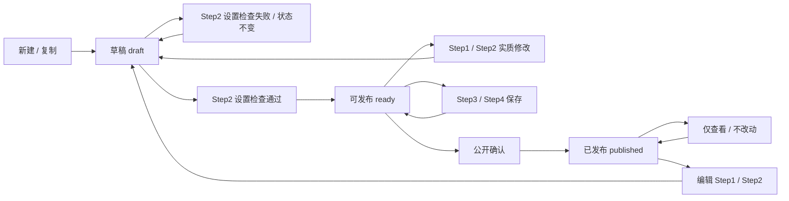
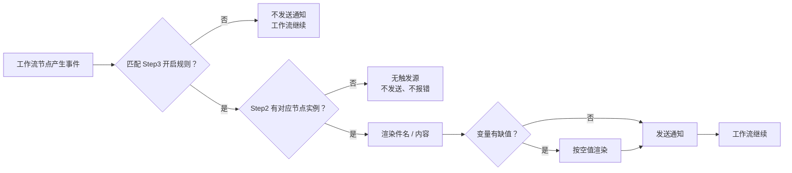
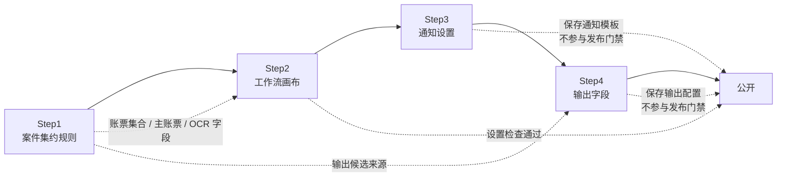

# NeosAI 日本保险 IDP 工作流配置 — 产品需求文档（PRD）

## 第 6 章｜功能详细说明

### 6.01 业务场景设置

<ins class="change-added">蓝色为新增</ins>，<mark class="change-modified">橙色为修改</mark>，<del class="change-deleted">红色删除线为废弃规则</del>。

#### 6.01.1 概述

四步向导：Step1 案件集约规则，Step2 工作流画布，Step3 通知设置，Step4 输出字段与发布。新建、编辑已发布、复制场景共用流程。案件场景只展示一个主状态，不展示分步状态。各步骤保存只写草稿配置；只有发布生成正式版本号。

#### 6.01.2 功能点

1. 场景列表：新建、复制、重命名、删除、关键词检索；复制后进入 Step1 继续编辑。
2. Step1：配置名称、说明、账票集合（1～20）、主账票与主字段、关联账票字段关系；支持关联检查与 AI 自动关联。AI 根据当前场景配置动态生成关联规则，不使用固定推荐数据。
3. Step2：进入工作流画布；画布读取 Step1 账票与关系，限制节点可选范围。<mark class="change-modified">独立的设置检查执行静态配置校验；不读取测试样例、不调用节点。</mark>
4. Step3：配置全局通知规则模板。每条规则选择対象节点、触发事件、通知对象、件名、内容和可插入变量；页面不展示触发表达式。处理节点按节点专属 `Status / Result` 自动判断；人工确认按完了、补件、案件中止三出口事件触发。
5. Step4：从 OCR 抽出账票类型中勾选要导出的字段（允许 0）。点保存固化勾选；0 字段也可以保存，表示用户确认本场景不导出 OCR 字段。
6. 发布：<mark class="change-modified">Step2 设置检查通过后，场景变为可发布。</mark>Step3、Step4 只保存通知和输出配置，不参与发布门禁。<ins class="change-added">Step4 点击公开时若不是可发布状态则自动执行同一检查；检查通过后显示确认弹窗，确认后生成新版本号；</ins>新案件只读取已发布版本。

<del class="change-deleted">废弃：Step2 使用内置样例真实执行工作流，测试成功后才允许发布。</del>

#### 6.01.3 页面与入口

| 场景      | 菜单/入口            | 角色                  |
| ------- | ---------------- | ------------------- |
| 场景列表    | 业务规则配置 / 业务场景设置  | 系统管理员、业务规则配置人员、只读人员 |
| Step1～4 | 场景详情 / 各步骤       | 系统管理员、业务规则配置人员      |
| 工作流画布   | Step2 / ワークフロー設定 | 同上                  |

#### 6.01.4 按钮与启用条件

| 按钮   | 界面文案（日语）    | 适用场景    | 启用条件                        | 点击后                                                         |
| ---- | ----------- | ------- | --------------------------- | ----------------------------------------------------------- |
| 新建   | ＋ 業務シーン追加   | 场景列表    | 有编辑权限                       | 创建草稿并进入 Step1                                               |
| 复制   | コピー         | 场景列表菜单  | 有编辑权限                       | 生成草稿副本并进入 Step1                                             |
| 重命名  | 名称変更        | 场景列表菜单  | 有编辑权限                       | 修改显示名称                                                      |
| 删除   | 削除          | 场景列表菜单  | 有编辑权限                       | 删除场景及本地配置                                                   |
| 变更历史 | 変更履歴        | 场景列表菜单  | 场景已存在                       | 切换到该场景的 Step2，并打开当前页面会话内的画布变更历史                           |
| 关联检查 | 関連チェック      | Step1   | 已选主账票且有关联账票                 | 只检查是否存在未和主账票连上的关联账票                                         |
| 添加账票 | + 帳票追加      | Step1   | 有编辑权限                       | 打开账票类型选择                                                    |
| 自动关联 | AI 自動関連付け   | Step1   | 已选择至少 2 类账票且当前没有生成任务         | 读取当前业务场景、主账票、主字段及全部账票抽出字段后调用 AI；成功时用生成结果整体替换当前关联规则，失败时保留当前规则并提示原因 |
| 下一步  | 次へ          | Step1→2 | 所有账票均可直接或间接到达主账票              | 校验并保存 Step1；存在未连通账票时提示并停留在 Step1                           |
| 保存   | 保存          | Step1   | 有编辑权限                       | 保存当前草稿并停留在 Step1；不执行 Step1 业务校验                              |
| 清空   | リセット        | <mark class="change-modified">Step2 左下角工具栏</mark> | 有编辑权限                       | <mark class="change-modified">位于变更历史右侧；弹窗确认后删除开始节点以外的所有工作流节点和连线，场景回草稿</mark>                         |
| <ins class="change-added">设置检查</ins> | <ins class="change-added">設定チェック</ins>     | Step2   | 有编辑权限                       | <mark class="change-modified">先保存当前草稿，再执行静态配置校验；失败时提示首条错误并定位节点，成功时更新为可发布</mark>                           |
| 下一步  | 次へ          | Step2→3 | <mark class="change-modified">始终可用</mark>                       | <mark class="change-modified">进入 Step3 通知设置，不执行设置检查</mark>                                      |
| 上一步  | 前へ          | Step2/3 | 始终可用                        | 返回上一步                                                       |
| 打开画布 | ワークフロー設定    | Step2   | 有查看权限                       | 进入工作流画布                                                     |
| 通知设置 | 通知設定        | Step3   | 始终可用                        | 按全局対象节点和触发事件追加通知规则；规则开启时运行时匹配触发                             |
| 选择字段 | 出力項目を設定     | Step4   | 画布已配置 OCR 抽出时有候选；否则保留两栏配置布局 | 侧栏选 OCR 账票类型，右侧勾选抽出字段；无候选时侧栏和预览区为空，仅提示「出力可能な項目がありません」；允许全不选 |
| 保存   | 保存          | Step3   | 已进入 Step3                   | 保存当前通知配置，停留在 Step3                                          |
| 保存   | 保存          | Step4   | 已进入 Step4                   | 固化当前勾选（允许 0 字段）；不生成版本号                                      |
| 发布   | 公開          | Step4   | <mark class="change-modified">始终可点击</mark>                       | <ins class="change-added">非可发布状态先执行 Step2 设置检查；失败时提示并跳转 Step2，成功时显示公开确认</ins>                  |

#### 6.01.5 字段与参数规格

| 字段/参数       | 控件      | 必填 | 数据来源与枚举                    | 校验与转换                                                                                     | 下游消费             |
| ----------- | ------- | -- | -------------------------- | ----------------------------------------------------------------------------------------- | ---------------- |
| 业务场景 ID     | 只读      | 是  | 系统生成                       | 保存后生成                                                                                     | 上传、案件集约、工作流实例    |
| 业务场景名称      | 文本      | 是  | 用户输入                       | 1～64 字符；租户内唯一                                                                             | 上传、场景列表、画布       |
| 业务场景说明      | 多行      | 否  | 用户输入                       | 最长 256 字符                                                                                 | 场景列表             |
| 场景状态        | 只读标签    | 是  | 草稿、可发布、已发布                 | <mark class="change-modified">草稿=新建、复制或 Step1/Step2 有实质变更；可发布=Step2 设置检查通过；已发布=当前查看正式版本</mark>                                 | Step1～4 工具栏、上传过滤 |
| 账票类型        | 多选      | 是  | 账票类型设置                     | 1～20；被后续步骤引用时不可删除                                                                         | 画布、案件集约          |
| 主账票 / 主字段   | 单选      | 是  | 已选账票及 OCR 字段               | 主账票唯一；字段类型从账票类型设置读取                                                                       | 案件集约             |
| 关联账票字段关系    | 下拉组     | 是  | 关联账票 OCR 字段                | 按帐票对配置；每套可独立成立的关联方案配置一个 Group，并按 A、B、C 顺序标识；每个 Group 至少 1 条完整字段关系；组内固定按 AND 判断，组间固定按 OR 判断；同一账票对内不得重复配置相同的左右字段关系；字段类型从账票类型设置读取 | 案件集约             |
| Step3 通知配置  | 表单      | 否  | 全局対象ノード和トリガーイベント           | 每条规则包含対象ノード、トリガーイベント、通知对象、件名、内容、启用状态；允许同一対象ノード、同一トリガーイベント、同一通知对象保存多条规则；关闭规则不触发            | 运行时内置通知触发        |
| Step4 是否已保存 | 系统内部    | 是  | 已保存 / 未保存                  | 点「保存」记为已保存；改勾选后变未保存；允许保存 0 字段；无 OCR 候选时也可保存空输出设置                                          | 配置保存记录；不影响发布     |
| 输出字段        | 勾选 + 排序 | 否  | Step2 OCR 抽出账票类型及其抽出字段、表格列 | 普通字段与表格分区展示；普通字段区按字段行展示，表格区按表格分块展示，多表格时每个表格一块；每块都只勾选要导出的 OCR 字段/表格列；允许 0 项；不提供导出格式/输出目标配置 | 导出               |

场景状态触发条件：

| 显示状态 | 实现取值        | 触发条件                                                                | 按钮影响                                    |
| ---- | ----------- | ------------------------------------------------------------------- | --------------------------------------- |
| 草稿   | `draft`     | <mark class="change-modified">新建/复制后；Step1/Step2 存在实质变更；旧 `pending_review` 读档时回退为草稿</mark> | <mark class="change-modified">Step2 设置检查通过前不可公开</mark>                         |
| 可发布  | `ready`     | <mark class="change-modified">Step2 设置检查通过</mark>                                                 | 可公开；允许继续编辑；编辑 Step1/Step2 后回草稿          |
| 已发布  | `published` | 用户在可发布状态点击发布并通过确认，系统生成版本号                                           | 发布按钮置灰；新案件读取该已发布版本；再次编辑时从已发布版本派生草稿      |

业务场景状态转换图：


```mermaid
flowchart LR
  newScene["新建 / 复制"] --> draft["草稿 draft"]
  draft --> checkFail["Step2 设置检查失败 / 状态不变"]
  checkFail --> draft
  draft --> checkSuccess["Step2 设置检查通过"]
  checkSuccess --> ready["可发布 ready"]
  ready --> edit12["Step1 / Step2 实质修改"]
  edit12 --> draft
  ready --> save34["Step3 / Step4 保存"]
  save34 --> ready
  ready --> publish["公开确认"]
  publish --> published["已发布 published"]
  published --> viewOnly["仅查看 / 不改动"]
  viewOnly --> published
  published --> editPublished["编辑 Step1 / Step2"]
  editPublished --> draft
```

保存与版本号：每一步保存只保存草稿配置，不生成版本号。Step1 保存只保存场景基础与集约规则；Step2 保存只保存画布、节点、连线和变量引用；Step3 保存只保存通知配置；Step4 保存只保存输出配置。发布读取 Step1～Step4 当前已保存草稿，生成一个新的正式版本号。

每一步状态变更：

| 动作         | 保存内容             | 场景主状态 | 说明                                 |
| ---------- | ---------------- | ----- | ---------------------------------- |
| 新建/复制场景    | 初始化草稿            | 草稿    | 不生成版本号                             |
| Step1 保存成功 | 场景基础、账票集合、关联规则   | 草稿    | 不覆盖 Step2～Step4 已保存内容；允许暂存未完成配置       |
| Step2 保存成功 | 画布、节点、连线、变量引用    | <mark class="change-modified">不改变</mark>   | <mark class="change-modified">只保存当前草稿，不执行设置检查</mark>                 |
| <ins class="change-added">Step2 设置检查通过</ins> | 当前画布配置          | 可发布   | <ins class="change-added">执行静态配置校验并更新状态</ins>                    |
| Step3 保存成功 | 通知规则模板           | 不改变   | 通知规则为空也可保存；有规则时只校验必填字段和变量 token 格式 |
| Step4 保存成功 | 输出字段勾选           | 不改变   | 允许保存 0 个输出字段                       |
| 发布成功       | 读取四步当前已保存草稿并生成版本 | 已发布   | 生成正式版本号；新案件只读取已发布版本                |
| 切回草稿并编辑    | 保留已发布版本，编辑当前草稿    | 草稿    | 旧发布版本继续服务正式案件，直到再次发布               |

清空规则：

| 步骤    | 清空对象       | 保留对象                                | 状态影响                              | 说明                           |
| ----- | ---------- | ----------------------------------- | --------------------------------- | ---------------------------- |
| Step1 | 本期不提供清空按钮  | —                                   | —                                 | 避免用户误以为会清空整个 Step1，也避免破坏后续引用 |
| Step2 | 开始节点以外的所有工作流节点和全部连线 | 固定开始节点、Step1 账票定义、Step3 通知规则、Step4 已保存输出配置 | 场景回草稿；Step4 需重新保存 | 清空后画布仅保留一个固定开始节点；用户不能删除或再次添加开始节点 |
| Step3 | 本期不提供清空按钮  | —                                   | —                                 | 用户可逐条删除通知规则                  |
| Step4 | 本期不提供清空按钮  | —                                   | —                                 | 输出字段可通过取消勾选后保存为 0 项          |

<ins class="change-added">已发布后再编辑：刷新或重新进入场景时默认展示可编辑的「現在の下書き」；正式案件仍使用标记为「適用中」的最新发布版本。用户从版本履历选择最新发布版本后进入只读查看；切回「現在の下書き」后恢复编辑。草稿再次通过 Step2 设置检查、再确认公开后，生成新版本并替换后续新案件使用的版本。</ins>

#### 6.01.6 Step1 案件集约规则

Step1 负责业务场景基础信息、关联账票集合、主账票、主字段和账票间字段关系。Step2 的账票候选、OCR 字段候选、条件字段候选和 Step4 的输出候选都从 Step1 派生。

Step1「保存」只写场景基础与集约规则，不生成版本号，不执行业务校验，并停留在 Step1。「次へ」检查必填项、账票数量上限、账票关系网络与后续引用保护；每个账票均可直接或间接到达主账票时，保存并进入 Step2。

Step1 不提供清空按钮，原因是关联账票集合、主账票和业务键可能被 Step2 条件、OCR、AI 检证和 Step4 输出引用。用户需要修改基础信息或案件集约规则时，直接编辑对应字段并保存。

关联预览中的账票默认折叠，仅展示已参与关联关系的字段；未配置字段关系的账票只展示账票标题。点击账票标题可展开全部字段，再次点击恢复折叠。字段关系使用无箭头直线连接两侧具体字段，不表示方向和优先级。

账票间字段关系按帐票对维护。每个 Group 表示一套可独立成立的字段关联方案。一个帐票对至少包含 1 个 Group，并允许继续添加多组；界面按 A、B、C 顺序标识，超过 Z 后使用 AA、AB。A、B、C 只用于界面区分，不表示优先级或执行顺序。

界面以帐票对照矩阵呈现。账票对使用“左侧账票选择框—双向箭头—右侧账票选择框”的单行结构；不显示外部标题，未选择时通过选择框占位符区分左右两侧。两侧只表示配置列位置，不表示主账票或关联账票角色。条件组相对帐票对向右缩进。每条字段关系同样使用“左字段选择框—双向箭头—右字段选择框”的单行结构；不显示外部标题，未选择时通过占位符区分左右字段。每个条件组内的字段关系固定按 AND 判断，只有组内全部字段关系成立，该条件组才匹配成功。同一账票对内，完全相同的左右字段关系只能配置一次，不得在同一 Group 或不同 Group 中重复。

同一帐票对的组间逻辑固定为 OR。每个 Group 独立判断，任一 Group 匹配成功即表示该文件对的字段规则匹配成功；多个 Group 同时匹配成功时仍只产生一条文件对关联。界面在相邻 Group 之间显示只读 OR 标记，并在每个 Group 标题旁显示「グループ内：AND」。

Group 内多条字段关系固定按 AND 判断，只有全部关系成立，该 Group 才匹配成功。每条关系的左右字段均须完整选择；任一侧字段值为空或左右值不相等时，该关系不成立；左右两侧同时为空不得判定为相等。同一账票对内，完全相同的左右字段关系只能配置一次，不得在同一 Group 或不同 Group 中重复；同一字段可以参与不同的字段关系。系统不限制 Group 的字段组合或 Group 之间的包含关系。

AI 自动关联同时评估主账票与关联账票、关联账票与关联账票，不设置账票对优先级。生成结果须使所有已选账票形成连通关系，每个账票至少参与一条关联，但不要求任意两个账票都直接关联。每个账票对只生成 1 个 Group，不自动生成 OR 备用 Group；组内存在多个字段关系时固定按 AND。字段按业务语义和区分度选择，字段名可以不同；涉及主账票时，主字段可作为候选。金额、日期、医疗机构名、诊断名和地址只作为辅助字段。AI 只能返回当前 Step1 已选账票及其抽出字段；返回非法账票、非法字段、重复账票对或空关系时，本次生成失败且不覆盖现有规则。

关联检查只检查一件事：是否存在无法通过账票间关系最终到达主账票的关联账票。系统将账票间关系视为无向图，从主账票开始遍历；关联账票可以直接连接主账票，也可以先连接其他关联账票后间接到达主账票。只有与主账票所在关系网络完全断开的账票才判定为未关联。账票数量、主账票和主字段在添加账票或字段选择时已经校验；关系字段有效性、关系方向、重复关系和后续引用保护不属于关联检查。

| 规则 ID | 检查项       | 通过条件                 | 失败条件 / 处理               |
| ----- | --------- | -------------------- | ----------------------- |
| S1-01 | 关联账票可达主账票 | 每个关联账票均可通过一条或多条账票间关系最终到达主账票 | 任一关联账票无法到达主账票时，提示该账票列表 |

#### 6.01.7 Step2 工作流画布

Step2 负责配置工作流节点、连线、条件表达式、人工确认出口和节点参数。Step2 读取 Step1 的账票集合、主账票、关联关系和 OCR 字段；不能在 Step2 单独新增、删除或重命名账票类别和 OCR 字段。

<mark class="change-modified">Step2 不提供样例测试入口，提供独立的设置检查。设置检查执行静态配置校验，检查结构、连线、节点必填项、变量引用、字段选择和节点依赖；不读取 Mock 样例、不求值条件路径、不真实调用节点。检查失败时提示首条错误；错误对应节点时选中并定位该节点。保存、下一步和步骤条跳转不触发该检查。</mark>

<del class="change-deleted">废弃：Step2 测试弹窗使用系统内置案件样例，真实调用处理节点并按命中路径生成执行时间线。</del>

Step2 清空删除开始节点以外的所有工作流节点和连线。开始节点是系统固定入口，默认存在，节点面板不提供新增，用户不能单独删除，也不会出现多个开始节点。<mark class="change-modified">リセット 后场景回到草稿。清空后画布仅保留开始节点，用户需要重新添加处理节点、条件节点、人工确认和结束节点，并重新通过设置检查后才能公开。</mark>

| 检查维度 | 检查内容                                                        | 失败处理                     |
| ---- | ----------------------------------------------------------- | ------------------------ |
| 结构   | 结束节点、从固定开始节点到结束的有效路径、分支可达结束、孤立或不可达节点、回流可终止                 | 设置检查失败；提示首条原因并定位节点；状态不变；仍可全局保存或步骤跳转 |
| 连线   | <mark class="change-modified">同一节点仅允许一条普通输入连线、条件出口、人工确认出口；案件中止不连线；补件出口必须连接前序节点并回流；禁止悬空连线</mark> | 同上 |
| 节点配置 | AI 前处理、OCR 抽出、数据映射、AI 检证、条件、人工确认、自定义 JavaScript 的必填配置及 Step1 账票范围 | 同上     |
| 变量引用 | 条件变量、自定义函数输入、删除或改线后的引用                                      | 同上       |
| 字段选择 | 条件左值必须选到可判断的叶子字段，字段类型与运算符匹配                               | 同上        |
| 依赖   | 人工确认合法上游、数据映射上游、AI 检证上游满足节点依赖                               | 同上        |

#### 6.01.8 Step3 通知设置

Step3 负责配置全局通知规则模板，不读取 Step2 画布里的实际节点实例。运行时由工作流节点类型、输出变量和变量取值匹配这里的全局规则；如果 Step2 没有对应节点，则对应规则不会被触发，但配置本身仍可保存。

页面上方是「通知ルール追加」生成器。配置人员先选対象节点，再选节点变量和取值，例如 `ocrStatus = failed` 或 `ocrResult = reviewRequired`。然后选择通知对象，编辑件名和内容。件名和内容上方提供变量插入区，先切换插入目标（件名 / 内容），再从变量下拉中选择要插入的变量。

页面下方是「通知ルール一覧」。每条规则展示 No.、対象ノード（对象节点）、トリガーイベント（触发事件）、通知对象、件名、内容摘要、状态和操作。每条规则可开启、关闭、编辑、删除。点击「編集」打开弹窗编辑器，不回填到页面上方生成器。

| 配置项      | 控件   | 必填 | 规则                                                                                                                            |
| -------- | ---- | -- | ----------------------------------------------------------------------------------------------------------------------------- |
| 対象ノード    | 单选下拉 | 是  | 固定为前处理、OCR 抽出、数据映射、AI 检证、人工确认                                                                                                 |
| トリガーイベント | 单选下拉 | 是  | 随対象ノード切换；处理节点展示该节点可触发通知的输出变量及取值，开放 `status=processing/success/failed` 和 `result=passed/reviewRequired`；人工确认按画布三分支开放完了、补件、案件中止 |
| 通知对象     | 多选下拉 | 是  | 可多选；允许同一対象ノード、同一トリガーイベント、同一通知对象保存多条规则                                                                                         |
| 件名       | 文本   | 是  | 支持插入变量                                                                                                                        |
| 内容       | 多行文本 | 是  | 支持插入变量                                                                                                                        |
| 状态       | 开关   | 是  | 开启规则参与运行时匹配；关闭规则保留配置但不触发                                                                                                      |

通知可插入变量：

| 变量来源   | 可插入范围            | 插入格式示例                                        | 说明                                                    |
| ------ | ---------------- | --------------------------------------------- | ----------------------------------------------------- |
| 系统变量   | 案件 ID            | `{caseId}`                                    | 运行时由通知引擎注入                                            |
| 节点输出变量 | 可配置通知节点的标准输出变量定义 | `{ocrStatus}`、`{verifyResult}`、`{hitlStatus}` | Step3 为全局模板页，不读取 Step2 当前画布；运行时有对应节点输出时填值，没有值时按缺值规则处理 |

通知变量选择器规则：

1. 变量插入只影响件名和内容，不允许用户配置触发表达式。
2. トリガーイベント只决定什么时候发送通知，不限制件名/内容可插入的变量范围。
3. 变量选择器展示系统变量 `caseId` 和固定节点类型的标准输出变量定义，不展示文件变量 `files[]`，不读取 Step2 当前画布，也不随画布节点增删动态变化。
4. 保存时只校验变量 token 格式，不校验变量是否属于当前トリガーイベント，也不校验 Step2 当前画布是否存在対象ノード。
5. 运行时若某变量在具体案件路径中没有值，按空值渲染；不阻断工作流。

内置触发事件：

| 対象ノード  | 可选トリガーイベント                                                                                | 说明                     |
| ------ | ----------------------------------------------------------------------------------------- | ---------------------- |
| 前处理    | `preprocessStatus = processing/success/failed`；`preprocessResult = passed/reviewRequired` | 直接选择前处理节点输出变量的具体取值     |
| OCR 抽出 | `ocrStatus = processing/success/failed`；`ocrResult = passed/reviewRequired`               | 直接选择 OCR 抽出节点输出变量的具体取值 |
| 数据映射   | `mappingStatus = processing/success/failed`       | 按数据映射节点输出状态的具体取值触发通知    |
| AI 检证  | `verifyStatus = processing/success/failed`；`verifyResult = passed/reviewRequired`         | 直接选择 AI 检证节点输出变量的具体取值  |
| 人工确认   | 完了；补件；案件中止                                                                                | 人工确认按画布三分支触发           |

校验规则：

| 规则 ID | 检查项      | 通过条件                                          | 失败条件 / 处理                           |
| ----- | -------- | --------------------------------------------- | ----------------------------------- |
| S3-01 | 进入 Step3 | 点击下一步或步骤条                                  | 不执行 Step2 设置检查；允许继续配置通知规则          |
| S3-02 | 可配置节点    | 対象ノード在固定列表内                                   | 不允许选择开始、结束、条件、自定义函数                 |
| S3-03 | 必填字段     | 启用规则必须填写対象ノード、トリガーイベント、通知对象、件名、内容             | 缺任一必填项时提示补齐                         |
| S3-04 | 变量插入     | 件名和内容可插入系统变量和固定节点输出定义变量；不允许插入文件变量；变量不改变触发条件   | 变量 token 格式非法时阻断保存并提示变量名            |
| S3-05 | 画布依赖     | Step3 不读取 Step2 当前画布节点实例；通知规则可先作为全局模板保存       | 不因 Step2 没有対象ノード而阻断保存               |
| S3-06 | 内置触发     | 页面不展示自由表达式；处理节点从対象ノード输出变量的可选取值中选择；人工确认从三分支中选择 | 不允许用户手写触发条件                         |

保存与运行时：

| 动作       | 规则                                                          |
| -------- | ----------------------------------------------------------- |
| 保存       | 通知规则为空时允许保存；有规则时只执行必填字段和变量 token 格式校验                       |
| 次へ       | 先保存 Step3 通知配置；保存成功后进入 Step4                                |
| 运行时匹配    | 工作流节点触发事件时，用节点类型和事件匹配开启规则；命中多条则全部发送；没有命中规则则不发通知，不影响工作流继续    |
| 対象ノード不存在 | 如果 Step3 配了某节点通知，但 Step2 画布没有该节点，运行时没有触发源；该规则不发送、不报错、不影响工作流 |
| 变量缺值     | 如果件名或内容插入的变量在本次案件路径中没有产生值，按空值渲染；通知日志记录缺值变量名，不阻断发送和工作流       |

通知运行时匹配图：


```mermaid
flowchart LR
  nodeEvent["工作流节点产生事件"] --> matchRule{"匹配 Step3 开启规则？"}
  matchRule -- "否" --> noSend["不发送通知\n工作流继续"]
  matchRule -- "是" --> hasSource{"Step2 有对应节点实例？"}
  hasSource -- "否" --> noSource["无触发源\n不发送、不报错"]
  hasSource -- "是" --> render["渲染件名 / 内容"]
  render --> missingVar{"变量有缺值？"}
  missingVar -- "是" --> logMissing["按空值渲染"]
  missingVar -- "否" --> send["发送通知"]
  logMissing --> send
  send --> continueFlow["工作流继续"]
```

#### 6.01.9 Step4 输出字段与发布

Step4 负责配置导出字段和发布。侧栏展示 Step2 OCR 抽出已开启的账票类型；右侧按「普通字段」和「表格」分区展示。普通字段区是一张字段表；表格区按 OCR 表格分块展示，多表格时每个表格一块。普通字段表和每个表格块的列名一致，固定为字段、OCR 抽出样例；普通字段行可在普通字段区内拖动排序，表格列行可在所属表格块内拖动排序。只有勾选和排序是配置项；OCR 抽出列是样例预览，用于帮助配置人员判断字段含义，不作为独立导出配置。允许 0 个字段，表示用户确认本场景不导出 OCR 字段。

Step4 没有测试。点击「保存」固化当前勾选并记为已保存；保存不改写 Step1～Step3，也不重验工作流。<ins class="change-added">保存与公开均使用蓝底主按钮。点击公开时，若场景不是可发布状态，系统直接执行 Step2 设置检查；失败时用 Toast 提示首条原因并自动跳转 Step2，成功时更新为可发布并继续显示公开确认。</ins>发布成功后生成新版本号并标记已发布。

| 规则 ID | 检查项      | 通过条件                                                                                                  | 失败条件 / 处理                                                   |
| ----- | -------- | ----------------------------------------------------------------------------------------------------- | ----------------------------------------------------------- |
| S4-01 | 进入 Step4 | 点击 Step3「次へ」或从步骤条进入                                                                                   | Step3 通知配置未保存不阻断进入                                          |
| S4-02 | 候选来源     | 侧栏仅展示 Step2 OCR 抽出已开启账票类型；右侧普通字段与表格分区展示；普通字段表和每个表格块都使用字段、OCR 抽出样例两列；普通字段区和各表格块分别支持拖动排序；允许 0 勾选 | 无 OCR 候选时保留 Step4 两栏布局，侧栏和预览区无项目，仅提示「出力可能な項目がありません」；不因此阻断保存 |
| S4-03 | 保存       | 用户点保存即固化当前勾选并记为已保存                                                                                    | 保存失败时保持未保存                                                  |
| S4-04 | 公开       | <mark class="change-modified">主状态为可发布；不是可发布时自动执行 Step2 设置检查</mark>                                                                 | <ins class="change-added">检查失败时 Toast 提示首条原因并自动跳转 Step2；检查通过时更新状态并显示公开确认弹窗；</ins>Step4 是否保存不阻断发布                  |

#### 6.01.10 步骤跳转、引用保护与联动

Step1 提供关联检查；<mark class="change-modified">Step2 负责工作流画布配置，并通过独立的设置检查更新可发布状态；</mark>Step3 保存通知配置；Step4 保存输出勾选并发起公开。<ins class="change-added">保存、下一步和步骤条跳转均不触发 Step2 设置检查。点击 Step4 的公开时，若当前不是可发布状态则自动执行同一检查；通过后显示确认弹窗，确认后直接公开。</ins>

四步依赖图：


```mermaid
flowchart LR
  step1["Step1\n案件集约规则"] --> step2["Step2\n工作流画布"]
  step2 --> step3["Step3\n通知设置"]
  step3 --> step4["Step4\n输出字段"]
  step4 --> publish["公开"]
  step1 -. "账票集合 / 主账票 / OCR 字段" .-> step2
  step1 -. "输出候选来源" .-> step4
  step2 -. "设置检查通过" .-> publish
  step3 -. "保存通知模板\n不参与发布门禁" .-> publish
  step4 -. "保存输出配置\n不参与发布门禁" .-> publish
```

步骤跳转与依赖总表：

| 从     | 到     | 跳转条件           | 依赖关系                                        |
| ----- | ----- | -------------- | ------------------------------------------- |
| Step1 | Step2 | 当前 Step1 无阻断错误 | Step2 读取 Step1 的账票集合、主账票、关联关系和 OCR 字段       |
| Step2 | Step3 | <mark class="change-modified">无阻断条件</mark> | <mark class="change-modified">直接进入 Step3；不执行设置检查、样例测试或节点调用</mark>             |
| Step3 | Step4 | 点击「次へ」或已保存后继续  | Step3 保存的是通知规则模板；Step4 读取 Step2 OCR 抽出候选    |
| Step4 | 公開    | <mark class="change-modified">按钮始终可点击</mark>        | <ins class="change-added">当前不是可发布时先执行 Step2 设置检查；失败则提示并跳转 Step2，成功则显示公开确认</ins>             |

状态依赖总表：

| 改动来源     | 影响                                                        |
| -------- | --------------------------------------------------------- |
| Step1 改动 | 会影响 Step2 画布和 Step4 输出候选；破坏性改动时阻断保存                       |
| Step2 改动 | 场景回到草稿；若删除或改线导致 Step4 已引用字段失效，保存时阻断                     |
| Step3 改动 | 仅影响通知配置本身；未保存或保存校验失败不改变主状态，发布时读取上一次已保存通知配置          |
| Step4 改动 | 仅影响输出设置；不影响主状态是否可发布                                     |

四步之间允许来回跳转。Step1 的关联账票集合、OCR 字段和字段类型是 Step2 的账票/字段范围来源；Step2 不单独维护账票类别、OCR 字段和字段类型。前处理目标账票、OCR 节点账票行、条件节点中的账票字段、条件运算子、AI 检证账票上下文，都从 Step1 派生。用户不能直接做会破坏后续引用的修改；系统在保存当前步骤前检查后续步骤引用关系，如果存在引用，阻断本次修改，并提示用户先到后续步骤解除引用。

| 改动来源                   | 如果后续没有引用                                            | 如果后续已有引用                                                    | 用户提示 / 处理                                |
| ---------------------- | --------------------------------------------------- | ----------------------------------------------------------- | ---------------------------------------- |
| Step1 新增关联账票类型         | 允许；Step2/Step4 候选项增加；场景回草稿，Step4 需重新保存 | 不影响既有引用，允许保存                                                | 保存成功；提示重新确认工作流和输出设置                     |
| Step1 删除关联账票类型         | 允许；对应候选项从 Step2/Step4 消失                            | 阻断删除：该账票被前处理目标账票、OCR 节点账票开关、条件账票字段、AI 检证账票上下文或 Step4 输出字段引用 | 「この帳票は後続ステップで使用されています。参照を解除してから削除してください」 |
| Step1 修改主账票或主字段        | 允许；关联检查结论清空；场景回草稿，Step4 需重新保存          | 阻断修改：主账票或主字段被案件集约关系、条件 OCR 字段、人工确认确认内容或 Step4 输出字段引用        | 「主帳票または業務キーが後続ステップで使用されています」             |
| Step1 删除、改名或改类型 OCR 字段 | 允许；Step2 条件字段候选、字段运算子和 Step4 输出字段候选更新               | 阻断修改：该字段被条件节点、AI 检证规则或 Step4 输出字段引用                         | 「このOCRフィールドは後続ステップで使用されています」             |
| Step1 修改账票字段关系         | 允许；关联检查结论清空；场景回草稿，Step4 需重新保存          | 若被 Step2 条件或人工确认确认内容依赖，阻断修改                     | 提示受影响节点名；用户先解除引用再保存                      |
| Step2 删除节点             | 允许；变量池和 Step4 候选项重算                                 | 阻断删除：节点输出被后续条件、人工确认确认内容或 Step4 输出字段引用                       | 「このノードの出力は後続ステップで使用されています」               |
| Step2 删除连线或改线          | 允许；可达变量池重算；场景回草稿                       | 阻断修改：会导致后续条件或人工确认上游类型校验失效                                   | 提示受影响变量和节点；用户先解除引用再改线                    |
| Step2 修改节点配置           | 允许；变量池重算；场景回草稿                         | 如果会移除已被引用的变量或改变人工确认合法上游，阻断保存                | 提示受影响引用；非破坏性配置保存成功                       |
| Step2 修改条件表达式          | 允许；分支路径重算                                      | 如果改动会使已连接分支不可达结束节点，阻断保存                                     | 「分岐先が終了ノードに到達できません」                      |
| Step3 修改通知配置           | 允许；不影响 Step2                                        | 若模板插入变量无效，保存时提示移除引用                                         | 不影响发布状态                           |
| Step4 增删输出字段           | 允许；不影响 Step2                                        | 允许；允许 0 字段；点保存固化                                            | 不影响发布状态                     |
| Step4 修改显示名或排序         | 允许；不影响 Step2                                        | 本期不以显示名/格式为门禁；改后需再保存                                        | 不影响发布状态                     |

引用检查范围：

| 被改项目         | 后续引用位置                                              |
| ------------ | --------------------------------------------------- |
| Step1 关联账票类型 | 前处理目标账票、OCR 节点账票开关、AI 检证账票上下文、条件账票字段、Step4 OCR 输出字段 |
| Step1 OCR 字段 | 条件节点左值、条件运算子、AI 检证规则、Step4 输出字段                     |
| Step2 节点     | 后续节点变量引用、条件左值、Step4 工作流结果字段                         |
| Step2 连线     | 变量可达性、人工确认最近上游类型、结束节点可达性                            |
| 标准字段         | 条件节点左值、Step4 标准字段输出                                 |

状态联动规则：

| 场景            | 规则                                                                                 |
| ------------- | ---------------------------------------------------------------------------------- |
| 非破坏性 Step1 改动 | 保存成功；相对进入前有实际变更时场景状态置为草稿，Step4 需重新保存；无变更时状态保持不变；Step2/Step3/Step4 配置保留 |
| 破坏性 Step1 改动  | 保存阻断；不修改现有 Step1 配置；后续步骤不变                                                         |
| 非破坏性 Step2 改动 | 画布有实质修改时场景状态置为草稿，Step4 需重新保存；从 Step3/Step4 仅回退浏览无修改时状态保持                    |
| 破坏性 Step2 改动  | 保存阻断；不修改现有画布；Step3/Step4 不变                                                        |
| Step3 改通知     | 保存通知配置；场景可发布状态保持（若仍满足 Step2）                                        |
| Step4 改勾选     | 改后须再点保存才固化输出配置；场景可发布状态保持（若仍满足 Step2）                                |
| Step4 保存成功    | 记为已保存；不影响公开按钮                                                                      |
| Step4 保存失败    | 保持未保存；不影响公开按钮；场景可发布状态不变                                                            |
| 发布成功          | 场景状态置为已发布；保存最新只读发布版本；新案件只读取该发布版本                                                  |
| 复制场景          | 复制后保留三步配置，场景状态为草稿；不再展示「要確認」引用检查横幅                                                  |
| 读档状态          | 保留当前草稿与最新发布版本；发布版本只读                                                               |

#### 6.01.11 列表展示

Step1～4 顶部工具栏在场景名后同步展示同一状态徽章（下書き / 公開可能 / 公開済み）。<ins class="change-added">已发布过的场景在顶部展示版本切换图标。下拉列表只包含「現在の下書き」和最新发布版本；发布版本标记为适用中。刷新或重新进入场景时默认展示可编辑的当前草稿；发布成功后立即显示最新发布版本。选择发布版本后，Step1～4 的表单、画布和快捷操作全部只读，但保留步骤条及「前へ / 次へ」用于浏览四步配置；隐藏关联检查、保存和公开等编辑操作。切回「現在の下書き」后恢复编辑。再次发布时覆盖最新发布版本，不展示或保留可切换的更早版本。</ins>列表工具栏关键词检索，占位「業務シーン名で検索」。无数据时展示空状态；无权限隐藏新建。

#### 6.01.12 异常与边界

| 场景           | 条件                    | 用户提示 / 处理                                                  |
| ------------ | --------------------- | ---------------------------------------------------------- |
| <mark class="change-modified">Step2 设置检查失败</mark>   | <mark class="change-modified">点击 Step2 设置检查，或在非可发布状态点击公开</mark> | <mark class="change-modified">Toast 提示首条错误并定位对应节点；从 Step4 发起时自动跳转 Step2；状态不变；仍可全局保存</mark>                            |
| 名称为空         | 保存或发布未填名称             | 「業務シーン名を入力してください」                                          |
| 名称重复         | 同租户同名                 | 「同じ業務シーン名が既に存在します」                                         |
| 未选账票         | Step1 无关联账票           | 「関連帳票を1件以上追加してください」                                        |
| 无主账票/主字段     | 未指定                   | 「主帳票を1件選択してください」/「業務キーを選択してください」                           |
| 账票网络未连通      | 有账票无法直接或间接到达主账票        | 「主帳票へ到達できない帳票があります：{列表}」                                    |
| 关系缺失         | 帐票对没有条件组，或条件组内没有字段关系 | 「この帳票間関連のフィールドを追加してください」                                   |
| 工作流未配置       | 画布无节点                 | 「ワークフローノードを設定してください」                                       |
| 无可选输出字段      | Step4 无 OCR 抽出候选      | 保留 Step4 配置布局；侧栏和预览区无项目，仅提示「出力可能な項目がありません」；允许保存空输出设置；不影响发布 |
| 输出未保存        | 有 OCR 候选但未点保存就公开      | 允许发布；发布读取上一次已保存的输出配置，若从未保存则按空输出处理                          |
| <ins class="change-added">公开前自动检查</ins>       | 场景不是可发布且点击公开          | <ins class="change-added">直接执行 Step2 设置检查；失败时 Toast 提示首条原因并自动跳转 Step2，成功时继续显示公开确认</ins> |
| 发布确认         | 场景为可发布且点击公开           | 标题「業務シーンを公開しますか？」；按钮「公開」「キャンセル」；确认后直接公开                      |
| 并发保存         | 草稿已被他人更新              | 「設定が更新されています。再読み込みしてからもう一度お試しください」                         |

***

### 6.02 工作流画布与可编排节点

#### 6.02.1 概述

画布只编排案件集约完成之后的处理段；不编排上传、案件集约、导出。节点规则在账票类型、数据映射、AI 检证等设置页维护，画布配置外壳、开关、引用与分支。

- 各节点变量统一说明出力、消费路径、允许取值和可用运算符。
- 配置端「出力変数」不提供折叠按钮；列表行显示裸变量键、日文显示名、圆形 i 和右对齐类型。i 气泡只显示日文「取値範囲」；`files[]` 额外显示日文「例」及 1 条短 JSON 示例。所有节点都直接平铺展示，不再显示案件/文件/账票类型分组标题。
- 画布节点不再展示配置摘要行；节点卡片只显示类型名（条件/人工确认额外显示分支结构）。

#### 6.02.2 功能点

1. 画布编辑：添加/插入/连接/删除节点与连线、自动整列；逻辑变更置测试为未测试。节点标题固定为类型名。
2. 节点选择器：业务 Agent（前处理、OCR、映射、检证）、控制（条件、人工确认）、扩展（自定义函数）、端点（开始、结束）。
3. 节点编辑面板：按类型展示参数；底部「出力変数」不折叠，只读展示变量键、日文显示名和右对齐类型；i 中显示取值范围，`files[]` 额外显示短示例。映射、检证仅跳转设置页。
4. 变量引用：条件仅选可达上游变量；自定义函数通过「入力変数」追加入参，变量选择器与条件节点一致，并额外允许选择开始节点输出变量。<mark class="change-modified">自定义函数不纳入设置检查，脚本及入参问题在运行时记录。</mark>
5. 分支：条件 IF/ELIF/ELSE；人工确认三出口（完了/补件/案件中止），审查者选出口即路由。
6. 人工确认：默认模板提供 3 个人工确认，分别接在前处理条件、OCR 条件、AI 检证条件的「要确认」分支之后；完了出口回到对应后续主流程；<mark class="change-modified">补件出口必须连接人工确认之前的节点并形成回流，不允许连接后续节点；设置检查同时校验是否已连接及回流方向。</mark>案件中止出口只在画布上展示，不开放连接。案件中止只结束当前工作流实例，案件后续可重新执行工作流。校验时穿透条件节点检查最近上游处理节点是否为前处理、OCR 抽出或 AI 检证。
7. 静态校验：Step2 设置检查执行结构、连线、节点配置、变量引用、字段选择与依赖校验。失败时提示首条原因并定位节点；通过后将场景更新为可发布。保存、下一步和步骤条跳转不触发检查。校验不读取样例、不执行节点、不创建人工待办、不发送通知或邮件。
8. Step1 派生范围：Step2 的账票类别和 OCR 字段只来自 Step1 关联账票集合；Step2 不能新增、删除或重命名账票类别和 OCR 字段。
9. 说明图标统一为圆形 i。

#### 6.02.3 页面与入口

| 场景     | 菜单/入口          | 角色                  |
| ------ | -------------- | ------------------- |
| 工作流画布  | 业务场景设置 / Step2 | 系统管理员、业务规则配置人员、只读人员 |
| 节点编辑面板 | 画布右侧           | 配置人员                |

#### 6.02.4 按钮与启用条件

| 按钮        | 界面文案（日语）     | 适用场景      | 启用条件            | 点击后                                              |
| --------- | ------------ | --------- | --------------- | ------------------------------------------------ |
| 添加节点      | ノードを追加       | 画布工具栏/连接点 | 有编辑权限           | 打开选择器                                            |
| 插入节点      | ここにノードを挿入    | 连线        | 类型兼容            | 插入并重连                                            |
| 删除节点/连线   | 削除 / この接続を削除 | 选中项       | 有编辑权限；选中项不是开始节点 | <mark class="change-modified">节点不弹确认，直接删除选中节点及相关连线；开始节点不能单独删除；删除后场景回到草稿</mark>                   |
| 撤销        | 元に戻す         | 左下角工具栏    | 当前会话存在上一条画布编辑历史 | 回到上一条画布编辑历史状态                                    |
| 取消撤销      | やり直し         | 左下角工具栏    | 已执行撤销且存在后一条历史   | 回到后一条画布编辑历史状态                                    |
| 变更历史      | 変更履歴         | 左下角工具栏    | 当前会话存在画布编辑历史    | 展示当前打开页面期间的画布编辑历史，可选择恢复到某一条历史状态                  |
| 清空        | リセット        | <mark class="change-modified">左下角工具栏</mark>    | 有编辑权限           | <mark class="change-modified">位于变更历史右侧；弹窗确认后删除开始节点以外的全部节点和连线，保留固定开始节点</mark>       |
| 自动整理并全体表示 | 整列して全体表示     | 画布        | 存在节点            | 按左到右层级重布局，自动疏散节点以保留连线曲率空间，重算连线路径，然后调整视口让画布内容完整显示 |
| <ins class="change-added">设置检查</ins>      | <ins class="change-added">設定チェック</ins>      | 画布        | 有编辑权限           | <mark class="change-modified">先保存当前草稿，再执行静态配置校验；通过后更新为可发布，失败时提示首条原因并定位节点</mark>             |
| 保存        | 保存           | 画布        | 有编辑权限           | <mark class="change-modified">保存当前草稿，不执行设置检查</mark>                                 |
| 前へ        | 前へ           | 向导        | 始终可用            | 返回上一步                                            |
| 次へ        | 次へ           | Step2     | <mark class="change-modified">始终可用</mark>           | <mark class="change-modified">进入 Step3，不执行设置检查</mark>                                  |
| 公開        | 公開           | Step4     | <mark class="change-modified">始终可点击</mark>          | <ins class="change-added">非可发布状态先执行 Step2 设置检查；失败时提示并跳转 Step2，成功时显示公开确认</ins>       |

画布底部保留两个快捷工具栏：左下角为撤销、取消撤销、变更历史；右下角为添加节点、自动整理并全体表示、缩小、放大。撤销历史只在当前页面打开期间保留，刷新页面或切换场景后重新初始化。

撤销与取消撤销的操作粒度：

| 类型     | 日文文案     | 包含操作                                               |
| ------ | -------- | -------------------------------------------------- |
| 节点结构编辑 | ノード構成を変更 | 添加节点、插入节点、删除节点                                     |
| 连线编辑   | 接続を変更    | 添加连线、删除连线、修改连接目标                                   |
| 节点位置编辑 | ノード位置を変更 | 拖动节点位置、自动整理并全体表示、交换节点位置                            |
| 不进入历史  | 无        | 条件分支、右侧节点参数配置、保存、测试、步骤跳转、打开/关闭面板、缩放、适配画面、选择节点、查看历史 |

撤销、取消撤销和变更历史只反映 Step2 画布操作，恢复范围是画布节点、连线和节点位置；不恢复条件分支、右侧节点参数配置、Step1 账票关系、Step3 通知规则、Step4 输出字段配置。只要执行了进入历史的画布编辑操作，场景回草稿；撤销回旧画布状态也不自动恢复可发布状态。

#### 6.02.5 节点面板字段与参数

| 节点/字段     | 控件     | 必填     | 数据来源与枚举                                             | 校验与转换                                              | 保存结果与消费方                                                                                       |
| --------- | ------ | ------ | --------------------------------------------------- | -------------------------------------------------- | ---------------------------------------------------------------------------------------------- |
| 开始节点      | 只读说明   | 否      | 系统固定入口                                              | 不保存配置；节点面板不提供新增；单独选中时不显示删除按钮；Step2 リセット 后仍保留一个开始节点 | 运行时由引擎注入 `caseId`、`files[]`；不进入条件变量池                                                           |
| AI 前处理能力  | 开关+多选  | 至少一项   | 画像旋转/补正/整列；目标账票来自 Step1 关联账票集合                         | 全关阻断保存                                             | 保存为前处理节点配置；运行时输出 `preprocessStatus`、`preprocessResult`；条件节点只消费 Result，Step3 通知可消费 Status / Result |
| OCR 抽出开关  | 开关列表   | 至少一项   | Step1 关联账票集合                                        | 关闭账票仅分类                                            | 保存为 OCR 节点目标账票配置；运行时输出 `ocrStatus`、`ocrResult`；Step4 输出字段候选来自已配置 OCR 抽出的账票字段                   |
| 数据映射跳转    | 跳转链接   | 否      | 数据映射设置页                                             | 面板不编映射规则                                           | 节点面板只保存引用关系；映射规则在数据映射设置页维护；运行时输出 `mappingStatus` 和标准字段结果；Step3 通知消费 Status |
| AI 检证模块   | 开关列表   | 至少一项   | 必须字段、必要账票、文本检证、数据检证、标准数据整合性、签名与印章检证                         | 至少开启一项                                             | 保存为 AI 检证节点配置；运行时输出 `verifyStatus`、`verifyResult`、逐条规则结果；条件节点只消费 Result，Step3 通知消费 Status / Result，人工确认页读取规则明细 |
| 条件变量/分支   | 级联+表达式 | 条件节点必填 | 可达上游变量；标准字段和 OCR 字段必须选到叶子                           | ELSE 无表达式                                          | 只保存分支表达式和连线出口；条件节点不输出变量，不进入 Step3 通知対象ノード                                                      |
| 审查角色      | 下拉     | 人工确认必填 | 担当者、操作员、操作管理者                                       | —                                                  | 保存为人工确认待办指派规则；运行时生成待办并输出 `hitlStatus`；完了、补件、案件中止由人工提交事件表达，Step3 通知也按这三类事件触发                    |
| 自定义函数输入参数 | 弹窗+列表  | 按用户添加  | 用户添加的输入参数；变量选择器与条件节点一致，并额外允许开始节点 `caseId`、`files[]` | <mark class="change-modified">弹窗内校验参数名与 Source；不纳入设置检查</mark>                               | 保存为 JavaScript 节点入参映射；代码内用自定义变量名读取入参；返回值只进执行日志或本节点调试，不进变量池                                     |
| 自定义函数脚本   | 代码编辑器  | <mark class="change-modified">否</mark>      | 用户输入 JavaScript                                     | <mark class="change-modified">不纳入设置检查；运行时异常写执行日志</mark>                                | 保存为 JavaScript 节点执行代码；运行时只输出 `codeStatus`，不进入条件变量选择器；Step3 通知不把自定义函数作为対象ノード                    |
| 结束节点      | 只读说明   | 否      | 系统固定终点                                              | 画布不提供出线端口；不能从结束节点发起连接                              | 不保存配置，不输出变量；到达结束仅代表工作流路径结束，案件状态由平台状态机汇聚                                                        |

#### 6.02.6 列表展示

| 区块     | 展示内容                          | 说明                                                                         |
| ------ | ----------------------------- | -------------------------------------------------------------------------- |
| 画布节点   | 类型名（条件/人工确认含分支结构）             | 不展示配置摘要行；节点标题固定为类型名；条件节点的 ELSE 行显示所连接的后续节点名称，未连接时显示「未接続」              |
| 连线     | 分支名（条件/人工确认）                  | 默认模板使用固定基准布局：主链横向排列，人工确认旁路放在源节点与汇入节点之间的下方 lane；连线采用平滑曲线，回流才走外侧通道，测试时标注環状パス |
| 出力変数列表 | 所有节点平铺展示；行内为裸键 + 日文显示名 + i，类型右对齐；标题旁显示条数 | i：只显示日文「取値範囲」；`files[]` 另附日文「例」及 1 条短 JSON 示例                            |

#### 6.02.7 案件级节点入口校验

数据映射与 AI 检证为案件级节点；引擎调度前校验本案逻辑文件到齐（配置端不展示）。

| 校验项        | 数据映射 | AI 检证 | 说明           |
| ---------- | ---- | ----- | ------------ |
| 集约关联成功     | 是    | 是     | 见总 PRD 文件状态  |
| 文件级确认待办已办结 | 是    | 是     | 前处理/OCR 确认待办 |
| 数据映射已完成    | —    | 路径可达时 | 无映射节点则跳过     |

未通过：节点进度等待，文件状态变更后重试。

#### 6.02.8 静态配置校验

<mark class="change-modified">Step2 点击「設定チェック」时先保存当前草稿，再执行静态配置校验；当前状态不是可发布而点击 Step4「公開」时，也先保存当前草稿并执行同一校验。保存失败时不执行校验。校验只读取当前画布、Step1 账票与字段定义；不读取样例数据，不执行 OCR、AI 检证、数据映射或自定义 JavaScript，不创建人工待办，不发送通知或邮件。</mark>

<mark class="change-modified">每次点击「設定チェック」均从第一个维度开始重新检查，只显示本次检查结果中的首个错误，不记录上次检查位置。</mark>

| 检查维度 | 检查内容 | 失败处理 | <ins class="change-added">日文错误文案</ins> | <ins class="change-added">中文翻译</ins> |
| --- | --- | --- | --- | --- |
| 结构 | 至少配置一个结束节点 | 设置检查失败；Toast 显示首条原因；存在对应节点时自动选中、居中并高亮；状态不变；仍可全局保存或步骤跳转 | <ins class="change-added">終了ノードを配置してください。</ins> | <ins class="change-added">请配置结束节点。</ins> |
| 结构 | 开始节点可以到达结束节点 | 同上 | <ins class="change-added">開始ノードから終了ノードへ到達できません。</ins> | <ins class="change-added">无法从开始节点到达结束节点。</ins> |
| 结构 | 不存在孤立或从开始节点不可达的节点 | 同上 | <ins class="change-added">開始ノードから到達できないノードがあります。</ins> | <ins class="change-added">存在无法从开始节点到达的节点。</ins> |
| 结构 | 所有分支和回流路径最终均可结束 | 同上 | <ins class="change-added">終了ノードに到達できない経路があります。</ins> | <ins class="change-added">存在无法到达结束节点的路径。</ins> |
| 连线 | 条件节点的 IF、ELIF、ELSE 均已连接 | 同上 | <ins class="change-added">「{分岐名}」の接続先が設定されていません。</ins> | <ins class="change-added">“{分支名称}”尚未设置连接目标。</ins> |
| 连线 | 同一分支只连接一个后续节点 | 同上 | <ins class="change-added">「{分岐名}」から複数のノードに接続されています。</ins> | <ins class="change-added">“{分支名称}”连接了多个节点。</ins> |
| 连线 | <ins class="change-added">人工确认的补件出口已连接到前序节点并形成回流</ins> | 同上 | <ins class="change-added">「{ノード名}」の補件出口を前述ノードへ回流接続してください。</ins> | <ins class="change-added">请将“{节点名称}”的补件出口回流连接到前序节点。</ins> |
| 节点配置 | 前处理至少开启一个选项 | 同上 | <ins class="change-added">前処理オプションを1件以上有効にしてください。</ins> | <ins class="change-added">请至少启用一个前处理选项。</ins> |
| 节点配置 | OCR 抽出至少开启一个对象账票 | 同上 | <ins class="change-added">OCR対象帳票を1件以上有効にしてください。</ins> | <ins class="change-added">请至少启用一个 OCR 对象账票。</ins> |
| 节点配置 | AI 检证至少开启一个模块 | 同上 | <ins class="change-added">検証モジュールを1件以上有効にしてください。</ins> | <ins class="change-added">请至少启用一个检证模块。</ins> |
| 节点配置 | 条件分支已设置 | 同上 | <ins class="change-added">未設定の条件分岐があります。</ins> | <ins class="change-added">存在尚未设置的条件分支。</ins> |
| 引用有效性 | <mark class="change-modified">Step1 删除账票或字段，或画布删除节点、修改连线后，条件变量不存在失效引用；不检查自定义函数输入</mark> | 同上 | <ins class="change-added">「{ノード名}」に無効な参照があります。設定内容を確認してください。</ins> | <ins class="change-added">“{节点名称}”中存在无效引用，请检查设置内容。</ins> |
| 执行前提 | 人工确认只连接在前处理、OCR 抽出或 AI 检证结果对应的条件分支后 | 同上 | <ins class="change-added">「{処理ノード名}」の結果を判定する条件分岐には、人工確認ノードを接続できません。</ins> | <ins class="change-added">判断“{处理节点名称}”结果的条件分支不能连接人工确认节点。</ins> |

<mark class="change-modified">条件节点的变量类型、可选字段和运算符匹配，以及人工确认的默认审查角色由配置控件即时保证，不纳入设置检查。案件中止的可连接范围由画布即时限制，不纳入设置检查；补件出口必须已连接并回流到前序节点，否则设置检查失败。数据映射与 AI 检证节点调用全局配置，不在 Step2 校验输入数据。</mark>

<mark class="change-modified">设置检查开始前自动保存当前草稿；保存失败时不执行检查。保存成功但检查失败时，草稿已保留，状态仍为草稿；从 Step4 发起检查时，Toast 提示首条原因并自动跳转 Step2。检查通过时场景更新为可发布；从 Step4 发起检查时继续显示公开确认。Step1 或 Step2 后续发生实质修改时，场景重新变为草稿，必须再次通过设置检查。</mark>

<mark class="change-modified">公开不执行样例测试。</mark><ins class="change-added">Step4 的公开按钮始终可点击；当前不是可发布状态时先执行 Step2 设置检查，检查通过后显示公开确认弹窗，确认后直接生成发布版本并切换为只读。</ins>

***

#### 6.02.10 工作流变量

本节先按消费场景说明变量怎么被使用，再按节点说明配置、校验和输出变量。消费场景固定为：条件、通知、系统、待办。独立通知节点已删除；通知能力内置在 Step3 通知设置。

#### 出力変数展示规则（配置端，对齐画布右侧检视）

选中画布节点后，右侧检视面板底部展示「出力変数」。规则如下：

| 项      | 规则                                                   |
| ------ | ---------------------------------------------------- |
| 出现条件   | 当前为节点检视，且该节点有至少 1 条输出变量；无输出时整块不展示                    |
| 折叠     | 不提供折叠按钮；标题栏界面文案：出力変数；标题旁展示变量条数                       |
| 分组     | 不显示分组标题；所有节点统一平铺                                     |
| 列表行    | 左侧显示「裸变量键 + 日文显示名 + 圆形 i」，类型右对齐；不显示说明、不显示消费路径列      |
| 说明入口   | 日文显示名右侧放置圆形 i；悬停弹出气泡                                |
| i 气泡内容 | 只显示日文「取値範囲」；`files[]` 额外显示日文「例」及 1 条短 JSON 示例；不重复变量名，不展示长说明 |
| 文件级    | 仅开始节点列出 `files[]` 一项；其他节点不输出文件变量                     |
| 画布卡片   | 节点卡片不展示出力变量摘要行                                       |

出力変数面板列全量输出，不代表该变量可被条件直接选用；条件选择器另按消费路径过滤。

#### 变量粒度分类

| 粒度      | 定义                              | 典型变量                                                                                                                                                  | 是否可进条件变量池                  | 说明                    |
| ------- | ------------------------------- | ----------------------------------------------------------------------------------------------------------------------------------------------------- | -------------------------- | --------------------- |
| 案件级变量   | 一个案件实例只有一个值，或由多个文件/字段汇聚成一个案件级结论 | `preprocessStatus`、`preprocessResult`、`ocrStatus`、`ocrResult`、`mappingStatus`、`verifyStatus`、`verifyResult`、`hitlStatus`、`codeStatus` | 上游可达节点的 Result 可选，Status 不可选 | Status 用于运行状态、通知和自定义函数入参；条件节点消费 Result |
| 文件级变量   | 仅开始节点以 `files[]` 数组承载归属文件信息     | `files[]`                                                                                                                                             | 不可直接选                      | 传给处理节点与人工确认页读取；条件不用数组 |
| 账票字段级变量 | 从 Step1 账票模板字段或标准字段中选到具体叶子字段后生成 | `docTypes.{账票类型}.{OCR字段名}`、`standardFields.{字段名}`                                                                                                     | 按模板字段类型 String / Number 可选 | 字段容器不可选；必须选到叶子字段      |

`files[]` 仅开始节点输出。人工确认页、日志和系统执行仍可读取运行时文件对象，但不作为其他节点的出力变量。

#### 处理状态与处理结果（业务处理节点共用）

前处理、OCR、数据映射、AI 检证统一拆成两个案件级枚举：

| 变量   | 取值               | 白话                               |
| ---- | ---------------- | -------------------------------- |
| 处理状态 | `processing`     | 还在跑                              |
| 处理状态 | `success`        | 跑完了且没系统失败；没东西可处理时也记成功（旧所说的 skip） |
| 处理状态 | `failed`         | 跑挂了（系统/配置/依赖异常）                  |
| 处理结果 | `passed`         | 业务通过，可走主流程                       |
| 处理结果 | `reviewRequired` | 业务要确认，去人工确认                      |

分岔时使用处理结果：`passed` 进入主流程，`reviewRequired` 进入人工确认。处理状态不进入条件变量选择器。

Step3 通知规则模板只消费通知变量白名单里的变量。触发条件由系统按节点事件内置判断，用户只能在件名和内容里插入变量；插入变量不改变触发条件。

内置触发条件：

| 対象ノード  | 可选トリガーイベント                                                                                | 说明                      |
| ------ | ----------------------------------------------------------------------------------------- | ----------------------- |
| 前处理    | `preprocessStatus = processing/success/failed`；`preprocessResult = passed/reviewRequired` | 按前处理节点输出变量的具体取值触发通知     |
| OCR 抽出 | `ocrStatus = processing/success/failed`；`ocrResult = passed/reviewRequired`               | 按 OCR 抽出节点输出变量的具体取值触发通知 |
| 数据映射   | `mappingStatus = processing/success/failed`       | 按数据映射节点输出变量的具体取值触发通知    |
| AI 检证  | `verifyStatus = processing/success/failed`；`verifyResult = passed/reviewRequired`         | 按 AI 检证节点输出变量的具体取值触发通知  |
| 人工确认   | 完了；补件；案件中止                                                                                | 人工确认仍按画布出口分支触发通知        |

人工确认节点不输出 `result` 或 `action` 变量；完了、补件、案件中止三类通知由人工确认出口路由事件触发，不进入条件变量池。自定义函数节点不是 Step3 通知设置的対象ノード。开始节点、结束节点、条件节点不配置通知。

自定义函数节点和人工确认节点只输出各自节点状态键：`hitlStatus` / `codeStatus`，取值同处理状态：`processing / success / failed`。它们不输出 `result`。

#### 变量消费分类

案件状态是平台固定聚合状态，不是 Step2 节点变量。条件节点不能直接选择案件状态。

| 消费分类 | 谁消费              | 可消费变量                                                                              | 不可消费变量                                              | 说明                     |
| ---- | ---------------- | ---------------------------------------------------------------------------------- | --------------------------------------------------- | ---------------------- |
| 条件   | 条件判断节点           | 上游可达处理节点的 Result；标准字段和 Step1 OCR 字段必须选到叶子                                           | 所有 Status、开始节点输出、结束节点输出、`files[]`、Array 容器、Date、DateTime、系统变量 | 只用于 IF / ELIF 分岔       |
| 通知   | Step3 通知规则模板     | `caseId`、可配置通知节点的标准输出变量定义（前处理/OCR 抽出/数据映射/AI 检证的 `Status`/`Result`、人工确认的 `Status`） | `files[]`、触发条件本身、自定义函数脚本返回值                         | 只用于主题和内容插值；缺值按空值渲染并记日志 |
| 系统   | 引擎、日志、状态汇聚、Step4 | 开始 `caseId` / `files[]`                                                            | 不提供给条件                                              | 数据映射不是系统变量来源           |

同一业务事件的推荐写法：

| 场景    | 条件变量                                   | 待办/运行时    |
| ----- | -------------------------------------- | --------- |
| 结果要确认 | `{node}.case.*Result = reviewRequired` | 人工确认页展示明细 |
| 业务通过  | `{node}.case.*Result = passed`         | 走主流程      |

#### 条件变量规则

条件节点只能选择上游连线可达的 Result、OCR 字段叶子和标准字段叶子。所有节点的 Status 均保留为输出变量，但不得出现在条件变量选择器中。开始节点、结束节点、条件节点本身都不是条件变量来源。条件节点变量选择器不得出现 Array 容器、Date、DateTime、`files[]`、字段容器 `standardFields`。

账票类型字段不经由开始节点输出，条件选择器直接从 Step1 模板加载 `docTypes.{账票类型}.{OCR字段名}`。Step1 账票模板新增字段类型配置，当前只允许 `string` 与 `number`。OCR 字段和标准字段被条件节点选中时，运算子按用户在模板中配置的字段类型决定；字段容器仍不可选。

条件节点选择 OCR 字段时，不是从变量池里取一个预先存在的单值，而是在运行时按当前案件和上游节点结果解析字段集合。条件节点选择数据映射节点的标准字段时，消费的是数据映射后的一个标准字段值；多来源、多文件和冲突处理由数据映射节点内部完成，条件节点不再比较标准字段来源集合。

字段条件联动流程：

| 序号 | 分类           | 入口                          | 关联类型               | 是否依赖上游执行 | 工作流实例如何执行                                                              | 条件状态限制                                               | 跑通优先级 |
| -- | ------------ | --------------------------- | ------------------ | -------- | ---------------------------------------------------------------------- | ---------------------------------------------------- | ----- |
| 1  | OCR 字段条件     | 条件节点变量选择器 → 账票类型 → OCR 字段叶子 | OCR 抽出结果           | 是        | 执行到条件节点时，从当前案件中该账票类型的 OCR 抽出结果取同名字段；同一账票类型有多份文件时，收集所有匹配文件的该字段值         | 未经过 OCR 抽出的文件没有该字段值；必须选到字段叶子，不能只选账票类型或字段容器           | P1    |
| 2  | 标准字段条件       | 条件节点变量选择器 → 数据映射节点 → 标准字段叶子 | 标准字段结果             | 是        | 执行到条件节点时，从数据映射节点输出的标准字段结果取同名字段；每个标准字段叶子只输出一个映射后值                       | 数据映射节点未执行或未产出该字段时视为缺值；必须选到字段叶子，不能只选 `standardFields` | P1    |
| 3  | 多文件 OCR 字段判断 | 已选择 OCR 字段                  | 字段集合               | 是        | 系统不取第一条、不取最新一条，也不让用户选择第几份文件；先按模板字段类型规整成 String 集合或 Number 集合，再按对应运算子判断 | 当前版本不提供 `any / all` 开关，默认「全部满足」                      | P1    |
| 4  | 字段条件轻量分岔     | 条件节点 IF / ELIF              | String / Number 条件 | 是        | String 字段处理是否为空、是否包含固定关键字、是否等于固定类别；Number 字段处理金额或次数阈值；命中后按条件出口继续执行     | 复杂文本理解、跨字段一致性、证据解释仍由 AI 检证处理                         | P2    |

字段条件按模板字段类型选择运算子。系统先把运行时字段集合规整为同一类型集合，再对集合做判断；当前版本默认采用「全部满足」：

| 字段类型   | 运算子            | 单个值判断       | 集合判断                                             | 典型用途                        |
| ------ | -------------- | ----------- | ------------------------------------------------ | --------------------------- |
| String | `=`            | 字符串完全相等     | 有值集合中每个值都等于右值；没有任何值时为 false                      | 字段必须全部是同一类别或同一代码            |
| String | `≠`            | 字符串不等于      | 有值集合中每个值都不等于右值；没有任何值时为 false                     | 排除某一类别                      |
| String | `contains`     | 字符串包含右值     | 有值集合中每个值都包含右值；没有任何值时为 false                      | 字段文本全部包含关键字                 |
| String | `not contains` | 字符串不包含右值    | 有值集合中每个值都不包含右值；没有任何值时为 false                     | 字段文本全部不包含关键字                |
| String | `is empty`     | 值不存在或去空格后为空 | 没有任何值时为 true；有值集合中每个值都为空时为 true；只要有一个非空值则为 false | 判断字段整体缺失，例如 DNA 字段全为空时转人工确认 |
| String | `is not empty` | 值存在且去空格后非空  | 必须至少有一个值，且有值集合中每个值都非空；没有值或存在空值时为 false           | 只有所有匹配文件都抽到该字段时继续后续处理       |
| Number | `=`            | 数值相等        | 有值集合中每个值都等于右值；没有任何值时为 false                      | 金额或次数必须等于指定值                |
| Number | `≠`            | 数值不等于       | 有值集合中每个值都不等于右值；没有任何值时为 false                     | 排除指定金额或次数                   |
| Number | `>`            | 数值大于右值      | 有值集合中每个值都大于右值；没有任何值时为 false                      | 金额超过阈值时转人工确认                |
| Number | `≥`            | 数值大于等于右值    | 有值集合中每个值都大于等于右值；没有任何值时为 false                    | 金额达到阈值时进入检证                 |
| Number | `<`            | 数值小于右值      | 有值集合中每个值都小于右值；没有任何值时为 false                      | 金额低于阈值时跳过特定处理               |
| Number | `≤`            | 数值小于等于右值    | 有值集合中每个值都小于等于右值；没有任何值时为 false                    | 金额不超过阈值时走主流程                |

字段条件只适合做轻量分岔，例如文本是否为空、文本是否包含固定关键字、文本是否等于固定类别、数值是否超过固定阈值。复杂文本理解、跨字段一致性、证据解释等仍由 AI 检证规则处理；条件节点不承担 AI 检证职责。

条件运算子统一使用英文：

| 类型     | 可用运算子                                                                 | 默认  | 说明                           |
| ------ | --------------------------------------------------------------------- | --- | ---------------------------- |
| Enum   | `=` / `≠`                                                             | `=` | 节点 Result 枚举字段               |
| String | `=` / `≠` / `contains` / `not contains` / `is empty` / `is not empty` | `=` | 模板字段类型为 string 的 OCR 字段和标准字段 |
| Number | `=` / `≠` / `>` / `≥` / `<` / `≤`                                     | `=` | 模板字段类型为 number 的 OCR 字段和标准字段 |

级联选择与变量生成规则：

| 字段来源            | 选择层级                               | 生成的条件左值                    | 类型              | 运行时取值                                     |
| --------------- | ---------------------------------- | -------------------------- | --------------- | ----------------------------------------- |
| Step1 账票 OCR 字段 | `帳票フィールド` → `{帳票タイプ}` → `{OCR字段名}` | `docTypes.{账票类型}.{OCR字段名}` | String / Number | 从当前案件匹配账票的 OCR 抽出结果聚合；类型来自 Step1 账票模板字段类型 |
| 数据映射标准字段        | `{映射节点}` → `標準フィールド` → `{标准字段名}`   | `standardFields.{标准字段名}`   | String / Number | 从映射节点标准字段结果读取单值；类型来自标准字段模板类型              |
| 标准变量对象          | `standardFields`                   | 不直接生成条件左值                  | Object          | 节点输出变量；标准字段名为键、映射后值为值，条件选择时继续选择具体标准字段叶子            |

条件变量 catalog：

| 来源           | 变量键                        | 类型              | 取值范围                            | 典型条件场景                                 |
| ------------ | -------------------------- | --------------- | ------------------------------- | -------------------------------------- |
| AI 前处理节点     | `preprocessResult`         | Enum            | `passed / reviewRequired`       | `= reviewRequired` → 前处理确认             |
| OCR 抽出节点     | `ocrResult`                | Enum            | `passed / reviewRequired`       | `= reviewRequired` → OCR 确认            |
| 数据映射节点       | `standardFields.{field}`   | String / Number | 按模板字段类型的运算子                     | 关键字分岔或金额阈值分岔                           |
| AI 检证节点      | `verifyResult`             | Enum            | `passed / reviewRequired`       | `= reviewRequired` → 确认或补件路由           |
| Step1 账票模板字段 | `docTypes.{账票类型}.{OCR字段名}` | String / Number | 按模板字段类型的运算子                     | String 字段做关键字或空值分岔；Number 字段做金额阈值分岔    |

条件变量选择器展示约定：

1. 一级只显示节点名称或账票类型名称，不展示内部节点标识。
2. 二级只显示裸变量键或字段名，不加节点标识前缀。
3. 运行时引用路径仍保存为内部稳定路径，界面不暴露内部节点标识。

#### 系统变量规则

系统变量用于引擎执行、日志、状态汇聚和 Step4。开始节点只输出 `caseId` 与 `files[]`；结束节点、条件节点和数据映射节点不输出系统变量。

| 来源   | 变量键       | 类型     | 消费方 | 定义         |
| ---- | --------- | ------ | --- | ---------- |
| 开始节点 | `caseId`  | String | 系统  | 工作流实例绑定案件  |
| 开始节点 | `files[]` | Array  | 系统  | 触发时已归属文件数组 |

`files[]` 的每个元素至少包含文件基础 JSON。平台可以追加更多字段，但下列字段名须保持稳定，供自定义函数引用：

```json
[
  {
    "id": "file_001",
    "name": "領収書.pdf",
    "type": "pdf",
    "extension": ".pdf",
    "url": "s3://bucket/case/file_001.pdf",
    "size": 245760,
    "caseId": "CASE-2026-0001",
    "classificationResult": "領収書",
    "status": "Processed",
    "uploadedAt": "2026-07-14T10:00:00+09:00",
    "updatedAt": "2026-07-14T10:01:00+09:00"
  }
]
```

#### 待办变量规则

待办页读取运行时文件与人工确认结果；条件分岔使用处理状态/处理结果，不比较明细数组。

| 来源     | 变量键          | 类型    | 说明                                |
| ------ | ------------ | ----- | --------------------------------- |
| 开始节点   | `files[]`    | Array | 归属文件入口                            |
| 人工确认节点 | `hitlStatus` | Enum  | 人工确认处理状态；出口由画布三分支表达，不输出 action 变量 |

#### 开始节点

节点定位：系统固定入口。案件集约完成时启动 Workflow。零配置，不展示触发事件列表。默认存在，节点面板不能新增第二个开始节点，用户不能单独删除；Step2 リセット 后仍保留一个开始节点。不提供 Step2 条件变量。

配置界面（日语）：

| 区块/控件 | 界面文案（日语）                                       | 说明                   |
| ----- | ---------------------------------------------- | -------------------- |
| 面板标题  | 開始                                             | 右侧检视面板顶栏             |
| 说明    | 案件集約が完了したときに Workflow を開始します。開始ノードに設定項目はありません。 | 无事件列表                |
| 出力変数  | 出力変数                                           | 仅 `caseId`、`files[]` |

输出变量：

| 变量键       | 类型     | 消费分类    | 条件可选 | 定义         |
| --------- | ------ | ------- | ---- | ---------- |
| `caseId`  | String | 系统      | 否    | 案件唯一标识     |
| `files[]` | Array  | 系统 / 待办 | 否    | 触发时已归属文件数组 |

#### 结束节点

节点定位：Step2 画布终点。画布不提供出线端口，不能从结束节点发起连接。零配置，不展示事件或案件状态列表，不输出变量。到达结束时的案件状态汇聚由平台状态机处理，不属于本节点输出。

配置界面（日语）：

| 区块/控件 | 界面文案（日语）                        | 说明       |
| ----- | ------------------------------- | -------- |
| 面板标题  | 終了                              | 右侧检视面板顶栏 |
| 说明    | Workflow の終点です。設定項目と出力変数はありません。 | 无事件/状态列表 |

输出变量：无。

#### AI 前处理节点

节点定位：按配置能力处理文件图像。输出案件级处理状态与处理结果；不输出文件变量。

配置界面（日语）：

| 区块/控件 | 界面文案（日语）                     | 说明       |
| ----- | ---------------------------- | -------- |
| 面板标题  | AI前処理                        | 右侧检视面板顶栏 |
| 区块标题  | 前処理能力                        | 多能力开关    |
| 能力项   | 画像回転 / 画像補正 / 画像整列 | 可单独开关 |

校验规则：

| 校验项         | 规则                                                               |
| ----------- | ---------------------------------------------------------------- |
| 至少开启一项能力    | 全关时保存阻断                                                          |
| 无适用文件或 skip | 写 `preprocessStatus=success`（success 含 skip）                     |
| 处理失败        | 写 `preprocessStatus=failed`                                      |
| 结果需人工确认     | 写 `preprocessStatus=success` 且 `preprocessResult=reviewRequired` |
| 业务通过        | 写 `preprocessStatus=success` 且 `preprocessResult=passed`         |

输出变量：

| 变量键                | 类型   | 消费分类 | 取值范围                            | 定义   |
| ------------------ | ---- | ---- | ------------------------------- | ---- |
| `preprocessStatus` | Enum | 运行时 / 通知 | `processing / success / failed` | 处理状态；保留为节点输出，不进入条件变量选择器 |
| `preprocessResult` | Enum | 条件   | `passed / reviewRequired`       | 处理结果 |

#### OCR 抽出节点

节点定位：按 Step1 关联账票执行分类与 OCR 字段抽出。输出处理状态与处理结果；不输出文件变量与低置信计数字段。

配置界面（日语）：

| 区块/控件 | 界面文案（日语）      | 说明                       |
| ----- | ------------- | ------------------------ |
| 面板标题  | AI OCR        | 右侧检视面板顶栏                 |
| 区块标题  | OCR抽出設定       | 账票开关列表                   |
| 跳转快链  | 設定ページへ →      | 打开账票类型设置页；普通字重 |
| 帐票行   | {帳票タイプ名} + 开关 | Step1 关联账票；关=仅分类保管       |

校验规则：

| 校验项         | 规则                                                 |
| ----------- | -------------------------------------------------- |
| 至少开启一个账票    | 全关时保存阻断                                            |
| 无适用文件或 skip | 写 `ocrStatus=success`                              |
| 存在低置信等要确认   | 写 `ocrStatus=success` 且 `ocrResult=reviewRequired` |
| OCR 服务失败    | 写 `ocrStatus=failed`                               |

输出变量：

| 变量键         | 类型   | 消费分类 | 取值范围                            | 定义   |
| ----------- | ---- | ---- | ------------------------------- | ---- |
| `ocrStatus` | Enum | 运行时 / 通知 | `processing / success / failed` | 处理状态；保留为节点输出，不进入条件变量选择器 |
| `ocrResult` | Enum | 条件   | `passed / reviewRequired`       | 处理结果 |

#### 数据映射节点

节点定位：按数据映射设置把 OCR 字段归一到标准字段。画布只引用设置。

配置界面（日语）：

| 区块/控件 | 界面文案（日语） | 说明        |
| ----- | -------- | --------- |
| 面板标题  | データマッピング | 右侧检视面板顶栏  |
| 跳转快链  | 設定ページへ → | 打开数据映射设置页；普通字重 |

校验规则：

| 校验项         | 规则                                                         |
| ----------- | ---------------------------------------------------------- |
| 引用设置有效      | 映射设置不存在或未发布时发布阻断                                           |
| 无映射规则或 skip | 写 `mappingStatus=success`                                  |
| 映射冲突或要确认    | 由 AI 检证节点的標準データ整合性模块处理；数据映射节点仅生成标准变量 |
| 规则执行失败      | 写 `mappingStatus=failed`                                   |

输出变量：

| 变量键                      | 类型              | 消费分类 | 取值范围                            | 定义           |
| ------------------------ | --------------- | ---- | ------------------------------- | ------------ |
| `mappingStatus`          | Enum            | 运行时 / 通知 | `processing / success / failed` | 处理状态；保留为节点输出，不进入条件变量选择器 |
| `standardFields.{field}` | String / Number | 条件   | 按标准字段模板类型的运算子                   | 数据映射后的标准字段单值 |

#### AI 检证节点

节点定位：读取标准字段、OCR 字段、文件和检证配置，输出统一的处理状态与处理结果。不输出 Array 明细变量。

配置界面（日语）：

| 区块/控件 | 界面文案（日语） | 说明          |
| ----- | -------- | ----------- |
| 面板标题  | AI検証     | 右侧检视面板顶栏    |
| 区块标题  | 検証モジュール  | 六项模块开关      |
| 跳转快链  | 設定ページへ → | 打开 AI 检证设置页；普通字重 |

校验规则：

| 校验项      | 规则                                                     |
| -------- | ------------------------------------------------------ |
| 至少开启一项模块 | 全关时保存阻断；运行时可写 `verifyStatus=success`（含 skip）           |
| 引用设置有效   | 检证设置不存在或未发布时发布阻断                                       |
| 业务通过     | `verifyStatus=success` 且 `verifyResult=passed`         |
| 要确认或缺件   | `verifyStatus=success` 且 `verifyResult=reviewRequired` |
| 节点级异常    | `verifyStatus=failed`                                  |

输出变量：

| 变量键            | 类型   | 消费分类 | 取值范围                            | 定义   |
| -------------- | ---- | ---- | ------------------------------- | ---- |
| `verifyStatus` | Enum | 运行时 / 通知 | `processing / success / failed` | 处理状态；保留为节点输出，不进入条件变量选择器 |
| `verifyResult` | Enum | 条件   | `passed / reviewRequired`       | 处理结果 |

#### 人工确认节点

节点定位：固定三出口：完了、补件、案件中止。默认放在对应条件节点的「要确认」分支后；只开放给前处理、OCR 抽出、AI 检证上游，系统校验时可穿透条件节点识别最近上游处理节点。不输出文件变量。

人工确认节点联动流程：

| 序号 | 分类        | 入口                | 关联类型   | 是否生成待办 | 工作流实例如何执行                                                                        | 条件状态限制                                   | 跑通优先级 |
| -- | --------- | ----------------- | ------ | ------ | -------------------------------------------------------------------------------- | ---------------------------------------- | ----- |
| 1  | 进入人工确认    | 条件出口连到人工确认节点      | 人工确认待办 | 是      | 引擎创建人工确认待办，待办对象读取本节点审查角色；写 `hitlStatus=processing`；工作流实例停在该节点等待人工提交              | 人工确认节点必须配置审查角色；上游必须可穿透到前处理、OCR 抽出或 AI 检证 | P1    |
| 2  | 人工选择完了    | 待办页点击完了           | 完了出口   | 否      | 人工提交后写 `hitlStatus=success`；工作流沿完了出口继续执行                                         | 完了出口必须连接到后续处理、条件或结束节点                    | P1    |
| 3  | 人工选择补件    | 待办页点击补件           | 补件出口   | <mark class="change-modified">是</mark> | 人工提交后写 `hitlStatus=success`；工作流沿补件出口回流到补件后的再处理入口；如 Step3 配了补件通知规则，则按人工确认提交事件触发通知 | <mark class="change-modified">补件出口必须连接人工确认之前的节点并形成回流，不允许连接后续节点</mark> | P1 |
| 4  | 人工选择案件中止  | 待办页点击案件中止         | 案件中止事件 | 否      | 人工提交后写 `hitlStatus=success`，系统结束当前工作流实例；案件后续可重新执行工作流。如 Step3 配了案件中止通知规则，则按人工确认提交事件触发通知 | 画布上仅展示案件中止出口，不开放连接                       | P1    |
| 5  | 待办创建或提交异常 | 创建待办失败、权限异常、提交失败等 | 节点异常   | 否      | 写 `hitlStatus=failed`；工作流按异常处理规则停止或进入已配置的异常分支                                    | 不由完了、补件、案件中止三分支表达                        | P1    |

人工确认节点本身不判断业务是否要确认。是否进入人工确认，通常由上游处理节点的 `Result=reviewRequired` 或字段条件命中后，经条件节点连线决定。人工确认节点只负责把人工审查结果转换成三条画布出口：完了、补件、案件中止。

配置界面（日语）：

| 区块/控件  | 界面文案（日语）       | 说明       |
| ------ | -------------- | -------- |
| 面板标题   | 人工確認           | 右侧检视面板顶栏 |
| 下拉字段   | 審査ロール          | 审查角色     |
| 画布出口标签 | 完了 / 補件 / 案件中止 | 三分岐      |

出口连接校验：完了可接后续处理、条件或结束；补件只允许接回已在上游路径中出现过的补件后再处理入口；案件中止不开放连线，只作为运行时提交事件和 Step3 通知事件。

输出变量：

| 变量键          | 类型   | 消费分类 | 取值范围                            | 定义                                   |
| ------------ | ---- | ---- | ------------------------------- | ------------------------------------ |
| `hitlStatus` | Enum | 运行时 / 通知 | `processing / success / failed` | 人工确认处理状态；保留为节点输出，不进入条件变量选择器 |

#### 条件判断节点

节点定位：IF / ELIF / ELSE 分支。本身不输出变量。

配置界面（日语）：

| 区块/控件 | 界面文案（日语） | 说明              |
| ----- | -------- | --------------- |
| 面板标题  | IF/ELSE  | 右侧检视面板顶栏        |
| 变量选择  | 変数を選択    | 只显示条件变量 catalog |

典型条件：

| 场景              | 条件式                                                                            |
| --------------- | ------------------------------------------------------------------------------ |
| OCR 要确认         | `{ocr}.case.ocrResult = reviewRequired`                                        |
| AI 检证全部通过       | `{verify}.case.verifyResult = passed` |
| 标准字段关键字         | `{map}.case.standardFields.policyNo contains "A"`                              |
| 标准字段金额阈值        | `{map}.case.standardFields.claimAmount > 100000`                               |
| Step1 账票 OCR 字段 | `docTypes.invoice.claimNo contains "A"`                                        |

输出变量：无。

#### 自定义函数节点

节点定位：用户添加输入参数并选择要引用的上游节点变量，在 JavaScript 中通过输入参数名引用。脚本处理结果通过 `return` 返回，并作为本节点执行结果处理；返回值不注册为可供后续节点引用的输出变量。节点输出变量面板只展示处理状态 `codeStatus`，取值为 `processing / success / failed`。

入参规则：

「入力変数」弹窗用于声明脚本会读取哪些上游变量。它不是新建变量池变量，也不是配置出参；<mark class="change-modified">自定义函数脚本和入参不纳入设置检查，参照元变化导致的问题在运行时记录。</mark>

| 作用    | 说明                                                           |
| ----- | ------------------------------------------------------------ |
| 多变量声明 | 文件命名脚本可能同时读取案件 ID、文件列表、账票类型、标准字段、OCR 字段、连番等多项输入，弹窗用于逐条声明这些输入 |
| 代码内别名 | 字段级变量显示名可能是日文；配置人员可把参照元绑定成 JavaScript 里的英文变量名，例如 `policyNo`  |
| <mark class="change-modified">依赖处理</mark>  | <mark class="change-modified">平台保存每条入参的参照元路径；上游节点、字段或连线变更导致参照元不可达时，运行时按缺失值处理并记录日志</mark>              |
| 类型提示  | 参照元选定后只读展示类型，帮助配置人员在 JavaScript 里做字符串、数组或枚举处理                |

1. 右侧 inspector 的「入力変数」区只展示已添加入参列表；点击「追加」打开入参弹窗。
2. 入参弹窗填写变量名，并从 Source 下拉选择一个数据来源；不允许手工选择数据类型。
3. 变量名由配置人员自定义，作为 JavaScript 读取键；同一自定义节点内不可重复。字段级变量的显示名可能是日文，因此允许用英文变量名做代码内参照名。
4. 添加完成后，入参列表展示变量名和绑定 Source；每条支持编辑和删除。
5. Source 选择器展示规则与条件变量一致：一级只显示节点名称或账票类型名称，二级只显示裸变量键或字段名，不展示内部节点标识。下拉列表的叶子变量在变量名右侧只读展示数据类型，例如 String、Enum、Array。
6. 代码内用 `inputs.变量名` 或 `inputs["变量名"]` 读取已定义输入变量；例如变量名为 `claimFiles` 时，用 `inputs.claimFiles` 读取。变量类型由代码自行判断和转换，平台不在入参弹窗里要求选择类型。

入参范围：

| 来源类型     | 可选范围                    | 说明                                       |
| -------- | ----------------------- | ---------------------------------------- |
| 开始节点输出变量 | 开始节点 `caseId`、`files[]` | 自定义节点可额外读取工作流入口案件 ID 和文件列表；条件节点不可选开始节点输出 |
| 条件节点可选变量 | 与条件节点变量选择器一致            | 包含上游可达节点输出、Step1 OCR 字段叶子、标准字段叶子等        |

文件命名参考既有连携批处理规则。典型命名由时间戳、连番、集合编号、案件/请求编号、账票 ID、枝番、OCR 要否等片段组成。时间戳通常由 JavaScript 直接生成；如果业务要求使用扫描时间或上传时间，则从 `files[]` 的文件基础信息读取。

| 规则来源      | 命名结构                                                               | 变量来源说明                                                                   |
| --------- | ------------------------------------------------------------------ | ------------------------------------------------------------------------ |
| 扫描输出文件    | `timestamp_seq_claimNo_requestNo_docId_branchNo.pdf`               | 时间戳由脚本生成或从文件基础信息读取；连番来自文件基础信息或脚本生成；案件/请求编号、账票 ID、枝番来自文件 JSON、OCR 字段或标准字段 |
| OCR 输入/输出 | `timestamp_seq_setNo_claimNo_requestNo_docId_branchNo_ocrFlag.pdf` | 集合编号、OCR 要否来自文件 JSON、账票配置或脚本入参；其余片段同上                                    |
| 元数据/检查文件  | 与 PDF 主文件同名后追加 `_meta.csv`、`_inspection.csv`、`_punch.csv` 等后缀      | 后缀由脚本按输出目标决定；主文件名仍按同一组入参拼接                                               |

配置界面（日语）：

| 区块/控件 | 界面文案（日语）         | 说明                                                    |
| ----- | ---------------- | ----------------------------------------------------- |
| 面板标题  | カスタム関数           | 右侧检视面板顶栏                                              |
| 区块标题  | 入力変数             | 展示已添加入参；点击「追加」打开入参弹窗；添加后 inspector 只展示绑定结果；支持编辑和删除    |
| 弹窗字段  | 変数名              | 自定义变量名；脚本通过该名称读取；同节点内唯一                               |
| 弹窗字段  | 参照元              | 使用与条件节点一致的级联变量选择器；额外允许开始节点输出变量                        |
| 下拉内提示 | 型                | 参照元下拉列表中在叶子变量名右侧展示变量类型；仅提示 JavaScript 怎么取值和转换，不允许用户修改 |
| 区块标题  | JavaScript スクリプト | 代码编辑区；代码通过 `inputs.变量名` 或 `inputs["变量名"]` 使用已添加输入变量   |

<del class="change-deleted">废弃：Step2 对自定义函数执行代码必填、入参可达性和返回格式等专用校验。</del>

<mark class="change-modified">运行规则：自定义函数不参加 Step2 设置检查。运行时按 Source 解析入参值，JavaScript 用 `inputs.变量名` 或 `inputs["变量名"]` 读取。空值、缺失值和业务兜底由脚本处理；编译失败、运行异常、超时或返回格式非法时写执行日志，并输出 `codeStatus=failed`。</mark>

脚本示例：文件命名规则

```javascript
const files = inputs.files || [];

const safe = (value, fallback = "") =>
  String(value ?? fallback)
    .trim()
    .replace(/[\/:*?"<>|\s]+/g, "_");

const timestamp = new Date().toISOString().slice(2, 19).replace(/[-T:]/g, "");
const setNo = safe(inputs.setNo, "001");
const claimNo = safe(inputs.claimNo, inputs.caseId || "00000000-000");
const requestNo = safe(inputs.requestNo, "00000000-000-000");
const docId = safe(inputs.docId, "UNKNOWN");
const branchNo = safe(inputs.branchNo, "00");
const ocrFlag = safe(inputs.ocrFlag, "1");

return files.map((file, index) => {
  const seq = safe(file.sequenceNo, String(index + 1).padStart(4, "0"));
  const ext = file.extension || ".pdf";

  return {
    fileId: file.id,
    fileName:
      `${timestamp}_${seq}_${setNo}_${claimNo}_${requestNo}_${docId}_${branchNo}_${ocrFlag}${ext}`
  };
});
```

输出变量（配置端不折叠；行内显示变量键、日文显示名和 i，类型右对齐；i 只显示日文取值范围）：

| 变量键          | 类型   | 消费分类 | 取值范围                            | 定义              |
| ------------ | ---- | ---- | ------------------------------- | --------------- |
| `codeStatus` | Enum | 运行时 | `processing / success / failed` | JavaScript 处理状态；保留为节点输出，不进入条件变量选择器 |
